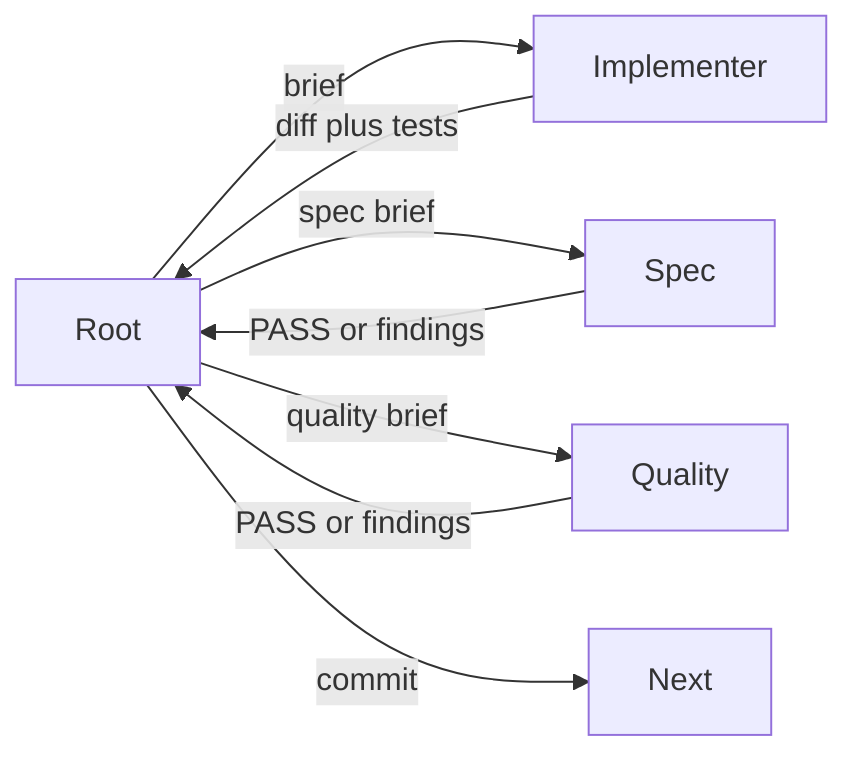

# Root Architect Execution

Root holds the plan, Git, and ledger. Isolated cheaper agents write product
code. Root does not write product code around a failed delegation.

**REQUIRED BACKGROUND:** `superpowers:subagent-driven-development` and
`superpowers:test-driven-development`. Overrides: workers never commit; spec
and quality are separate fresh agents; Git stays at root. Not for one-shot
root edits, `superpowers:executing-plans`, or unmodified SDD.

## Authority

Latest owner instruction, then the governing plan, then this skill, then
supporting ADRs/reports. Paused plans and superseded ADRs are evidence, not
build authority. Do not resume a superseded handoff or copy an ancestor
wholesale.

## Takeover

Confirm `pwd`, branch, `HEAD`, dirty paths; report drift. Read plan, ticket,
latest session. Resolve the intended branch/base and permitted sync operations
from the governing plan and repository policy; never assume current `HEAD` or
hard-code a prohibition on pull, reset, or rebase. Preserve and report dirty
paths. Stop only when the named base has a conflict that cannot be resolved
safely without touching owner-owned work or history. Open a session ledger. Run
plan-named baseline commands; checkpoint; one bootstrap commit. File the first owner report from
[references/contracts.md](references/contracts.md).

## Per-task loop

One dependent code task at a time; parallelize only independent read-only
discovery. Fill contracts from [references/contracts.md](references/contracts.md).

1. Brief with an explicit cheaper model. Never `inherit` — every host defaults
   to it, so an unset model silently makes a cheap worker as expensive as root.
   Start at the cheapest tier the task could plausibly pass and escalate one
   tier only after a failed attempt with recorded evidence. Role definitions,
   the host capability matrix, and what each host can and cannot express live in
   [references/agents/README.md](references/agents/README.md).
2. Implementer follows TDD. Must not commit, widen scope, spawn agents, or
   ask the owner.
3. Fresh `spec-validator` (read-only, no shell), then a different fresh
   `quality-validator` for the diff and named commands.
4. Same worker until three failures, then `blocked`.
5. Checkpoint model and effort; stage brief-owned paths plus the ledger;
   `git diff --cached --check`; one narrow commit.

## Validation scope

Run what the change can reach: the touched module's tests, plus any suite a
named dependency makes plausible. State that reachability argument in the
brief. If you cannot argue what is unaffected, run the full set — targeted
scope is a claim you defend, not a default.

Reuse root's evidence from an unchanged `HEAD` rather than re-running it, and
label it `reused` in the checkpoint so the saving is auditable.

The full baseline sweep belongs to the outcome gate, not to every task. No
outcome is declared complete on targeted evidence alone.

## Gates, quota, and stops

No broad migration, deletion, benchmarking, or release until the prior
vertical-slice gate is executable and checkpointed.

If 7-day quota is below 10% or 5-hour below 5%, safe-checkpoint, update
the handoff/ledger, inform the owner, stand by. No percentages: record
that and react to a host warning or owner report.

Ask the owner only for architectural conflict the plan does not resolve,
overlap with an owner-owned dirty path, credential or destructive work
outside the brief, three failed attempts, a failing prior-outcome gate, or
quota. Do not push, release, tag, merge to `main`, force Git, or delete
historical Codex notes without explicit approval.

## Red flags

Root writing product code; worker commit; `inherit`; combined spec+quality
in one agent; advancing past a failed gate; editing owner-owned dirty paths;
closing an outcome gate on targeted evidence; reusing evidence without
labelling it; asking the owner to restate decided architecture. Excuse
counters live in [references/contracts.md](references/contracts.md).
