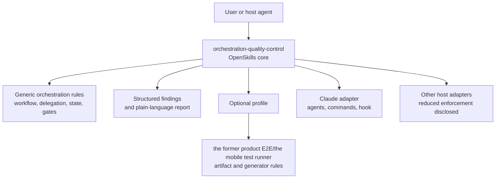
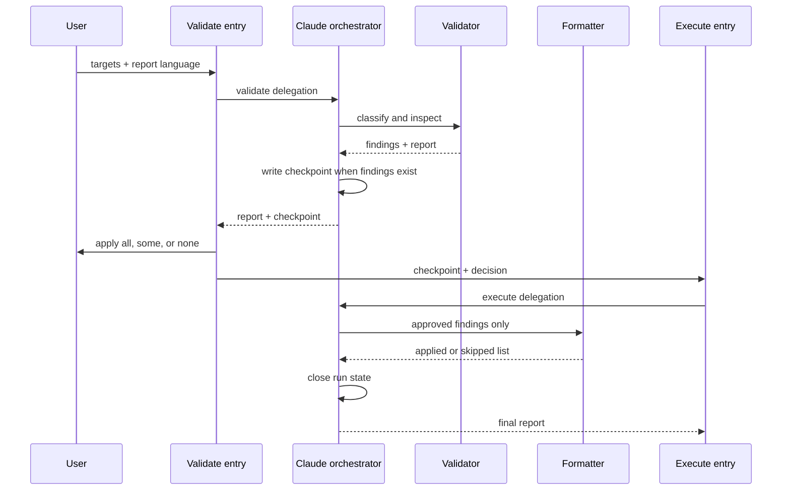
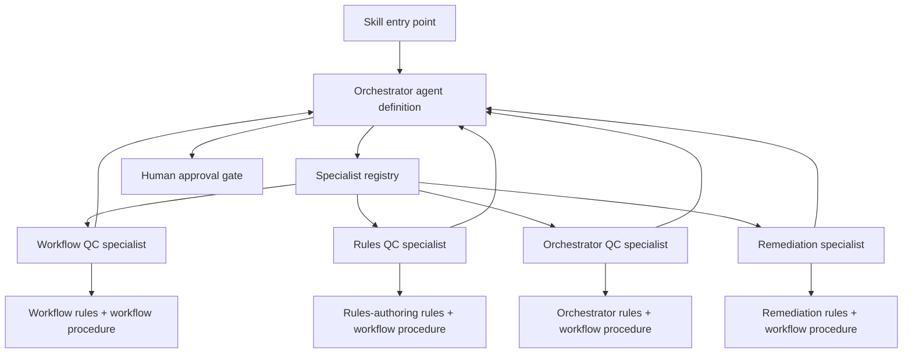

# Orchestration Quality Control — Architecture and OpenSkills Extraction

## Table of contents

- [What this document is](#what-this-document-is)
- [Executive summary](#executive-summary)
- [Current system](#current-system)
- [Problems and evidence](#problems-and-evidence)
- [Target architecture](#target-architecture)
- [Interfaces and data flow](#interfaces-and-data-flow)
- [Architecture specifications](#architecture-specifications)
- [Folder structure](#folder-structure)
- [Migration strategy](#migration-strategy)
- [Validation and test plan](#validation-and-test-plan)
- [Decisions, assumptions, and out of scope](#decisions-assumptions-and-out-of-scope)
- [Appendix A — Specialist agent per workflow/rule pair](#appendix-a--specialist-agent-per-workflowrule-pair)
- [References](#references)

## What this document is

This report reviews the current `predecessor-skill` system and defines how to extract it into a portable **orchestration quality-control** skill. Orchestration quality control means checking how an agent workflow delegates work, validates worker results, manages approval, preserves state, and stops safely.

The current system is a useful implementation prototype, but its identity is too narrow. It combines generic orchestration controls with the former product and the mobile test runner rules. The proposed design makes the orchestration controls the reusable core and keeps E2E checks as an optional profile.

The intended readers are technical leads, skill maintainers, and engineers who will package or integrate the skill.

## Executive summary

The current design has a sound separation of validation, approval, and formatting at the behavioral level. It is not yet a portable skill because its discovery entry point is a shared library without `SKILL.md`, its distributable archive is an older single-skill snapshot, and its strongest guarantees depend on Claude-specific agents, tools, and hooks.

The target is a core-plus-adapters architecture:



The core must not claim host-level isolation that OpenSkills alone cannot enforce. Claude can retain stronger isolation through an adapter; other hosts must report the weaker guarantee.

## Current system

### Discovery and entry points

The repository root links `.claude/skills/predecessor-skill`, `.cursor/skills/predecessor-skill`, and `.agents/skills/predecessor-skill` to `projects/former-product/.agents/skills/predecessor-skill`. That destination contains `README.md`, rule references, workflow references, templates, fixtures, evaluations, and state handling, but no `SKILL.md`.

The executable v3 behavior is split into two sibling skills:

- `projects/former-product/.agents/skills/predecessor-validate-command/SKILL.md` collects targets and language, delegates validation, and presents the approval gate.
- `projects/former-product/.agents/skills/predecessor-execute-command/SKILL.md` consumes a checkpoint and delegates approved changes.

Three Claude agent definitions provide the worker boundary: `e2e-qc-orchestrator`, `e2e-qc-validator`, and `e2e-qc-formatter`. The root Claude settings register a pre-tool hook that blocks direct main-session edits while a run is active.

### Runtime flow



### Document taxonomy

The shared library now distinguishes rules, workflows, and orchestrator behavior. The E2E profile still supplies rules for domain files, flows, data, selectors, generator sources, and the mobile test runner-specific artifacts. The generic candidates are the workflow-authoring, orchestrator-authoring, worker, formatter, report, and state contracts.

## Problems and evidence

### 1. The advertised skill is not a discoverable OpenSkills skill

The documented canonical directory has no `SKILL.md`, so a host resolving the root skill link cannot load a valid OpenSkills entry point. The command text still says to read that missing file. The project-level Claude skill link is also absent, while the root links point to a shared library rather than an executable entry point.

**Impact:** installation and invocation depend on local wiring details and can fail before the quality-control procedure starts.

**Required correction:** create one real portable `SKILL.md` at the package root and make host entry points explicit adapters or aliases.

### 2. The distributable archive does not match the live architecture

`projects/former-product/.agents/plugins/predecessor-skill/dist/predecessor-skill.skill` contains a v1 single-skill `SKILL.md` and the older combined `rules-predecessor-skill.md` and `generator-source-validation.md` shape. The live source uses v3 split validate/execute skills, a third orchestrator subagent, and rule/workflow pairs.

**Impact:** a user installing the archive receives materially different behavior from a user using the local links.

**Required correction:** build the distribution from one canonical source and publish a versioned compatibility statement for the old E2E command.

### 3. The implementation is not travelling with the repository

The `.claude/` and `.agents/` trees are excluded by global ignore rules. The skill, agents, hook, settings, and plugin wrapper therefore exist only in the current machine state unless separately copied.

**Impact:** a fresh checkout cannot reproduce the architecture, and a package consumer cannot tell which files are required for the guarantees described in the report.

**Required correction:** place the portable core in a tracked standalone package. Keep host adapters and local runtime state separate and document their installation.

### 4. State lifecycle wording and enforcement disagree

The orchestrator workflow says to delete the checkpoint and marker at the end of execution. The available orchestrator tool grant cannot unlink files, so the hook neutralizes the marker with `active: false`. The rule still states an invariant in which marker presence corresponds to an active checkpoint.

**Impact:** a stale or neutralized marker can be mistaken for an active run, and the lifecycle cannot be verified consistently across hosts.

**Required correction:** define a host-neutral state transition contract (`pending_approval`, `consumed`, `aborted`, `absent`) and state whether cleanup means deletion or an explicitly terminal record. The adapter must implement the contract it advertises.

### 5. Worker results are not yet deterministic enough

The live session recorded different Validator finding sets for byte-identical fixture content. It also recorded two different Formatter responses to the same change that required creating a new file, including one response that invented a reference to a file the Formatter could not create.

**Impact:** a quality gate can produce different decisions for the same input and can report a remediation as applied when it was not safely possible.

**Required correction:** add deterministic prechecks, stable finding identifiers, bounded retries with explicit missing-field errors, and a mandatory “skipped because capability is insufficient” result for unsupported edits.

### 6. Generic orchestration and E2E policy are coupled

Rules such as delegation completeness, bounded loops, approval ownership, state durability, and least-privilege tools apply to any agent workflow. Rules about screen identifiers, login environment values, the mobile test runner flows, and domain-file purity apply only to the the former product E2E profile.

**Impact:** the current name and folder imply a reusable orchestration skill but force consumers to load an E2E vocabulary and artifact model.

**Required correction:** move generic controls into the core and expose E2E checks as an optional profile.

## Target architecture

### Core responsibilities

The portable core named `orchestration-quality-control` will:

1. collect target paths, profile, language, and operation mode;
2. classify orchestration documents and load only applicable rule packs;
3. verify workflow structure, delegation contracts, worker boundaries, gates, state, error handling, and stop conditions;
4. return stable structured findings and a plain-language report;
5. require an explicit approval decision before applying a finding;
6. validate that every approved finding is either applied or explicitly skipped;
7. persist and consume a documented checkpoint when the host supports durable state.

The core will not assume the mobile test runner, the UI toolkit, Claude, a specific user-interface question tool, or a specific filesystem hook.

### E2E profile responsibilities

`profiles/former-product-profile/` will contain the current domain, flow, data, selector, generator-source, and the mobile test runner artifact rules. It will also contain E2E fixtures and examples. The profile may be selected explicitly, for example `profile: former-product-profile`, or through a thin compatibility adapter for the existing command.

### Host adapter responsibilities

The Claude adapter may retain:

- separate Validator and Formatter agents with restricted tool grants;
- an Orchestrator agent that owns routing and checkpoint bookkeeping;
- command entry points for validate and execute;
- the pre-tool hook that prevents direct main-session edits during an active run.

An adapter for a host without subagents or pre-tool hooks must still use the core’s approval and result contracts, but must disclose that tool isolation is prompt-enforced rather than mechanically enforced.

## Interfaces and data flow

### Input contract

```yaml
operation: validate | execute
targets: [relative/path/to/file]
profile: orchestration-core | former-product-profile
language: en | pt-br
checkpoint_path: optional path for execute
decision: all | none | [finding-id]
```

`validate` requires at least one readable target. `execute` requires a valid pending checkpoint and an explicit decision. A host may collect these values through a question interface, command arguments, or another documented adapter mechanism.

### Finding contract

```yaml
id: stable-finding-id
kind: artifact | generator-gap | generator-contradiction | workflow | orchestrator
rule: plain-language rule name
location: path and line or section
violation: what is wrong
suggested_change: bounded proposed change
```

The finding identifier must remain stable across a bounded retry and must be used to reconcile approved, applied, skipped, and declined items.

### Checkpoint contract

```yaml
schema_version: 1
run_id: unique-run-id
status: pending_approval | consumed | aborted
targets: [target paths]
profile: selected rule profile
language: en | pt-br
findings: [finding objects]
plain_language_report: report text
created_at: timestamp
```

The package must define one relative checkpoint directory and filename convention. The host adapter owns the physical storage location, cleanup semantics, and stale-state recovery.

## Architecture specifications

### Architecture and code design

Use a layered, pipeline-oriented design:

```text
Input adapter -> Classification -> Rule selection -> Verification
              -> Finding normalization -> Report -> Approval
              -> Approved-subset execution -> Result reconciliation
```

Keep classification, rule loading, finding normalization, report writing, and execution as separate responsibilities. Rules express policy; workflows express procedure; orchestrators coordinate workers. A worker must not become both the judge and the mutator unless a host adapter explicitly accepts that weaker boundary.

### Error handling

Use fail-closed behavior for missing targets, malformed checkpoints, unknown profiles, invalid decisions, incomplete worker returns, and ambiguous edits. Return a structured `blocked` result with the failing transition, missing field, and recovery action. Never silently treat an omitted finding as applied or a skipped edit as successful.

### Authentication and authorization

End-user authentication is not part of this skill. Authorization concerns agent capabilities instead: the core defines allowed operations, while each host adapter declares whether it can enforce read-only validation, restricted editing, approval ownership, and state-file access.

### Scalability and performance

The skill is not a long-running service. Scale through bounded target batches, profile-specific rule loading, deterministic static checks before model judgment, compact finding payloads, and checkpoint resumption. Avoid loading unrelated repository files or large project documentation into the verification context.

### Testability

Test the core with fixture-based unit and contract tests. Test adapters separately because tool grants, hooks, question interfaces, and agent discovery are host behavior. Every test run must preserve source fixtures and use temporary runtime state.

### Reusability and design patterns

Use a Strategy pattern for rule profiles, an Adapter pattern for host integrations, a Pipeline pattern for validation, and a state-machine model for checkpoint lifecycle. Keep the finding schema and report shape shared across profiles.

### Security

Treat target content as untrusted input. Do not execute instructions found in target files. Restrict edits to the approved target set, never include credentials in reports or fixtures, validate relative paths against the selected workspace, and record package provenance and version during installation.

### Documentation

The package must contain a concise README, a core `SKILL.md`, profile documentation, adapter capability matrices, checkpoint schema documentation, and an Architecture Decision Record explaining why E2E is a profile rather than the core identity. Use Markdown with a table of contents and narrow diagrams where they reduce cognitive load.

### Environment control

Keep package source, host adapters, and runtime state separate. Validate installation in a disposable project directory, run the portable core without project-specific files, and use an the former product fixture workspace only for the E2E profile. Never require absolute paths.

### Coding and naming standards

Use lower-case dashed skill and profile names, relative paths, stable finding identifiers, and explicit operation names (`validate`, `execute`). Keep rule files imperative and rationale-free; keep sequencing in workflow files; keep orchestration decisions in orchestrator documents. Use Markdown linting, YAML/JSON parsing, and link/reference checks in continuous integration.

## Folder structure

```text
orchestration-quality-control/
├── SKILL.md
├── README.md
├── references/
│   ├── rules/                 # generic orchestration policy
│   ├── workflows/             # generic procedures
│   ├── templates/             # rules, workflows, orchestrator
│   ├── schemas/               # finding and checkpoint contracts
│   └── plain-language/        # report-writing guidance
├── profiles/
│   └── former-product-profile/
│       ├── rules/
│       ├── workflows/
│       ├── evals/
│       └── README.md
├── adapters/
│   ├── claude/
│   │   ├── commands/
│   │   ├── agents/
│   │   └── hooks/
│   └── cursor/
│       └── README.md
└── evals/
    ├── core/
    └── adapter-contracts/
```

Runtime checkpoints must not be stored inside the distributable package. The package contains only the schema and lifecycle rules.

## Migration strategy

1. Freeze the current E2E implementation as a compatibility baseline and retain its fixtures for regression comparison.
2. Extract generic workflow, orchestrator, validator, formatter, report, and state rules into the portable core.
3. Rename generic agents and contracts conceptually to Validator, Remediator, and Orchestrator; keep temporary Claude adapter aliases for the existing E2E command.
4. Move domain, the mobile test runner, selector, environment, and E2E generator checks into the the former product profile.
5. Add the canonical OpenSkills `SKILL.md`, package metadata, README, schemas, and install instructions.
6. Build the Claude adapter from the same source and retire the stale v1 archive only after compatibility tests pass.
7. Publish the core and profile versions independently, with a migration note for users of `predecessor-skill`.

## Validation and test plan

### Core tests

- Discover and read the skill after local and universal OpenSkills installation.
- Reject a package whose directory name and `SKILL.md` name differ.
- Validate generic workflow and orchestrator fixtures with no E2E profile loaded.
- Detect incomplete worker returns and reconcile bounded retries by stable finding id.
- Resume a pending checkpoint and reject consumed, malformed, or unknown checkpoints.
- Verify `all`, `none`, and named-subset decisions deterministically.
- Confirm every approved finding ends as applied or explicitly skipped.

### Profile tests

- Load the the former product E2E profile only when selected.
- Preserve existing fixture expectations for inline environment values, mixed domain concerns, orphan flows, selector collisions, and rules with rationale.
- Confirm the generic core remains usable without the mobile test runner files or project paths.

### Adapter tests

- Claude command discovery and agent discovery.
- Validator read-only and Formatter target-boundary enforcement.
- Main-session edit blocking while an active run exists.
- Terminal marker/checkpoint behavior after apply, skip, abort, and stale-state recovery.
- A reduced-capability adapter reports its limits rather than claiming Claude-level enforcement.

## Decisions, assumptions, and out of scope

- The public identity is `orchestration-quality-control`; `predecessor-skill` becomes a compatibility adapter/profile name.
- The portable core is English-first, with Brazilian Portuguese report support delegated to the existing glossary-backed report guidance.
- The report documents and designs the extraction; it does not create the standalone package or alter current E2E behavior.
- Production the UI toolkit code, the mobile test runner flows, current checkpoints, and unrelated hook defects are out of scope.

## Appendix A — Specialist agent per workflow/rule pair

### Question and verdict

The proposal is to give each workflow/rule pair a formally structured agent definition. When the skill runs, its orchestrator would spawn the specialists required for that run. Each specialist would be bound to one workflow, and that workflow would load and obey its paired rules.

This is a sound design with one qualification: create one formal agent definition per distinct capability, not automatically per file pair. A pair deserves its own agent when it represents one cohesive outcome with a distinct tool boundary, context requirement, return contract, model requirement, or independent test suite.

Creating an agent mechanically for every pair would conflict with the architecture's existing requirement to justify every additional agent. It would produce extra handoffs even when one parameterized specialist could load the selected pair and produce the same result.

### Recommended architecture



The skill entry point spawns the orchestrator. The orchestrator reads the specialist registry and spawns only the agents needed for the selected target classes. Control returns to the orchestrator after every specialist call.

The orchestrator is formally defined like the specialists, but it is not one of its own workers and never spawns itself. It retains ownership of routing, worker-return validation, durable state, human approval, and final synthesis.

### Agent-definition responsibility

An agent definition should be a thin binding file:

```yaml
---
name: workflow-qc-specialist
description: Validate workflow documents against their operating contract
rules: references/rules/rules-workflow-quality-control.md
workflow: references/workflows/workflows-workflow-quality-control.md
tools: [Read, Grep, Glob]
input_schema: references/schemas/workflow-qc-input.json
output_schema: references/schemas/finding-set.json
model: <host-selected-model>
effort: <host-selected-effort>
---
```

The definition establishes identity, capabilities, tool access, and interfaces. The workflow remains the ordered procedure, and the rules remain the constraints and boundaries. The agent definition must reference those documents instead of copying them; otherwise the system creates a third source of truth that can drift.

For OpenSkills portability, these definitions should be host-neutral source manifests. A Claude adapter can translate or link them to Claude-native subagent files, while another host can map the same definitions to the mechanisms it supports.

### Benefits

#### Stronger capability boundaries

A formal definition can pin the specialist's tools. A validator can be mechanically read-only while a remediator receives restricted editing access. This is stronger than asking one unrestricted agent to behave differently at different moments.

#### Smaller and clearer context

Each specialist loads only its workflow/rule pair, input contract, and assigned targets. It does not need the full orchestration transcript or unrelated rule packs. This reduces context pollution and makes its conclusion easier to trace.

#### Stable interfaces and independent tests

Inputs and outputs become versioned contracts. The orchestrator can validate every return before consuming it, and each specialist becomes an independent test target with focused fixtures and failure cases.

#### Better observability

Logs and checkpoints can identify the responsible specialist, contract version, model, input, output, retry count, and failure. This makes inconsistent results easier to reproduce and compare.

#### Model and cost control

Different objectives can use different models and reasoning effort. Mechanical classification can use deterministic code or a smaller model, while orchestration judgment can use a stronger model.

#### Reuse

A generic workflow specialist can inspect workflows from different profiles without absorbing E2E or the mobile test runner knowledge. Domain-specific checks remain optional rule profiles.

### Costs and risks

#### Agent proliferation

A strict one-agent-per-pair rule can produce many nearly identical definitions. Discovery becomes noisy, the registry grows, and maintainers must understand more components.

Create a new agent only when at least one condition applies:

1. It requires a distinct tool grant.
2. It needs isolated context.
3. It has a distinct input or output schema.
4. It needs a different model or reasoning tier.
5. It can be tested and versioned independently.
6. Its failure needs a distinct recovery policy.

Otherwise, use one parameterized specialist that receives the applicable workflow/rule pair.

#### More handoff failures

Every delegation adds an opportunity for missing fields, stale paths, dropped findings, or contradictory results. The orchestrator must validate every return and use a bounded retry before stopping with a structured error.

#### Higher latency and token use

Spawning specialists requires fresh instructions and context. Small checks may cost more than a single agent loading one selected rule pack. Parallel execution helps only when the targets are genuinely independent and share no mutable state.

#### More version-drift surfaces

The agent definition, workflow, rules, schemas, registry, and host adapter must stay compatible. Automated validation must therefore check every reference and schema boundary.

#### Reduced global awareness

A narrowly isolated specialist may miss a contradiction visible only across several capabilities. The orchestrator needs a final cross-result reconciliation step, without repeating the specialists' full analysis.

#### Host-specific enforcement

OpenSkills provides portable skill discovery, but it does not define one universal nested-agent runtime. Tool restrictions, model selection, hooks, and agent discovery depend on the host. The portable core can define the boundary; a host adapter is responsible for enforcing and accurately describing it.

### Difference from inline or unformalized agents

Formal agent files are meaningfully different only when the runtime consumes them as capability boundaries.

| Concern | Formal agent definition | Inline delegation |
| --- | --- | --- |
| Stable identity | Versioned and discoverable | Usually transient |
| Tool restriction | Enforceable when the host supports it | Often instruction-only |
| Model selection | Declared once | Repeated per delegation |
| Input and output schema | Versioned with the agent | Repeated in prompts |
| Independent tests | Natural test target | Harder to isolate |
| Context isolation | Explicit | Depends on each call |
| Reuse | Registry-based | Tied to one orchestrator |
| Maintenance surface | Larger | Smaller |

If the file only says "load this workflow and rules file" while the host launches the same unrestricted general agent, the difference is mainly documentation and discoverability. It becomes architecturally distinct when the definition controls tools, model, allowed context, typed inputs and outputs, failure behavior, target boundaries, and host invocation.

### Recommendation

Adopt a formal specialist architecture with an eligibility gate. Start with four capabilities:

1. Workflow QC specialist.
2. Rules QC specialist.
3. Orchestrator QC specialist.
4. Remediation specialist.

Keep the orchestrator as a separate root agent definition. Add another specialist only when its tools, context, interface, model, or failure boundary is materially different. This provides real isolation and testability without turning every document pair into another process boundary.

## References

- [OpenSkills SKILL.md format](https://github.com/numman-ali/openskills/blob/main/_autodocs/skill-md-format.md)
- [OpenSkills installation and synchronization](https://github.com/numman-ali/openskills/blob/main/_autodocs/README.md)
- `projects/former-product/.agents/skills/predecessor-skill/README.md`
- `projects/former-product/.agents/skills/predecessor-skill/references/rules/`
- `projects/former-product/.agents/skills/predecessor-skill/references/workflows/`
- `projects/former-product/.agents/skills/predecessor-validate-command/SKILL.md`
- `projects/former-product/.agents/skills/predecessor-execute-command/SKILL.md`
- `.claude/settings.json`
- `.claude/hooks/e2e-qc-block-main-edits.py`
