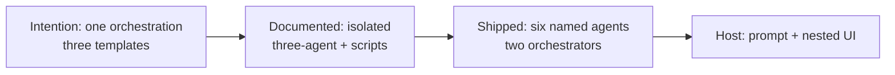
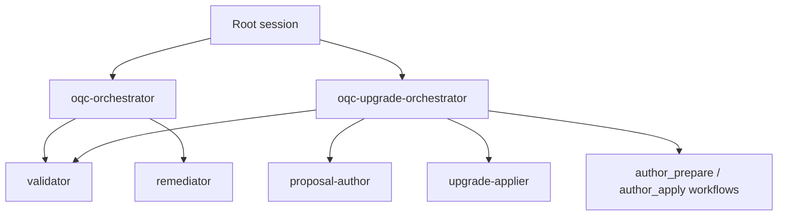

# Intention vs outcome — orchestration-quality-control drift

This note records the gap between the architecture this product was supposed
to be and the tree that exists on 2026-09-02. It is a diagnosis, not a
rewrite plan.

Ingested:

- Public GitHub
  [theocarranza/orchestration-quality-control](https://github.com/theocarranza/orchestration-quality-control)
  (`upstream`, last public update 2026-08-27). Still product-profile era:
  `aplicatudo-e2e`, `AI_Codex_OrchestratorQcPlugin/`, `docs/adr/`, README
  claims three-role isolation and human apply-before-edit.
- Working origin
  [theocarranza/orchestration-quality-control-agnostic](https://github.com/theocarranza/orchestration-quality-control-agnostic)
  (`origin`, local `main` at `f34404d`). Agnostic strip, authoring 3.1.0,
  auto-continue 3.2.0.
- Local package, adapters, ADRs, live-model run, and the 2026-09-02 Cursor
  interface smoke.

## The intended machine

One orchestration. One set of agent definitions. Three templates:

| Template | Job | Host grants |
| --- | --- | --- |
| Orchestrator | Routes, checkpoints, spawns workers | Spawn + routing scripts. Stronger model. |
| Validator | Judges | Read + classify/id scripts. No spawn. No write. |
| Remediator | Does the approved work | Edit + render/apply scripts. No spawn. No approval. |

Three layers:

1. **Root session** loads the orchestrator and gives it model, effort, and
   tools that include spawning the other two.
2. **Orchestrator** spawns workers from those templates, with only the tools
   each role may use and **no** power to spawn further agents.
3. **Workers** run the work they were given.

The interview exists to fill the inputs that **this same machine** needs to
put work into action — not to invent a second topology. Deterministic
scripts stay the mechanical gates (classify, identity, checkpoint, reconcile,
diff).

That is also what the public README still sells: a root-owned Orchestrator,
a read-only Validator, an apply-only Remediator, and “code-enforced gates.”

## What actually shipped

### Six named agents, not three

Every host adapter already had **six** agent files on the original GitHub
tree (`adapters/claude/agents/`):

| Shipped file | What it really is |
| --- | --- |
| `oqc-orchestrator` | Orchestrator for `validate` / `execute` |
| `oqc-validator` | Validator |
| `oqc-remediator` | Remediator for finding diffs |
| `oqc-upgrade-orchestrator` | **Second orchestrator** |
| `oqc-proposal-author` | **Third worker** — drafts trees, neither judges nor applies |
| `oqc-upgrade-applier` | **Second remediator** — copies a preview via `apply_*.py` |

Cursor and Codex duplicate the same six under different names. ADR 0010
says the only execution shape is Orchestrator / Validator / Remediator.
ADR 0008 had already added a second trio for upgrade. 3.1.0 then hung
authoring off the **upgrade** orchestrator instead of the QC trio.

The QC orchestrator does not own a single procedure. It loads a **different
workflow file** per operation (`workflows-qc-validate.md` vs
`workflows-qc-execute.md`). The upgrade orchestrator loads four:
prepare, apply, `author_prepare`, `author_apply`. That is a dispatcher
with a growing menu, not one template that always orchestrates.

### Isolation is mostly prose

The original architecture report ([[2026-07-15-orchestration-qc-openskills-architecture]])
already warned: the core must not claim host-level isolation a skill
installer cannot enforce; Claude can keep stronger isolation; other hosts
must disclose the weaker guarantee.

The adversarial critique ([[2026-07-16-adversarial-critique-qc-architecture-feedback]]
F5) went further: the only host-enforceable benefit of the split is a
mechanically read-only Validator via tool grants, and that existed **only
on Claude**. Everywhere else the multi-agent shape pays token cost without
the isolation.

Outcome:

| Claim | Claude | Cursor (measured 2026-09-02) |
| --- | --- | --- |
| Named three roles | Frontmatter `tools` / `model` / `effort` | `model: inherit`; no `tools`; no `effort` on most agents |
| Validator cannot write | Tool grant excludes Edit/Write | README: **prompt-enforced** plus `readonly: true` |
| Bash only named scripts | Comment in the agent file | Remediator ran arbitrary `/tmp` Python |
| Workers cannot spawn | No `Agent` on validator/remediator | Not proven; Task is available to nested agents in this host |
| Human talks only to root | Commands collect AskUserQuestion | Nested Shell **Pending approval** opened in the remediator tab |

The Cursor adapter README documents this honestly in its capability matrix
and then the root README still says every host “mechanizes the same isolated
three-agent topology.” Those two sentences cannot both be operationally true.

### Interview never drove the machine

Intention: interview answers are inputs to the same three templates (outcome,
targets, what to write, when to stop).

Outcome:

- 3.1.0 authoring asked a long gap list (`outcome`, `output_root`, shape,
  approval, state, stop, named inputs, language, fork).
- Nested Cursor agents cannot surface `AskQuestion` to the parent chat.
  Live author evals waited inside Task transcripts; OS notifications opened
  the main agent with no question card.
- 3.2.0 deleted eighteen gates and auto-continues, including **apply**.
  Only `author-outcome` remains a root question. The README and package
  README still say nothing is changed until a person approves.
- Authoring still does not instantiate the three agent templates in the
  caller’s repo. It writes process markdown (`ARCHITECTURE.md`, rules,
  workflow). Host adapters remain “upgrade.” So the interview never
  parameterizes live Orchestrator/Validator/Remediator definitions — it
  parameterizes documents **about** a process.

### Two publics, two truths

| Surface | What a stranger sees |
| --- | --- |
| github.com/theocarranza/orchestration-quality-control | v2-era extraction: product E2E profile, vault name `AI_Codex_OrchestratorQcPlugin`, `docs/adr`, four operations, human apply gate, “three-agent only” |
| github.com/theocarranza/orchestration-quality-control-agnostic + this working tree | 3.0.0 strip, 3.1.0 authoring, 3.2.0 auto-continue, `AI_Codex/`, `example-pipeline`, six agents, live evals not closing ADR 0005 |

The original repo was renamed `upstream` with push disabled. The README on
`origin` still badges **version 3.1.0** after 3.2.0 shipped. The GitHub
ingest page for the first URL still shows `aplicatudo-e2e` and Maestro in
the solution diagram.

### Definition of done did not close

ADR 0005 item 3 still requires 100% with-skill on core **and**
example-pipeline. The 2026-09-02 live run (32 executor runs for that gate,
plus 8 author runs extra):

- example-pipeline with-skill: 100%
- core with-skill: 95.8% — `eval-workflows-generic-clean` run 1 invented a
  W13 finding on a designed-clean fixture
- author with-skill: 100%, not in the gate

Offline scripts are the part that matches intention (mechanical stages are
Python). The live “isolated topology” eval is the part that does not.

### Interface smoke (this session)

One `deploy-orchestrator` validate from the root session: no OQC apply
question (3.2.0). Execute spawned the remediator. The human stop that
appeared was Cursor’s Shell permission card **inside the nested agent
panel**. Checkpoint aborted; fixture unedited.

That is the same class of failure as buried `AskQuestion`: the human is
not acting in the root session that the three-layer diagram draws.

## Mistakes (named)

1. **Split the topology instead of parameterizing it.** Upgrade needed a
   drafter and an exact-copy apply. Those should have been Validator and
   Remediator under different inputs, not new species and a second
   orchestrator.
2. **Advertised three-agent-only (ADR 0010) while shipping six files.**
   The README’s sequence diagram never shows proposal-author or
   upgrade-applier.
3. **Made the orchestrator a workflow loader.** Identity of the role
   became “which markdown file did we `@` this time.”
4. **Claimed code-enforced isolation on every host.** Cursor’s own matrix
   says validator write-block is prompt-enforced. The 2026-09-02 remediator
   run showed unrestricted Shell.
5. **Used interview as a second product.** Then deleted most of it in 3.2.0
   without collapsing the six agents back to three.
6. **Authoring writes documents, not the three templates.** Callers still
   do not get an Orchestrator/Validator/Remediator they can run. They get
   markdown outlines plus a promise that upgrade will install host files.
7. **Left two GitHub repositories telling two stories.** Ingest of the
   URL in the query still shows the product-coupled extraction.
8. **Left user-facing copy claiming human apply after auto-continue
   shipped.** Root README first paragraph; package README “nothing is
   changed until a person explicitly approves.”
9. **Counted nested agents as the value.** The durable value that actually
   exists is the **scripts and schemas**. Extra named agents without
   host-enforced grants are a more expensive prompt.

## Gaps (what would have to be true for intention to hold)

- Exactly three agent definition templates per host, each with name,
  description, model, effort, and a **host-enforced** tool list.
- Orchestrator is the only spawner. Validator and remediator cannot Task /
  Agent.
- Bash/Shell allowlisted to named scripts, not “please only run these.”
- One orchestrator; `validate`, `execute`, `upgrade`, `author` are
  **inputs**, not extra agent types.
- Interview (or packaged defaults) fills those inputs in the **root**
  session only.
- Public README, SKILL.md, and both GitHubs describe the same version and
  the same apply policy.
- ADR 0005 item 3 either met or explicitly demoted; no silent 95.8%.

Until those hold, the difference from “a skill that validates markdown and
applies diffs” is documentation volume, not a delivered three-layer
orchestration runtime.

## Codex context

Consulted: this report’s `sources` frontmatter, local
`adapters/{claude,cursor,codex}/agents/`,
`references/templates/isolated-three-agent.md`,
`orchestration-quality-control/SKILL.md`, root `README.md`,
`CHANGELOG.md` 3.0.0–3.2.0, Cursor adapter capability matrix,
`eval-harness/RUNBOOK.md`, ADR 0005 live-model section, session
`2026-09-02-094852-project-overview`.
