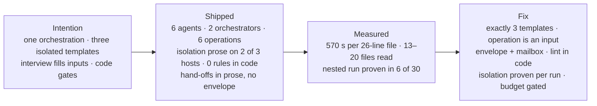
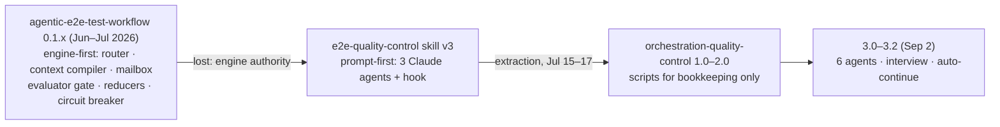
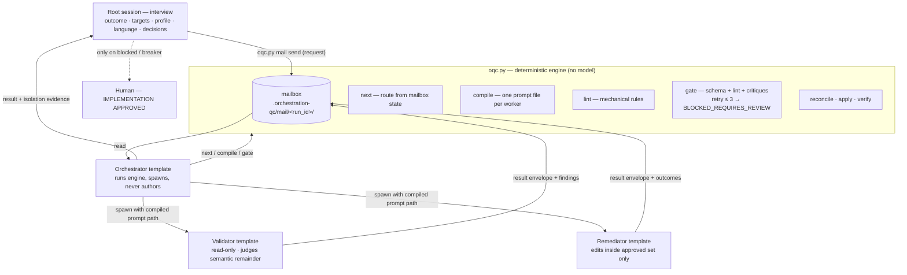

# Intention vs outcome — reconciliation

Companion to [[2026-09-02-intention-outcome-drift]], which diagnosed the
topology drift. This note adds cost and noise evidence, names every problem
with a measurement or a file path, and states the solution under the owner's
decisions of 2026-09-02 (section 5). The execution recipe is
[[2026-09-02-return-to-intention-4-0-0]]. The decision record is
[[0013-three-agent-parameterized-code-gated]] (proposed).

All numbers were measured on 2026-09-02 against local `main` at `f34404d`
(3.2.0) and the gitignored eval workspace
`orchestration-quality-control-workspace/`.



## 1. What was intended

### 1.1 Genealogy



The ancestor is a **deterministic Python engine paired with LLM workers**
(spec v3 §1). Its authority split is the intention this product lost:

| Concern | Ancestor owner | File |
| --- | --- | --- |
| What runs next | engine | `router.py` — artifact state (missing → `novo`, `error.log` → `correcao`, stale mtime → `atualizacao`); one task per run; repeated runs converge |
| What the worker reads | engine | `adapters.py` — compiles system prompt + execution context + upstream artifacts + failed artifact + critiques into **one file** |
| How engine and agent talk | engine | filesystem mailbox `.agentic/e2e_prompts/stage_X.prompt.md` ↔ `stage_X.error.log`; rationale in CHANGELOG 0.1.0: bypass CLI limits, harness-agnostic |
| Whether the output is acceptable | engine | `evaluator.py` — static checks per stage; PASS clears `error.log`, FAIL writes critiques |
| Retry and stop | engine | `reducers.py` — critiques injected into the next attempt; `retry_count ≥ 3` → `BLOCKED_REQUIRES_REVIEW`; resume only on the literal token `IMPLEMENTATION APPROVED` |
| State | engine | `state.py` frozen dataclasses; `stream.py` dispatch = pure reduce + hooks; `events_history` immutable |
| Side effects | hooks | `hooks.py`, `hooks/{authorization,circuit_breaker,evaluator_gate,ledger_sync}.py` |
| Authoring artifacts | worker agent | ephemeral, pristine context, spawned by the Orchestrator agent |
| Spawning and looping | orchestrator agent | `skills/e2e/SKILL.md`: run engine → spawn worker with compiled prompt → `evaluate` → send critiques or advance; "Do NOT generate the artifact yourself"; after 3 failures ask the human |
| Human contact | circuit breaker only | `approval_mode: auto` default; human enters when retries exhaust — the same policy as owner decision 2 |
| Worker contract | manifest | `reference/manifest.json`: `inputs`, `outputs`, `tools[].executable`, `authoritative_instructions` |

The ancestor also recorded its own defects (spec v3 §10): literal-string
gates are brittle (F6), context sweeps blow up tokens (F7), mailbox files
nobody clears loop forever (F10, fixed 0.1.1), `input()` in a hook, stub
hooks (`evaluator_gate.py`, `ledger_sync.py`), duplicated engine copies.
Those are lessons, not features.

### 1.2 Later statements of intent

| Source | Intended product |
| --- | --- |
| Architecture report 2026-07-15 | Core-plus-adapters. Generic orchestration rules, structured findings, plain-language report. Claude keeps stronger isolation through an adapter; other hosts disclose the weaker guarantee. |
| Adversarial critique 2026-07-16, F4/F7 | Mechanical stages are model-free code. Finding identity content-anchored. Findings are literal diffs. Report generated from findings, never from raw target text. |
| Drift report 2026-09-02 | One orchestration, three templates (Orchestrator spawns; Validator reads and judges; Remediator applies). The interview fills the inputs **this same machine** needs; it does not create a second topology. Authoring should hand the caller a runnable Orchestrator/Validator/Remediator, not documents about one. |
| Owner, 2026-09-02 | Sub-agent isolation is the most valuable asset and is non-negotiable. Human approval mid-run is removed on purpose; the interview before execution covers every decision; a human is asked only for unforeseen, potentially serious events. Report language is an interview decision, default `en`. |

Reduced to one sentence: **a deterministic engine that routes, compiles
context, gates, retries and stops; three isolated, host-enforced agent
templates that only judge and author; an up-front interview; a mailbox
between them; at a cost a team can pay per run.**

## 2. What shipped — problems, with evidence

### A. Cost

| # | Problem | Evidence |
| --- | --- | --- |
| A1 | A `validate` of a 26-line fixture takes 8–9 minutes. | `deploy-orchestrator.md` is 26 lines. 12 core with-skill runs: mean 520 s, median 570 s, max 900 s (`*/timing.json`). Without the skill: 120 s. Ratio 4.3x. Example-pipeline 550 s vs 210 s; author 670 s vs 180 s. 40 runs = 5.2 h wall. |
| A2 | The model reads 13–16 packaged files before the target. | Across the 17 with-skill transcripts whose `## Files read` is a parseable list: mean 12.9 packaged files, median 16, max 20. Package markdown an agent may be routed to: 3,694 lines (excl. tests, CHANGELOG) across 10 workflows, 11 rules, 15 schemas, 4 templates, 4 plain-language files, SKILL.md 181 lines. Each agent file is an `@` chain: agent → rules-qc-role → workflow → rule set → template → plain-language (4 files) → schemas. |
| A3 | The accuracy bought is small and the one failure is fabrication. | Core 95.8% with-skill vs 85% without (+10.8 pp) at 4.3x time. The only core failure: the skill **invented** a W13 finding on the designed-clean fixture and proposed an edit. |
| A4 | The isolation being paid for is not proven per run. | Of 30 with-skill transcripts, 6 mention a nested or spawned validator, 1 records "validator collapse" (deploy-orchestrator run 1 — passed 5/5 anyway), 23 do not say. No eval assertion requires evidence that the Validator ran as a separate agent. The asset the product exists for is not measured by its own benchmark. |
| A5 | Zero rules are checked in code. | `scripts/` (2,131 lines, 15 files) do: filename-glob classification, SHA-256 of an anchor plus substring check, a JSON status field machine, `str.replace` + `difflib`, set arithmetic, default dictionaries. Every rule walk (W1–W13, O1–O12, R1–R6, G*, T*) is model judgment. Yet R2 (`because`, `so that`), R3 (`first`/`then`), W3 (required sections, `<...>`, `TODO`), W7/O5 (`retries it until it succeeds`), W12 (empty stop conditions) are regex-decidable, and the fixtures prove it: `rg -i "because\|so that\|first\|then" rules-generic-with-rationale.md` returns exactly the three lines the eval expects flagged. |
| A6 | Two orchestrator spawns per run where one suffices. | `validate` and `execute` are separate orchestrator delegations; with auto-continue (3.2.0) the root session spawns the orchestrator twice for one outcome. Same for `upgrade_*` and `author_*`. |

### B. Noise

| # | Problem | Evidence |
| --- | --- | --- |
| B1 | One run emits 28 KB of artifacts with the same content four times. | `checkpoint-…json` 9.8 KB embeds `findings` and `plain_language_report`; `findings.json` 6.4 KB duplicates findings; `plain-language-report.md` 2.9 KB duplicates the report; `outputs/report.md` duplicates it again. Under `core/iteration-1/eval-x/with_skill/run-1/sandbox/.orchestration-qc/state/` — eight directory levels. |
| B2 | The eval workspace is 546 files (262 JSON, 259 markdown), 2 MB, for 40 runs of 26–60-line fixtures. | `find … -type f \| wc -l`. |
| B3 | The package is 156 files (131 excluding tests) for three outcomes (check, upgrade, author). | 18 agent definitions (6 × 3 hosts), 10 workflows, 11 rule files, 15 schemas, 4 templates, 4 plain-language files, 15 scripts, 2 entrypoint skills, 2 Cursor skills, 4 Claude commands, 3 hook implementations, 3 build scripts, 2 installers. |
| B4 | The ledger narrates grading instead of recording decisions. | `Agent_Sessions/2026-09-02-094852-project-overview.md` 330+ lines; 13 near-identical "Grade — … run-N" checkpoints. 12 ADRs, 4 plans, 3 specs, 5 reports for 32 commits over 3 calendar days. A stray `AI_Codex_OrchestratorQcPlugin/` with 2 session files still sits at the repo root. |

### C. Documentation that does not describe the code

| # | Claim | Reality |
| --- | --- | --- |
| C1 | Root README ¶1 and package README: "applies nothing until a human explicitly approves" / "Nothing is changed until a person explicitly approves." | 3.2.0 `SKILL.md`: "Packaged defaults apply all findings after validate unless the invocation overrides the decision." `gate-defaults.json` moves 18 gates to defaults. This is the intended behaviour; the READMEs describe the old one. |
| C2 | Eval prompts: "Ask me before changing any file." Assertions a4: "Does not edit the target file before an explicit apply confirmation." | Packaged default is to apply. The 2026-09-02 benchmark passed because runs waited for an absent human (`apply_decision.md` = `waiting_for_approval`). The benchmark grades pre-3.2.0 behaviour. |
| C3 | Root README badge: version 3.1.0, 174 offline tests. | `build_plugin.py` `VERSION = "3.2.0"`; suites today: 91+8+6+36+19+17 = 177. |
| C4 | Root README and SKILL.md: "Every host adapter mechanizes the same isolated three-agent topology"; "mechanically read-only Validator (tool grant excludes Edit/Write) … every shipped adapter". | Claude: `tools:` grants per agent — enforced. Cursor: Validator `readonly: true` — enforced; Remediator has no tool restriction (`model: inherit`, no `tools`), shell scope exists only through the hook while a checkpoint is pending; "workers cannot spawn" not enforceable (Task available to nested agents). Codex: same shape as Cursor. The Cursor README's matrix says this; the root README says the opposite. 2026-09-02 smoke: remediator ran arbitrary `/tmp` Python; Cursor's Shell permission card surfaced inside the nested panel. |
| C5 | ADR 0010, README: "three-agent only". README sequence diagram shows O/V/R. | 6 agent files per host. A second orchestrator (`oqc-upgrade-orchestrator`) loads 4 workflows; a proposal author; an upgrade applier. Never drawn. |
| C6 | Public GitHub `theocarranza/orchestration-quality-control`. | Still 2.0.0: `aplicatudo-e2e`, Maestro, `AI_Codex_OrchestratorQcPlugin/`, `docs/adr/`, four operations, "155 tests". Owner decision: stays read-only for now (section 5). Recorded as accepted debt, not a task. |
| C7 | `docs/authoring.md`, README use case 7: "Authoring a new process". | Authoring writes `ARCHITECTURE.md`, a rules file and a workflow file. It does not produce a runnable Orchestrator, Validator, Remediator in the caller's host. |

### D. Defects

| # | Defect | Evidence |
| --- | --- | --- |
| D1 | Author and upgrade flows are denied by their own hooks on Cursor and Codex. | `author_state.py` writes `checkpoint-<id>.json` with `status: pending_approval` into the shared state dir (lines 105–128). `oqc_cursor_guard.py` and `oqc_codex_guard.py` `ALLOWED_SCRIPTS` omit `apply_author.py`, `author_state.py`, `gate_defaults.py`, `discover_workspace.py`, `plan_interview.py`. While an author checkpoint is pending, `apply_author.py` is a denied shell command. Author evals passed only because the sandbox had no plugin hook. |
| D2 | The hook denies all shell for the whole workspace while any checkpoint is pending. | `oqc_cursor_guard.py` 202–207. Hooks cannot see which agent is calling, so this is the only mechanism available; with auto-continue the window is short. It must be disclosed and the allowlist must be correct (D1). |
| D3 | Checkpoints carry a fake timestamp. | `checkpoint_state.py` line 83: `created_at: "1970-01-01T00:00:00Z"`. |
| D4 | Fabricated findings have no mechanical guard. | ADR 0005 Consequences (W13 on the clean fixture). The anchor check requires only that quoted text exists, not that it violates anything. |
| D5 | ADR 0005 item 3 open since 2026-07-16; five releases shipped past it. | ADR 0005 status; `CHANGELOG.md`. |
| D6 | Nested agents cannot ask the human; the run stalls silently. | 2026-09-02 author eval: `apply_decision.md` = `waiting_for_approval` inside a Task transcript; OS notification opened the parent chat with no question card. Any residual question inside a worker is a hang, not a gate. |

### E. What was never done

ADR 0010 chose the isolated topology as the only shape and wrote: "ADR
0003's cost/reliability argument … is not being relitigated here — it was
never actually exercised." The topology's cost was therefore never
measured, and its isolation was never asserted per run. Six agents, a second
orchestrator, ten workflows and an `@` chain of 13–20 files were added on top
of an unmeasured base. The 2026-09-02 numbers in section A are the first
measurement. The isolated topology stays; what changes is that its cost and
its isolation both become gated facts.

### F. Hand-offs have no contract — the envelope and mailbox were declared, never built

| # | Problem | Evidence |
| --- | --- | --- |
| F1 | The template declares a hand-off contract; no schema defines it. | `references/templates/isolated-three-agent.md` line 65: "Hand-offs contain resolved inputs, decisions, artifact paths, and hashes — not accumulated transcripts." Line 47: "Every delegation states objective, output shape, tool guidance, and boundaries." `references/schemas/` holds 15 schemas; none is a delegation or a return message. `rg -i "envelope\|mailbox"` over the package, its git history, both remotes and the eval workspace returns nothing. |
| F2 | Delegation is prose; return is prose. | `workflows-qc-validate.md` step 4 tells the orchestrator to write objective/format/tools/boundaries into a Task prompt. The Validator's findings and report come back in-band as chat text; the orchestrator "validates the return is structurally complete" by reading it. `oqc_cursor_orchestrator.md`: "Return only the structured operation result to the root session" — no shape is defined for that result. |
| F3 | Nothing about a hand-off is durable, bounded or inspectable. | The only durable object is the checkpoint, written **after** the Validator returns. A worker that stalls (D6) leaves nothing on disk. A worker that reads the wrong files or ran with the wrong tools leaves no record (A4). The 2026-09-02 Cursor smoke's permission card inside the nested panel had no channel to root. Offline tests cannot cover hand-offs because no hand-off is a file. |
| F4 | Content travels instead of references. | Findings and the report are passed in the return text, then written to `findings.json`, `plain-language-report.md` and embedded again in the checkpoint (B1). The template asked for paths and hashes. |

### G. Lost from the ancestor

| Ancestor mechanism | OQC 3.2.0 status | Consequence |
| --- | --- | --- |
| Engine routes (`router.py`) | Orchestrator **agent** reads a workflow file and decides; `checkpoint_state.py is-run-active` is the only state query | Routing is prose; two orchestrator spawns per outcome (A6); no convergence guarantee on re-run |
| Engine compiles worker context (`adapters.py`) into one mailbox file | Each agent follows an `@` chain of 4–8 files; no compiler exists | 13–20 packaged reads per run (A2); the model assembles its own context |
| Mailbox (`prompt.md` / `error.log`) | None (F1–F4) | Hand-offs unbounded, undurable, untestable; D6 stall |
| Static evaluator gate (`evaluator.py`) | None; schema check of findings only | Zero rules in code (A5); fabrication unguarded (D4) |
| Reflection loop with critiques (`handle_task_failed`) | "Re-delegate once with corrective guidance" in prose | Retry is unbounded in practice and uncounted |
| Circuit breaker → `BLOCKED_REQUIRES_REVIEW` → literal `IMPLEMENTATION APPROVED` | `blocked` payload exits 2; no attempt counter; no resume token | The one human contact decision 2 wants has no mechanism |
| Immutable state + pure reducers + event history | Mutable checkpoint JSON with a `status` field | No event log; a run cannot be replayed or audited |
| Hooks as isolated side effects | Host hooks (deny/allow) only | Ledger sync, telemetry, UI are absent or inline |
| Worker `manifest.json` (inputs, outputs, tools) | Prose "objective, output format, tool guidance, boundaries" | Delegation contract is not machine-checkable |
| Prompt override by ejection (`e2e_test/prompts/`) | `.orchestration-qc/defaults.json` for a few values | Callers cannot adapt rules or templates without forking the package |

## 3. The solution



The authority split is the ancestor's (1.1): the engine decides, compiles,
gates and stops; agents judge and author. The Orchestrator agent's whole
procedure is *read request → `next` → `compile` → spawn → `gate` → loop*.

### 3.1 Exactly three templates; operation is an input

- One Orchestrator, one Validator, one Remediator per host. 18 agent files
  become 9.
- `operation ∈ {qc, upgrade, author}`. Each operation runs prepare and apply
  in **one** orchestrator spawn, because the decision was collected in the
  interview. The checkpoint is still written between the halves (durable,
  resumable if the run blocks). Six operations become three; two
  orchestrator spawns per outcome become one.
- The proposal author is the Remediator with `mode: draft` (writes only into
  an empty `output_root`). The upgrade applier is the Remediator with
  `mode: apply-preview` (runs `oqc.py apply` once). The upgrade
  orchestrator is the Orchestrator with `operation: upgrade`. No new
  species.
- Each template is thin: role, boundaries, and "read the envelope you were
  spawned with; read the compiled prompt it names; write your artifact; send
  a result envelope". Rules, report style, targets and critiques arrive in
  the compiled prompt (3.6), not through `@` chains. No workflow files.

### 3.2 Isolation is host-enforced where the host allows, and proven every run

| Guarantee | Claude | Cursor | Codex |
| --- | --- | --- | --- |
| Validator cannot write | `tools:` excludes Edit/Write | `readonly: true` | sandbox `read-only` |
| Remediator cannot read outside targets | `tools:` + hook | hook (exact change on targets) | hook |
| Shell limited to `oqc.py` | comment + hook | hook allowlist `{oqc.py}` during run | hook allowlist |
| Workers cannot spawn | `tools:` excludes Agent | **not enforceable** — disclosed; Orchestrator passes `no_spawn`; Validator/Remediator templates end the run `blocked` if asked to delegate | same as Cursor |
| Nested run actually happened | mailbox `verify`: distinct `agent_id` per role, request/result pairs, artifact hashes | same | same |

The Orchestrator's result envelope carries `isolation_evidence` derived from
the mailbox (3.6). An eval assertion requires it. A run that "collapses" a
worker into the orchestrator has no worker envelope and fails the benchmark.
That converts the asset from a claim into a graded fact.

### 3.3 Mechanical rules become code

`oqc.py lint` owns every rule a regex or structure test can decide. It emits
schema-conformant findings with real anchors or nothing. The Validator runs
it first, then judges only the semantic remainder (W1, W5/O3, W8/O6 candidates,
W9–W11, W13/O10, O1, O2, O4, O7–O9, O11, O12, R1, R4–R6, G*) and may not
emit lint-owned codes. A clean fixture yields zero lint findings; the model
cannot manufacture a W3 or an R2.

| Rule | Mechanical test |
| --- | --- |
| W2 | Frontmatter `description` present and non-empty |
| W3 | Sections `Inputs`, `Control`, `Steps`, `Stop Conditions` present; no `<...>`, `TODO`, `TBD`, `FIXME` |
| W12 | `Stop Conditions` body non-empty, not a placeholder |
| W7 / O5 | Sentence matching `(retry\|retries\|repeat)[^.]*until` with no integer or `cap`/`limit`/`maximum` in the sentence |
| R2 | Rule bullet containing `because`, `so that`, `which allows`, `in order to` |
| R3 | Rule bullet containing `^first\b`, `\bthen\b`, `after that`, `\bfinally\b` — **candidate**, Validator confirms or rejects (Boundaries allow timing qualifiers) |
| W8 / O6 | `State` section or sentence matching `(in\|within) (the )?conversation` — candidate |

### 3.4 The interview is the only place decisions are made

- Root session: `discover_workspace` → `plan_interview` → ask `outcome`
  (author) or infer targets (qc/upgrade) → present every packaged default
  including `language` (default `en`, `pt-br` selectable) → accept or
  update → spawn one Orchestrator with the complete input.
- Nested agents never ask. Any condition a worker cannot resolve from its
  input is a `blocked` payload with `reason_code`, and the Orchestrator
  returns it to the root session, which is the only place a human is
  addressed. `blocked` and the circuit breaker (`awaiting_authorization`,
  3.6) are the only mid-run human contacts, and both are engine states, not
  agent choices.
- Every document and every eval assertion says this. The words "apply
  gate", "ask me before", "explicitly approves" leave the package.

### 3.5 Authoring delivers the machine, not a description of it

`operation: author` writes into `output_root` the caller's own three agent
templates for the target host (Orchestrator, Validator, Remediator, filled
with the interview's outcome, targets, rules, stop conditions and
`no_spawn`), plus the process rules and workflow documents it writes today.
This closes drift-report gap 6.

### 3.6 Engine authority — mailbox, compiler, router, gate, breaker

This section restores the ancestor's engine (1.1) as `oqc.py` subcommands.
Everything here is model-free Python with offline tests.

**Mailbox.** One directory per run, `.orchestration-qc/mail/<run_id>/`:

```
mail/<run_id>/
  events.jsonl            # append-only envelopes; the run's event history
  002-validator.prompt.md # compiled prompt for envelope seq 002
  004-remediator.prompt.md
```

Every hand-off is an **envelope** conforming to `schemas/envelope.schema.json`
appended to `events.jsonl`. Fields: `schema_version`, `run_id`, `seq`,
`kind` (`request | result | blocked`), `from {role, agent_id}`, `to {role}`,
`operation`, `objective`, `attempt`, `critiques []`, `inputs {paths, sha256,
ids}`, `prompt {path, sha256}`, `boundaries {tools, targets, no_spawn}`,
`artifacts [{path, sha256}]`, `created_at`. **No content field.** Findings,
reports, outcomes and prompts are artifacts referenced by path and hash; an
envelope stays under a fixed byte cap. `critiques` is the ancestor's
`error.log` folded into the envelope: the gate writes them, the compiler
injects them into the next attempt's prompt.

```mermaid
sequenceDiagram
  participant Root
  participant E as oqc.py
  participant O as Orchestrator
  participant V as Validator
  participant R as Remediator
  Root->>E: mail send 001 request root→orchestrator (operation, inputs, decisions)
  O->>E: next → "validate"; compile → 002-validator.prompt.md
  O->>E: mail send 002 request orchestrator→validator (prompt hash, targets, no_spawn)
  V->>E: mail send 003 result validator→orchestrator (findings path + sha256)
  O->>E: gate 003 → PASS (schema ok, no lint-owned codes)
  O->>E: next → "remediate"; reconcile; compile → 004-remediator.prompt.md
  O->>E: mail send 004 request orchestrator→remediator (approved ids, checkpoint hash)
  R->>E: mail send 005 result remediator→orchestrator (outcomes path + sha256)
  O->>E: gate 005 → FAIL (outcome outside approved set) → critiques, attempt 2
  O->>E: compile → 006-remediator.prompt.md (critiques injected); send 006
  R->>E: mail send 007 result
  O->>E: gate 007 → PASS; next → "done"; verify
  O->>E: mail send 008 result orchestrator→root (checkpoint, isolation_evidence)
```

**`oqc.py next`** — the router. A pure function of `events.jsonl` (reduce
events → run state) returning exactly one of `validate | reconcile |
remediate | verify | done | blocked | awaiting_authorization`. One task per
call; calling it again after each step converges. The Orchestrator does not
read a workflow to know what to do; it asks. The reducer is the ancestor's
`reduce_queue_state` over envelopes instead of `Event`s, and the checkpoint
is *derived* from it — replayable from the mailbox alone.

**`oqc.py compile`** — the context compiler. Writes one prompt file per
worker request: role template body + the rule set for the target classes
(from `classify_targets`) + `report-style.md` (Validator) + interview
decisions + lint findings for the targets (Validator) or approved findings
and diff (Remediator) + `critiques` of the previous attempt. Project-local
overrides in `.orchestration-qc/templates/<role>.md` and
`.orchestration-qc/rules/*.md` take precedence over packaged files — the
ancestor's `--init` ejection pattern — so callers adapt without forking.
The compiler refuses to sweep: a target that cannot be read yields
`blocked`, never a larger context (ancestor F7). Output size is measured and
capped. **A worker reads exactly two things: its envelope and its compiled
prompt.** This is what makes the file-read budget a mechanical property
rather than an instruction.

**`oqc.py gate`** — the evaluator. Takes a result envelope; checks artifact
hashes, schema conformance of findings/outcomes, that no lint-owned code
was emitted by the model, that every finding anchors to real target
content, that every outcome id is in the approved set, and for authored or
upgraded documents runs `lint` on them (ancestor `evaluator.py`, with
structural checks in place of literal strings — ancestor F6). FAIL writes
`critiques` and increments `attempt` on the next request. `attempt` ≥ 3 →
`awaiting_authorization`: the run stops, root surfaces the critiques, and
the only resume is a root envelope carrying the literal token
`IMPLEMENTATION APPROVED` (ancestor circuit breaker; owner decision 2's
"unforeseen, potentially serious" contact, made mechanical).

**`oqc.py mail send | read | verify`**:

- `send` appends one envelope, assigning `seq`, refusing an illegal pair
  (only root↔orchestrator and orchestrator↔worker; never worker↔worker),
  refusing a body over the cap, refusing artifact paths outside the
  workspace, refusing a `request` while the previous one is unanswered.
- `read` returns the unanswered request addressed to a role — a worker's
  only input is the envelope path it was spawned with.
- `verify` checks sequence continuity, request/result pairing, hash match of
  every referenced artifact and prompt, distinct `agent_id` per role, that
  no role wrote to itself, and that every `attempt` increment has a
  preceding FAIL gate.

The mailbox is the run's transcript and its isolation evidence: the
Orchestrator's final envelope carries `isolation_evidence` from `verify`,
and the eval grader reads the mailbox instead of a free-form
`transcript.md`. A worker that cannot proceed writes a `blocked` envelope
and returns; `next` surfaces it to root — the channel D6 lacked. Templates
declare the envelope: the Orchestrator template's Workers table "Returns"
column names the envelope kind, and templates written by `operation:
author` (3.5) carry the same declaration and ship with the mailbox
commands, so authored orchestrations inherit the engine.

What is deliberately **not** restored from the ancestor: a long-running
process or MCP server (the engine is invoked per step and its state is the
mailbox), `input()` in a hook (humans are addressed only by the root
session), stub hooks, and per-model dialect middleware (Agent Skills
frontmatter plus host adapters already cover it).

### 3.7 Budgets are gated in evals

| Metric | 3.2.0 measured | 4.0.0 gate |
| --- | --- | --- |
| Files read per agent before its work (excluding targets) | 13–20 packaged (whole run) | 2 each (envelope + compiled prompt); run total ≤ 6 |
| Compiled prompt size | n/a | ≤ 32 KB, measured per envelope |
| Attempts per worker request | uncounted | ≤ 3, then `awaiting_authorization` |
| SKILL.md lines | 181 | ≤ 150 |
| Package markdown lines (excl. tests, CHANGELOG) | 3,694 | ≤ 1,600 |
| Package files (excl. tests, `__pycache__`) | 131 | ≤ 75 |
| Agent definition files | 18 | 9 |
| Scripts | 15 | ≤ 12 (incl. `oqc.py`, `lint_rules.py`, `mailbox.py`, `compile_prompt.py`, `route_next.py`) |
| Operations | 6 | 3 |
| Orchestrator spawns per outcome | 2 | 1 |
| With-skill `qc` wall time, ≤ 100-line target | median 570 s | ≤ 240 s median, ≤ 2x without-skill |
| Files written to `.orchestration-qc/` per run | 3 (duplicated content) | checkpoint + `mail/<run_id>/` (events + one prompt per request) |
| Envelope size cap | none (in-band prose) | ≤ 4 KB each, content by reference only |
| Runs whose mailbox passes `oqc.py mail verify` with distinct `agent_id` per role | not measured | 100% |
| Core with-skill assertion pass rate | 95.8% | 100% |

Model tiering is a cost lever on every host, and **no role inherits the root
model** (owner decision 6). Every agent file names its model (orchestrator /
validator / remediator): Claude `opus` / `sonnet` / `haiku`; Cursor
`grok-4.6[effort=high]` / `composer-2.5[effort=high]` /
`composer-2.5[fast=false]`; Codex `gpt-5.6-terra` medium / `gpt-5.5` high /
`gpt-5.6-luna` low. Escalation is per failing role, one step, never to
`inherit`. Details: [[2026-09-02-worker-model-decision-brief]].

### 3.8 Documentation is a descriptive model of the code

Each README section maps to a file or a measurement. A test asserts the
README's operation list, agent list, script list, version badge and test
count against the tree. "Evidence it helps" is removed until the 4.0.0
benchmark exists, then prints the benchmark and budget tables verbatim. The
enforcement matrix is the one in 3.2, per host, with a test behind every
"enforced" cell.

### 3.9 Ledger discipline

One ADR (0013) supersedes 0008 and 0012, amends 0010 and 0005. Session notes
record one checkpoint per gate, not per graded run.
`AI_Codex_OrchestratorQcPlugin/` leftovers move into `AI_Codex/Agent_Sessions/`.

## 4. What is kept unchanged in behaviour

Content-anchored finding ids, the checkpoint status vocabulary (now derived
from the mailbox by `next`), decision reconciliation with fail-closed
outcomes, literal-diff rendering, namespaced
`kind` registry, profile manifest and `example-pipeline`, the four core rule
sets' semantic requirements, the plain-language standard (condensed), the
packaged-defaults interview of 3.2.0, and the offline test discipline.

## 5. Decisions

Recorded from the owner, 2026-09-02:

1. Sub-agent isolation is non-negotiable; it is the primary asset.
2. Mid-run human approval stays removed. The interview covers all decisions;
   humans are asked only for unforeseen, potentially serious events.
3. `github.com/theocarranza/orchestration-quality-control` stays read-only
   until the owner decides otherwise. C6 is accepted debt.
4. Report language is an interview decision; default `en`.

5. Deletion order — delegated to the agent by the owner ("at your
   discretion"), decided 2026-09-02: **delete at P3**, no `deprecated/`
   staging. Recovery is the `v3.2.0-final` tag from P0 and git history.
   Reasons: (a) `deprecated/` would keep ~50 files and ~2,000 markdown lines
   in the tree that ships to hosts, so every 4.0.0 budget gate would need a
   carve-out that hides the very noise the release removes; (b) a removed
   agent file left under `deprecated/agents/` is still a discoverable agent
   on Cursor if a build script globs it; (c) the non-destructive mandate's
   purpose — recoverability — is met by the tag, which is immutable and
   named in the plan. The `> [!WARNING] DEPRECATED` convention stays for
   Codex notes (ADR 0008, 0012 get status lines, not deletion).

6. Model per role, all hosts — decided 2026-09-02: **`inherit` is not
   allowed for any role on any host.** Models set by the owner, orchestrator
   / validator / remediator: Claude `opus` / `sonnet` / `haiku`; Cursor
   `grok-4.6[effort=high]` / `composer-2.5[effort=high]` /
   `composer-2.5[fast=false]`; Codex `gpt-5.6-terra` medium / `gpt-5.5` high
   / `gpt-5.6-luna` low (the owner's "5.4" is retired from Codex since
   2026-08-31; Luna is OpenAI's named replacement). A role that fails the
   release benchmark moves up one step alone. Host documentation, pricing
   and caveats: [[2026-09-02-worker-model-decision-brief]].

All six decisions are recorded; the plan has no open owner input.

## Codex context

Consulted: local `main` `f34404d`; `orchestration-quality-control/` scripts,
rules, workflows, schemas, adapters (agents, hooks, READMEs); root and
package README; SKILL.md; CHANGELOG 1.0.0–3.2.0; ADR 0003, 0005, 0010;
Agent_Reports 2026-07-15, 2026-07-16, 2026-09-02 drift; eval fixtures and
`evals.json`; 40 `timing.json`, 30 with-skill transcripts, `integrity.json`
and `grading.json` under `orchestration-quality-control-workspace/`;
`eval-harness/RUNBOOK.md`; upstream GitHub README snapshot (intake 1);
ancestor `agentic-e2e-test-workflow` master: spec v3, `docs/specs.md`,
`maestro-e2e-plugin/orchestrator_core/*.py`, `hooks/*`, `skills/e2e/SKILL.md`,
`reference/manifest.json`, README, CHANGELOG 0.1.0–0.1.1 (intake 4);
offline test suites executed today (177 OK); owner decisions 2026-09-02.
