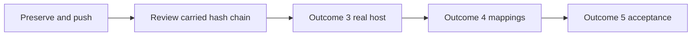

# Codex realignment resumption

## Bootstrap

Timestamp: 2026-09-07 (America/Recife). Active project is this repository;
its actual ledger is `AI_Codex/Agent_Sessions/`, not the parent workspace's
`AI_Codex/Projects/` template. Entry HEAD is `ef23d40` on
`feature/original-design-realignment`. Carry forward Outcome 3 Task 1's two
outstanding reviews; Outcomes 1 and 2 were closed by the previous session.
Intent: preserve and push all accumulated work, adapt execution to Codex,
and finish the governing outcomes in gate order.

The owner's current instruction explicitly authorizes committing and pushing
all existing work. It supersedes the old handoff's protection against staging
the two historical notes. Preserve contents of all four untracked files:

- `.superpowers/.markdownlint.jsonc`
- `AI_Codex/Implementation_Plans/2026-09-02-handoff-implementation-orchestration (copy).md`
- `AI_Codex_OrchestratorQcPlugin/Agent_Sessions/2026-09-02-121500-eval-grader-rules-with-rationale-run-2.md`
- `AI_Codex_OrchestratorQcPlugin/Agent_Sessions/2026-09-02-155800-approval-gate-defaults.md`

No tracked modifications at entry. Push only the current branch to `origin`.
No merge, release, tag, force push, or upstream mutation is authorized.

## Host adaptation

Use the repository's `root-architect-execution` contracts: root owns design,
ledger, Git; one bounded implementer at a time; fresh specification then fresh
quality reviewer; TDD and at most three failed attempts. Workers never commit,
spawn, widen scope, or contact the owner. Read parent coding-subagent rules
with this Python project's plan taking precedence over Flutter defaults.
The owner's instruction to initiate execution supplies implementation authority.

Start bounded execution and review with `gpt-5.6-luna`, effort `low`, explicit
at spawn with no inherited history. Raise effort to `medium` for demonstrated
reasoning gaps, then advance to `gpt-5.6-terra` only if evidence warrants it;
record actual selections and reasons. Root model is host-selected GPT-6.
The live collaboration API supplies explicit model and effort but no per-spawn
tool allowlist or sandbox override. Specification review receives a pre-read
source packet and uses no tools; quality review receives read/command-only
instructions. Do not claim host-enforced read-only permissions for these agents.

No quota percentages are exposed. React to any host warning or owner report;
record a safe checkpoint if limits prevent progress. Reuse unchanged evidence
explicitly, and run all six Python 3.12 suites at outcome gates.

## Progress

Bootstrap read the governing handoff, master plan, active ticket, latest session,
documentation conventions, parent startup rules, and execution contracts.
Memory registry search found no relevant project entry; no memory-derived
implementation assumptions were adopted.

- [ ] Preserve existing files, baseline, commit, and verify remote push.
- [ ] Outcome 3 Task 1: specification and quality review of `ef23d40`.
- [ ] Outcome 3 Task 2: branch-halting decision and executable evidence.
- [ ] Outcome 3 Task 3: Orchestrator contract and answer relay.
- [ ] Outcome 3 Task 4: first real host adapter.
- [ ] Outcome 3 Task 5: real run capture.
- [ ] Outcome 3 Task 6: full gate.
- [ ] Outcome 4: host mappings, enforcement disclosures, available smokes.
- [ ] Outcome 5: product flow, consolidation, acceptance and documentation.
