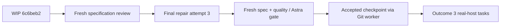

# Handoff to GPT-5.6 Sol

Continue the original-design realignment under the
[master plan](../Implementation_Plans/2026-09-04-original-design-realignment-master-plan.md)
and [adapted protocol](../Architecture/Protocols/2026-09-07-codex-execution-protocol.md).
Use GPT-5.6 Sol as requested in the owner's final instruction; verify callable
model IDs rather than assuming a GPT-6 Sol alias exists.

## Exact resumption point

- Accepted feature branch: `feature/original-design-realignment`, `8e37252`.
  Task 3b.2b passed specification and quality review; 534 scripts tests passed.
- Incomplete Task 3b.2c: **attempt 2 of 3**, preserved and pushed as `6c6beb2`
  on `wip/outcome-3-task-3b2c-quota-checkpoint`. Root reproduced 127 focused and
  540 scripts tests passing. Specification review was interrupted; no quality
  verdict exists. Green tests do not close this task.
- Implementation checkout: `/tmp/oqc-codex-realignment-20260907`, clean at that
  WIP commit when checked. Prefer a durable checkout from the remote WIP branch.
  The original `/mnt/DATA/Projects/Personal/orchestration-quality-control` has
  older staged ledger edits and Git object ownership problems. Preserve it;
  do not reset or overwrite it to synchronize.
- These two new handoff/protocol notes live in the original workspace and are
  uncommitted. They are not included in `6c6beb2`.

## Next bounded work

Review `git diff 8e37252..6c6beb2` and the latest session/packet in the WIP
checkout. Finish a fresh specification review before spending the remaining
implementation attempt. Task 3b.2c owns `oqc.py`, `compile_prompt.py`,
`adapter_port.py`, `fake_adapter.py` and their four corresponding test modules
under `orchestration-quality-control/scripts/`.

Known missing evidence: invalid/stale/duplicate answers leave JSONL unchanged;
zero-budget retry rejection and stop acceptance; repeated post-answer failure
and question handling; budget/attempt continuity; reload with a fresh seeded
FakeAdapter followed by resume; live/replay/verify equality and hashes; question
relay rejection and counter continuity. Restore the weakened empty-mailbox
status assertion and stale API docs/tests. Check blocked `drive` re-entry against
the packet's explicit prohibition on dispatching untouched siblings. Treat
these as review targets, not a completed defect audit.

Use `/usr/local/bin/python3.12` with
`PYTHONPATH=orchestration-quality-control/scripts:orchestration-quality-control/scripts/tests`.
Focused: unittest the four owned test modules. Full scripts:
`-m unittest discover -s orchestration-quality-control/scripts/tests -p 'test_*.py'`.
Run `git diff --check`; use the packet's six-suite baseline at outcome closure.

Start this coupled lifecycle repair above Luna/low, using the protocol's
complexity routing and the prior failed attempts as evidence. Consider Astra/high
for final integrated acceptance before marking Task 3b complete and committing.
Delegate exact Git mechanics to GPT-5.5/low using the protocol's Git schema.
Do not launch a Git worker until root has fixed the allowlist and acceptance.

Outcome 3 real-host transport, captured real run and full gate remain unstarted;
Outcomes 4 and 5 remain pending. No release or merge is authorized. A minor
vacuous assertion in `test_run_state.py` was explicitly accepted as residual
coverage debt at the preceding task's attempt cap; do not silently reopen it.

The owner reported 7% remaining and an 11:49 AM reset; the quota window was not
specified. The prior run conservatively paused and preserved WIP. Verify current
availability before resuming substantive work.
