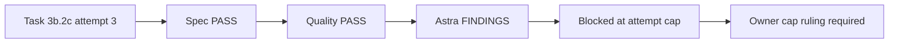

# Task 3b Astra blocker handoff

## Checkpoint — 2026-09-07 04:03 PM -03

Checkout: `/tmp/oqc-codex-realignment-20260907`, branch
`wip/outcome-3-task-3b2c-quota-checkpoint`, accepted base `8e37252`, WIP base
`6c6beb2`. Preserve the original workspace and its staged/uncommitted ledger
files. The current working tree contains the root-owned session update plus the
attempt-3 product/test delta; nothing has been committed or pushed in this run.

Attempt 3 Sol/medium repaired the previously known Task 3b.2c findings. Fresh
Luna/low specification and independent Terra/medium quality reviews passed.
Quality reran 137 focused and 550 complete scripts tests and `git diff --check`;
all passed. Astra/high then found a load-bearing integrated defect:

- whitespace-only worker `question_id` or `prompt` passes the checked-in worker
  result schema and `gate_result`;
- `drive` appends `awaiting-user-input` before FakeAdapter rejects the relay;
- later answers, including stop, cannot bind to the blank question context, so
  the persisted run is unanswerably waiting.

Required narrow correction if the owner explicitly authorizes a cap exception:
reject whitespace-only worker question identifiers and prompts at the gate,
with a gate regression and a composed `drive` regression proving no waiting
status or question append. Treat it as the fourth logical repair of the
attempt-capped Task 3b boundary; do not rename it to reset the count. Then rerun
fresh specification, independent quality, Astra scoped acceptance, focused and
complete scripts suites. Only after all pass may Task 3b.2c/Task 3b be checked,
committed and pushed to the verified feature branch through the Git worker.

No Task 4 real-host work, merge, release or tag is authorized. Current quota
percentages remain unavailable from this host; this stop is the attempt-cap
gate, not a quota claim.

## Resumed — 2026-09-07 04:06 PM -03

The owner authorized the narrow cap exception. Root resumed only the gate-side
nonblank validation and its gate/composed-drive regressions under the ruling in
the active session ledger.

## Resolved — 2026-09-07 04:15 PM -03

The narrow repair passed fresh specification, independent quality and scoped
Astra acceptance. Task 3b may be committed; Task 4 real-host work remains next.
