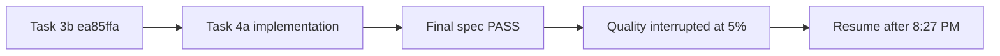

# Task 4a quota handoff

## Safe checkpoint — 2026-09-07 04:36 PM -03

Work in `/tmp/oqc-codex-realignment-20260907` on
`wip/outcome-3-task-3b2c-quota-checkpoint`. Accepted feature/remote checkpoint:
`ea85ffa54e61fbfe98cb0ee0bdfbd830465e4c2e` (Task 3b PASS). Preserve the
original workspace and its pre-existing staged/uncommitted ledger state.

Task 4 was split in the execution packet into 4a transport, 4b AdapterPort
composition and 4c policy hook. Task 4a owns new `scripts/claude_transport.py`
and `scripts/tests/test_claude_transport.py`. Terra/medium consumed three
attempts. Final worker evidence: 10 focused and 562 complete scripts tests pass;
diff check clean. Fresh final Luna/low specification review PASS.

The implementation is an offline injected-runner contract: shell-free explicit
Claude CLI argv, native init/result/resume session continuity, exact Agent
tool-use evidence, checked-in worker schema validation, frozen raw/parsed stream
evidence, generated-agent model/effort validation and no mailbox writes. The
accepted residual is that runner exceptions/nonzero exits cannot return a
`ParsedClaudeStream`; the injected runner must persist process evidence. Carry
this into Task 4b and Task 5.

The owner reported 5% remaining with an 8:27 PM reset but did not label the
quota window. Root interrupted the Terra/medium quality reviewer before it
returned a verdict. Do not infer PASS. Resume with a fresh independent quality
review: run focused `test_claude_transport`, complete scripts discovery and
`git diff --check`; independently probe argv, init/final/resume identity,
duplicate/malformed/wrong Agent/tool ID, schema rejection, immutable rejected
evidence, nested blank/inherit settings, and invocation-counter failure purity.
If PASS, checkpoint Task 4a narrowly before Task 4b. No real Claude model call,
Task 4b/4c, merge, release or tag has been authorized or started.
