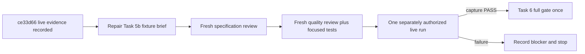

# Task 5b live-fixture handoff

Continue Outcome 3 under the
[execution packet](../Implementation_Plans/2026-09-07-codex-execution-packet.md)
and [master plan](../Implementation_Plans/2026-09-04-original-design-realignment-master-plan.md).

## Cold-start state

- Checkout: `/mnt/DATA/Projects/Personal/agent-stack/plugins/orchestration-quality-control`
- Branch: `feature/original-design-realignment`
- Current checkpoint before this handoff commit: `ce33d66665452d445474090525f64697b44be776`
- Remote relation at checkpoint: local branch is seven commits ahead of
  `origin/feature/original-design-realignment`, with no remote-only commits.
- Accepted repair: `2641a03` pins the Claude 2.1.234 subagent model through
  `CLAUDE_CODE_SUBAGENT_MODEL`, accepts additive common hook metadata and the
  optional boolean `run_in_background`, and retains strict inner tool/result
  validation. Its focused validation was 74 tests PASS with clean diff.
- Latest ledger checkpoint: `ce33d66` records the final authorized live-run
  failure. No Task 5b capture has been accepted and Task 6 has not started.
- Governing checkboxes remain: Task 5a complete; Task 5b, Task 5, and Task 6
  incomplete. Outcome 4 must not start.

## Preserved owner-owned dirty paths

Do not edit, stage, reset or delete these unless the owner explicitly places
one in a later brief:

- `AI_Codex/Agent_Sessions/2026-09-07-codex-realignment-resumption.md`
- `.agents/`
- `.codex/`
- `AI_Codex/Agent_Sessions/2026-09-07-gpt-5-6-sol-handoff.md`
- `AI_Codex/Architecture/Protocols/2026-09-07-codex-execution-protocol.md`
- `orchestration-quality-control/schemas.permission-backup-20260908-0142/`

## Exact live evidence

The final authorized run used Claude Code `2.1.234`, native session
`adb8e48a-5990-4968-8f2f-b53bc1e0bfd8`, and real `claude-opus-4-6`
inference. It proved:

- the top-level Orchestrator used `claude-opus-4-6`;
- exact native workers `agent-author-first` and `agent-author-second` ran;
- both subagent transcripts report `claude-opus-4-6`;
- `Agent` and schema-shaped `StructuredOutput` passed the repaired hook.

It did not prove the planned lifecycle. The first worker returned `passed`
because the live engine brief contains only structural metadata and never asks
attempt 1 to return `failed` with an engine-authorized question. The engine
then ran task two, and the controller correctly raised:

`Blocked: first worker did not return a valid engine-authorized awaiting state`

No durable directory exists at
`AI_Codex/Agent_Evidence/2026-09-08-task5b-live`. Do not reconstruct or bless a
capture from the failed run.

Evidence paths:

- Parent transcript:
  `/home/monolith/.claude/projects/-mnt-DATA-Projects-Personal-agent-stack-plugins-orchestration-quality-control-orchestration-quality-control-scripts/adb8e48a-5990-4968-8f2f-b53bc1e0bfd8.jsonl`
- Worker transcripts: the two JSONL files under that session's `subagents/`
- Ephemeral worker artifacts:
  `/tmp/oqc-task5b-final.XpmT1v/artifacts/`

## Next bounded task

Repair only the live fixture semantics. The implementation must ensure that
the actual brief reaching `agent-author-first` says:

- task-first attempt 1 returns `outcome: failed`, a nonblank critique, and the
  exact engine-authorized question expected by the accepted fixture;
- task-first attempt 2 returns `outcome: passed` after the approved retry
  answer is present;
- task-second attempt 1 returns `outcome: passed` only after task first passes.

The likely ownership boundary is
`orchestration-quality-control/scripts/claude_capture.py` and
`orchestration-quality-control/scripts/tests/test_claude_capture.py`, widening
to `test_claude_capture_run.py` only if a focused reproduction proves the
controller-facing seam needs coverage. Do not weaken the engine, transport,
hook, identity, schema, mailbox, capture or verification contracts.

Before dispatch, re-read the live transcript and inspect the generated worker
definitions at `compile_task_5b_seam()`. Write a root-architect brief with the
exact read/write paths and focused acceptance command. The previous owner's
TDD suspension and Luna-one-failure routing applied only to the prior session;
do not silently carry those session-only exceptions forward. Use the governing
skill defaults unless the owner renews an exception.

After implementation, require fresh specification PASS, then a different
fresh quality PASS running only the reachable Claude capture/controller tests
and `git diff --check`. Commit the accepted fixture repair narrowly. Do not run
the complete suite yet.

Only after that repair is accepted may root request explicit authorization for
one new authenticated live run with a fresh `/tmp` artifact directory and the
still-absent durable capture target. If the capture verifies with native
provenance, mark Task 5b and Task 5 complete and run Task 6's full six-suite
baseline exactly once, followed by its independent acceptance review. Push the
verified feature branch only as allowed by the packet; do not merge, release or
tag.

## Current availability

The latest owner screenshot shows 27% thread context remaining and both the
five-hour and seven-day usage windows fully available. Treat the handoff as a
cold-start safety checkpoint, not evidence that work must wait for quota reset.
