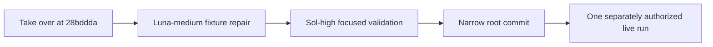

# Task 5b live-fixture repair

## First owner report

branch: feature/original-design-realignment
session path: AI_Codex/Agent_Sessions/2026-09-08-225026-task-5b-live-fixture-repair.md
preserved dirty paths: AI_Codex/Agent_Sessions/2026-09-07-codex-realignment-resumption.md; .agents/; .codex/; AI_Codex/Agent_Sessions/2026-09-07-gpt-5-6-sol-handoff.md; AI_Codex/Architecture/Protocols/2026-09-07-codex-execution-protocol.md; orchestration-quality-control/schemas.permission-backup-20260908-0142/
baseline:
  command: full suite deferred by owner override to the final completion-and-clean gate
  counts: not run
worker model routing: gpt-5.6-luna medium; escalate to gpt-5.6-terra medium on first failed implementation attempt
reviewer model routing: one final gpt-5.6-sol high focused validation; root runs no validation
task 1 started: no

### Progress — takeover — 2026-09-08 22:50:26 -03

Root confirmed the expected branch and preserved dirty paths. `HEAD` is
`28bddda`, the committed handoff itself, eight commits ahead of origin and one
commit beyond the handoff's pre-handoff checkpoint `ce33d66`; no conflicting
product drift was found.

### Progress — live evidence ruling — 2026-09-08 22:50:26 -03

Root re-read the failed parent and worker transcripts. The generated worker
prompt explicitly told attempt 1 that no actionable content existed, so the
worker returned skip and the Orchestrator projected it as passed. Ruling: repair
only generated live-fixture semantics in `claude_capture.py`, with focused
controller coverage; changing engine, adapter, schema, hook, or capture
verification contracts is out of scope.

### Progress — owner override — 2026-09-08 22:50:26 -03

Routine duplicate spec/quality stages are suspended for speed. A focused test
must cover this behavioral repair; after implementation, one fresh Sol-high
validation worker will inspect the diff and run the reachable focused command.
The full suite is reserved for the final outcome completion-and-clean gate.

### Progress — implementation dispatch — 2026-09-08 22:51:00 -03

Task: repair Task 5b generated live-fixture semantics. Dispatched attempt 1 of
3 to `gpt-5.6-luna` at medium effort, owning only `claude_capture.py` and its
focused capture tests. It must prove the real generated worker definitions
encode failure/question, retry-pass, and dependent-pass behavior without
weakening existing boundaries.

### Progress — implementation returned — 2026-09-08 22:56:00 -03

Luna-medium attempt 1 returned DONE within scope. TDD evidence: the focused
29-test command first produced one expected failure, then passed all 29 after
the repair; `git diff --check` was reported clean. Root accepted the report for
independent validation, with no escalation because the implementation attempt
itself completed successfully.

### Progress — focused validation dispatch — 2026-09-08 22:57:00 -03

Dispatched one fresh `gpt-5.6-sol` high quality validator, per owner override,
to check the two-file diff against the Task 5b lifecycle requirements and rerun
only the reachable 29-test capture/controller command plus `git diff --check`.

### Progress — model precedence evidence — 2026-09-08 22:58:00 -03

Root read `/mnt/DATA/Projects/Personal/AI_Codex/Knowledge/Model_Precedence.md`.
Ruling: it does not alter Codex worker routing. It confirms the failed live
host's Claude Code 2.1.234 uses the pre-2.1.251 precedence where
`CLAUDE_CODE_SUBAGENT_MODEL` wins, consistent with accepted commit `2641a03`;
the v2.1.257 FORCE mechanism is unavailable to that recorded host version.

### Progress — focused validation returned FINDINGS — 2026-09-08 23:06:00 -03

Sol-high reran 29 focused tests PASS and `git diff --check` clean, but found a
load-bearing identity-binding defect: production and its regression test pair
task IDs with agent specs through unrelated mapping iteration order, allowing a
legal reordered mapping to swap lifecycle prompts while the test still passes.
Root accepted the finding.

### Progress — Terra escalation dispatch — 2026-09-08 23:07:00 -03

Per owner override, the first failed validation escalates the focused repair to
`gpt-5.6-terra` medium. The worker must add an order-independent RED, bind each
agent through its task node role, and rerun only the 29-test focused command.

### Progress — TDD suspension — 2026-09-08 23:08:00 -03

The owner explicitly instructed `no tdd`. Root interrupted Terra before it
changed files. Ruling: apply the validator's direct semantic role-binding fix,
adjust the existing focused regression assertion without a RED cycle, run the
focused command once, then return to Sol-high validation.

### Progress — focused fix returned — 2026-09-08 23:12:00 -03

Terra-medium attempt 2 returned DONE after applying only Sol's instruction:
task nodes now resolve agent specs through their roles, and the existing
observable prompt test uses the same semantic binding. TDD was not used under
the owner's conditional policy; the single focused run passed 29 tests and
`git diff --check` was reported clean.

### Progress — focused revalidation dispatch — 2026-09-08 23:13:00 -03

Returned the exact two-file fix to the same Sol-high validator for a scoped
finding recheck and one rerun of the 29-test command plus `git diff --check`.

### Progress — session-wide TDD suspension — 2026-09-08 23:14:00 -03

The owner clarified that TDD is suspended for this entire session. No further
RED-first cycle will be dispatched; use direct focused changes followed by one
focused validation. The Luna RED predates this clarification and remains only
as recorded historical evidence.

### Progress — focused revalidation PASS — 2026-09-08 23:16:00 -03

Sol-high returned PASS with no findings. It reran the reachable capture and
controller surface: 29 tests passed with zero failures/errors; `git diff
--check` exited zero. The mapping-order defect is resolved.

### Checkpoint — Task 5b live-fixture semantic repair

time: 2026-09-08 23:16:00 -03
task: Task 5b live-fixture semantic repair
attempt: 2 of 3
worker model: gpt-5.6-terra
worker effort: medium
spec validator: suspended by owner override
quality reviewer: gpt-5.6-sol high — PASS
commands:
  command: PYTHONDONTWRITEBYTECODE=1 PYTHONPATH=orchestration-quality-control/scripts /usr/local/bin/python3.12 -m unittest orchestration-quality-control/scripts/tests/test_claude_capture.py orchestration-quality-control/scripts/tests/test_claude_capture_run.py
  counts: 29 passed, 0 failures, 0 errors
  command: git diff --check
  counts: clean
commit hash: pending
next: request one new explicit authenticated Task 5b live-run authorization; no full suite until the final outcome completion-and-clean gate

### Progress — validator routing correction — 2026-09-08 23:17:00 -03

The owner reserved Sol-high only for the high-profile final done-and-clean
gate. Root used Sol too early on this repair checkpoint and will not repeat it.
Routine focused validation now starts on Luna-medium, escalating to
Terra-medium only after failure; Sol-high returns only after a successful live
capture when the full-suite outcome gate is ready.
