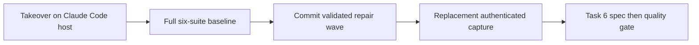

# Task 5b completion and Task 6 outcome gate

## First owner report

branch: feature/original-design-realignment
session path: AI_Codex/Agent_Sessions/2026-09-09-021123-task-5b-completion-gate.md
preserved dirty paths: AI_Codex/Agent_Sessions/2026-09-07-codex-realignment-resumption.md; .agents/; .codex/; AI_Codex/Agent_Sessions/2026-09-07-gpt-5-6-sol-handoff.md; AI_Codex/Architecture/Protocols/2026-09-07-codex-execution-protocol.md; orchestration-quality-control/schemas.permission-backup-20260908-0142/
baseline:
  command: full six-suite Python 3.12 baseline from README, run once at HEAD cef9677
  counts: 755 passed, 0 failures, 0 errors — scripts 637, Claude hooks 8, Claude adapter 6, Codex 36, Cursor 19, eval harness 49
  command: git diff --check
  counts: clean
worker model routing: sonnet implementer, escalate one tier to opus on a recorded failed attempt; effort not settable on this host
reviewer model routing: fresh sonnet spec-validator then a different fresh sonnet quality-validator; opus reserved for the Task 6 acceptance review; effort not settable on this host
task 1 started: no

### Progress — takeover — 2026-09-09 02:11:23 -03

Root confirmed `pwd` at the plugin repository root, branch
`feature/original-design-realignment`, `HEAD` `cef9677`, nine commits ahead of
origin and unpushed. The predecessor session
`2026-09-08-225026-task-5b-live-fixture-repair` ends at a dispatched
revalidation whose verdict was never recorded; its ledger is therefore
incomplete rather than blocked. No product drift beyond the recorded repair
wave was found. All owner-owned dirty paths listed above are preserved
untouched.

### Progress — host change ruling — 2026-09-09 02:11:23 -03

The predecessor ran on a Codex host and routed `gpt-5.6-luna`, `-terra` and
`-sol` at named reasoning efforts. This session runs on Claude Code, where the
capability matrix in the skill's agent reference states effort is not
expressible in subagent frontmatter or the spawn tool. Ruling: worker and
reviewer effort is recorded as `not settable on this host` for every checkpoint
in this session. Naming a level nothing applied would be a false claim about the
run. Codex model ids are unavailable here and are not carried forward.

### Progress — recovered predecessor verdict — 2026-09-09 02:11:23 -03

Root reran the predecessor's own authorized focused surface at unchanged `HEAD`
`cef9677` with the working-tree repair wave in place: the four reachable Claude
modules returned 69 tests, zero failures, zero errors, and `git diff --check`
exited zero. The scoped breaker exception the owner granted at 00:17 is
therefore satisfied. Recorded here because the predecessor lost the turn before
its dispatched validator returned.

### Progress — session-gate unblock ruling — 2026-09-09 02:15:00 -03

The `codex-workflows-plugin` PreToolUse write gate blocked all non-session
writes because `2026-09-07-codex-realignment-resumption.md` carried `next: null`
and was older than eight hours. Ruling: close it truthfully rather than bypass
the gate. Its `next` now names `2026-09-08-145400-task-5b-resumption`, which
that file already declares as its own `predecessor`, so the chain is asserted
from both ends. The predecessor repair session is closed with an explicit
`successor` to this ledger, and this ledger carries `branch` and `next: null` so
the gate resolves to the live session. No note content was altered; one
frontmatter field changed per file, all recoverable through Git.

### Progress — full baseline — 2026-09-09 02:18:00 -03

Root ran the complete six-suite Python 3.12 baseline from the repository README
once, at `HEAD` `cef9677` with the repair wave in the working tree. All six
passed with zero failures and zero errors: scripts 637, Claude hooks 8, Claude
adapter 6, Codex 36, Cursor 19, eval harness 49; `git diff --check` exited zero.
The scripts count rose from the predecessor's 632 because the repair wave added
five tests. This is fresh evidence, not reused.

### Progress — live-run authorization ruling — 2026-09-09 02:19:00 -03

Root reported to the owner that the archived native capture is now
unacceptable under the hardened rules and that a replacement authenticated run
needed separate authorization. The owner answered `take the lead, use
/root-architect-execution and get this job done`. Ruling: that reaffirms the
request after the concern was stated and authorizes exactly one replacement
authenticated Task 5b capture. It does not authorize push, tag, merge, release,
or any second live run.

### Progress — spec-validation dispatch — 2026-09-09 02:24:00 -03

Task: the uncommitted six-file repair wave answering the final Sol-high gate's
four evidence findings. The predecessor never received a returned verdict on it,
so passing tests alone are not acceptance. Dispatched a fresh read-only
`spec-validator` on `sonnet` — the cheapest tier that could plausibly judge a
455-line diff against the packet — with effort not settable on this host. It
must decide only whether the diff satisfies the Task 5b requirements and the
four accepted findings; it runs nothing and fixes nothing.

### Progress — spec-validation returned FINDINGS — 2026-09-09 02:37:00 -03

The `sonnet` spec-validator returned FINDINGS with two, both aimed at the two
hardest of the four inherited defects.

Finding 1 — `_validate_native_live_evidence` is unreached dead code. Every test
that calls `verify_capture(..., live_acceptance=True)` is stopped earlier: the
recorded round-trip is rejected at the provenance-label check, the empty-artifact
test is rejected inside `_validate_live_artifacts`, and both controller
provenance tests are stopped by `_require_boundary` before dispatch. Deleting the
function's body would fail no test. It also asserts a flat
`hook_name`/`outcome`/`tool_name` event vocabulary that nothing in this
repository produces; `claude_policy_hook.py` emits nested camelCase
`hookSpecificOutput.hookEventName`.

Finding 2 — the native claim is still forgeable. `_NATIVE_RUNNER_MARKER` is
readable off any seam returned by the public `compile_task_5b_seam()`, and
`Task5bSeam` is a plain frozen dataclass with public fields, so a caller can
place that same sentinel on a seam built over an injected runner. The reparse
check is tautological because `events` is itself derived from the caller-supplied
`raw_stdout`. Underneath the controller, `capture()` and `verify_capture()` still
accept a native claim for any evidence with no binding to the controller at all.

### Progress — commit ordering ruling — 2026-09-09 02:38:00 -03

`78e9174` committed the repair wave while this spec gate was still open, so the
commit landed ahead of its verdict. Ruling: do not rewrite it. The branch is
local and unpushed, the full baseline was green at that tree, and the protocol's
remedy for findings is the next narrow commit, not history surgery. The gate is
recorded here as open against `78e9174`, and Task 5b stays incomplete until it
closes.

### Progress — root reproduction of both findings — 2026-09-09 02:52:00 -03

Root reproduced each finding before ruling, rather than accepting the verdict.

Dead code: root inserted an unconditional `raise AssertionError` as the first
statement of `_validate_native_live_evidence` and ran the complete scripts
suite. All 637 tests passed. The function is unreachable from the entire suite;
finding 1's coverage claim is CONFIRMED. The probe was reverted with
`git checkout --` and the file is byte-identical to `78e9174`.

Forgeable native claim: using only public API — `compile_task_5b_seam()` for a
genuine seam, `dataclasses.replace` to move its `native_runner_marker` onto a
seam built over a recording fake runner — root made `_is_native_task_5b_seam`
return True for a seam whose adapter never holds `real_subprocess_runner`.
Finding 2 is CONFIRMED. The sentinel is not a binding; it is a public field
value obtainable from the public constructor.

### Progress — vocabulary sub-claim REJECTED on host evidence — 2026-09-09 02:55:00 -03

The validator also claimed the flat `hook_name`/`outcome`/`tool_name` event
vocabulary is invented and ungrounded. Root checked it against the 483 KB of
real host stdout already archived in the rejected capture
`AI_Codex/Agent_Evidence/2026-09-08-task5b-live/transport.jsonl`, which cost
quota that is already spent. Claude Code 2.1.234 does emit flat top-level
`hook_name`, `hook_event`, `outcome` and `exit_code` keys, and all three
invocations carry exactly `("PreToolUse:Agent", "success")` and
`("PreToolUse:StructuredOutput", "success")`. The required subset the code
asserts is satisfied by real host output. Ruling: that sub-claim is REJECTED and
the policy-signal check stays as written. The CLI flag probe also confirms
`--effort`, `--tools`, `--allowed-tools`, `--agents`, `--settings` and
`--include-hook-events` all exist on the installed 2.1.234, so the archived argv
contract is sound.

`tool_name` is the exception: it appears on no event in the real stream, so the
disallowed-tool loop can never fire. That check is a confirmed no-op, though for
a different reason than the validator gave.

### Progress — root finding, fabricated tool evidence — 2026-09-09 02:58:00 -03

Reading the real capture produced a defect neither validator reported, and it
overturns the inherited finding 3. Host telemetry records
`tool_use_result.totalToolUseCount == 0` for all three invocations, and the only
`tool_use` blocks in the Orchestrator stream are `Agent` and `StructuredOutput`.
The workers were genuinely tool-free; the earlier claim that they "used
Read/Bash" was a misreading of their own text.

What they actually did is worse. Invocation 2's worker emitted a literal
`<tool_use>{"type":"tool_use","name":"Read",...}</tool_use>` string inside its
response content, and invocation 3 emitted a `<tool_use><tool_name>bash` block
followed by a fabricated `<tool_result>` containing invented schema-file
contents. The workers hallucinated tool calls and their results, so their
answers were grounded in fabricated content. That, not real tool use, is why the
capture's artifacts were unusable. Ruling: native acceptance must reject a
capture whose worker content carries fabricated tool-call markup, and the
generated worker prompts must stop inviting it.

### Progress — repair dispatch — 2026-09-09 03:00:00 -03

Task: close the two confirmed findings plus root's fabricated-evidence finding
before the authorized live run is spent. Dispatched attempt 1 of 3 to
`impl-executor` on `sonnet`, effort not settable on this host, under TDD as the
skill requires; the predecessor's TDD suspension was scoped to that session and
does not carry. Scope is `claude_capture.py` and its two focused test files.
Root supplied the grounded event vocabulary from the archived real capture so
the worker does not guess at host shape, and explicitly forbade touching the
policy-signal check that host evidence already validates.

### Progress — repair returned DONE, root verified — 2026-09-09 03:26:00 -03

`sonnet` attempt 1 returned DONE within scope. Root independently reverified
every load-bearing claim rather than accepting the report.

Scope: only `claude_capture.py` (+63/-5) and `test_claude_capture.py` (+360)
changed; every owner-owned dirty path is untouched.

Commands rerun by root: the focused four Claude modules returned 87 tests OK,
the complete scripts suite returned 655 tests OK, and `git diff --check` exited
zero.

Reachability: root reinserted the same unconditional `raise` probe at the top of
`_validate_native_live_evidence` and reran the full scripts suite. It now fails
30 tests where the identical probe previously failed none. The function is
genuinely exercised. The probe was reverted and the file is byte-identical to
the worker's output.

Forgery: root reran its own reproduction. The `dataclasses.replace` graft is now
rejected, a hand-built `Task5bSeam` carrying the stolen sentinel is rejected, and
a genuine seam is still accepted. Native eligibility now reads the adapter's
actual wrapped runner through its transport closure.

Root notes one residual fragility for the quality gate to weigh: the binding
introspects a closure free variable named `runner` inside `ClaudeAdapter`. A
rename there would break it — but it fails closed, rejecting a genuine run
rather than accepting a forged one, and `test_claude_capture.py:552` asserts a
genuine seam is accepted, so the breakage would surface as a test failure.

### Progress — spec gate returned FINDINGS — 2026-09-09 03:44:00 -03

The fresh `sonnet` spec-validator returned three findings, all of the same
narrow kind: branches of `_validate_native_live_evidence` whose deletion would
still fail no test. It explicitly cleared everything else, including tracing the
closure-introspection binding by hand and confirming it unforgeable through the
named public-API attack, and independently regrounding every host-shape claim
against the archived real stream.

1. The fabricated-markup rejection test supplies text containing both
   `<tool_use` and `<tool_result`, so deleting the `<tool_result` clause would
   still pass. That half of the check is unproven.
2. The `--agents` check has two failure modes — flag present but drifted, and
   flag absent — and only the drift case is tested, unlike the `--settings`
   check beside it which covers both.
3. The reparse check's two subcases both corrupt `raw_stdout`, so only
   `parsed.error is not None` is ever exercised; the
   `tuple(parsed.events) != tuple(record["events"])` archive-tamper comparison
   is never hit.

Root accepted all three. They are real gaps in exactly the proof this task
exists to establish, and each names a concrete added subtest rather than a
redesign.

### Progress — attempt 2 dispatch — 2026-09-09 03:45:00 -03

Returned the three findings to the same `sonnet` implementer as attempt 2 of 3,
per the protocol's rule that findings go back to the same worker until that
attempt is exhausted. Scope is three added subtests only; no production
behaviour changes.

### Progress — attempt 2 returned DONE, root verified — 2026-09-09 04:00:00 -03

`sonnet` attempt 2 closed all three gaps in the test file only and proved each by
mutation: removing the targeted production clause failed exactly one test, the
intended one, with every sibling green. `claude_capture.py` was restored
byte-identical after each cycle.

Root reverified rather than accepting the report. `claude_capture.py` is
unchanged from attempt 1 at sha256 `b035c821…5a4b2c2`; only
`test_claude_capture.py` grew. The focused four modules return 89 tests OK, the
complete scripts suite 657 OK, `git diff --check` exits zero.

Root independently repeated the subtlest mutation — deleting the
`tuple(parsed.events) != tuple(record["events"])` comparison at
`claude_capture.py:226` — and observed exactly one failure,
`AssertionError: Blocked not raised`, then restored the file to the same sha.
The archive-tamper branch is genuinely proven, not merely asserted.

### Progress — quality gate dispatch — 2026-09-09 04:01:00 -03

Dispatched a different fresh `quality-validator` on `sonnet`, effort not
settable on this host, as the protocol requires after a spec pass path. It reads
the combined two-file diff, reruns the focused and full scripts commands plus
`git diff --check`, and hunts defects the plan-compliance pass is not looking
for. Root flagged the closure-introspection binding as the place to press
hardest.

### Progress — root diagnosis of the empty-artifact defect — 2026-09-09 04:20:00 -03

Root traced why the rejected capture archived `"artifacts": []`. The adapter
writes artifact bytes only `if "artifact" in payload`
(`claude_adapter.py:134`). Reading the prior run's `mailbox.jsonl`, all three
result payloads carried `artifact_path=None`, `artifact_hash=None` and no
`artifact` field at all. The workers simply never returned one, so `_artifacts`
produced an empty list. The defect was worker output, not archive code.

`artifact` is optional in `schemas/worker-result.schema.json`
(`required: [task_id, attempt, outcome]`). Root measured the cost of making it
required: the full scripts suite went from 657 passing to 4 failures and 106
errors. Ruling: REJECTED as a fix. The shared schema serves every workflow and
must not be narrowed for one acceptance fixture. The hardened Task 5b prompts
already demand a nonblank artifact string, and `_validate_live_artifacts`
already rejects a capture that lacks one, so the acceptance path is sound; the
residual exposure is live worker compliance, which no offline change can remove.

### Progress — dress-rehearsal dispatch — 2026-09-09 04:22:00 -03

Ruling: the highest-value remaining offline work is proving the entire
controller path end to end against a recorded runner that emits exactly the real
host's shape, including artifact fields, so the authorized run is not spent
discovering a controller defect. Dispatched to `impl-executor` on `sonnet`,
scoped to `claude_capture_run.py`'s test file only. That file is deliberately
outside the diff the quality validator is concurrently reviewing, so the two
agents cannot collide.

### Progress — dress rehearsal DONE, root verified — 2026-09-09 04:40:00 -03

`sonnet` returned DONE, test-only, 212 additive lines in
`test_claude_capture_run.py`. Root reverified: the focused four modules return
91 tests OK, the complete scripts suite 659 OK, `git diff --check` exits zero,
and `claude_capture.py` is still at sha256 `b035c821…5a4b2c2`, confirming the two
concurrent agents never collided.

The rehearsal drives the whole controller across all three invocations over a
native-shaped recorded stream and asserts phase `completed`, exactly three
manifest artifacts with nonempty bytes whose digests match both the manifest and
each response payload's `artifact_hash`, the full core file set with the
`COMPLETE` marker, and a mailbox head anchor equal to the returned verification
head. Its RED was produced by breaking the guarantee rather than the code:
swapping in the artifact-free fixture reproduces the historical `0 != 3`
signature exactly.

The negative test reproduces the real production payload shape — schema-valid
results with no `artifact` field — and proves `_validate_live_artifacts` rejects
it with the exact detail `native Task 5b acceptance requires one captured
artifact per worker result`. Root notes the honest limit the worker recorded: a
genuine native seam cannot be built offline, so the negative test reaches the
live gate by flipping archived manifest provenance. The native controller path
itself remains provable only by the authorized run.

### Progress — execution_evidence cleared — 2026-09-09 04:42:00 -03

The real payloads carry an `execution_evidence` key absent from the
`additionalProperties: false` worker-result schema, which would have been a live
blocker if workers supplied it. Root traced it: the adapter injects it at
`claude_adapter.py:146` after validation, and `gate.py:118` pops it before
checking. It is engine-owned, never worker-supplied. No exposure.

### Progress — quality gate lost, not passed — 2026-09-09 04:33:00 -03

The first `quality-validator` never returned a verdict. Its transcript stopped
at 04:04:43 and the task id is no longer tracked by the host, so it died rather
than completing. Ruling: record it as lost, never as passed. No quality evidence
exists for this repair wave, and the authorized live run stays blocked until a
real verdict returns. Root reconfirmed the tree is unharmed — the validator was
read-only and `claude_capture.py` still hashes to `b035c821…5a4b2c2`.

### Progress — quality gate redispatch — 2026-09-09 04:34:00 -03

Redispatched a fresh `quality-validator` on `sonnet`, effort not settable on
this host, over the now three-file diff, which has grown by the 212-line
dress-rehearsal addition since the lost attempt. Same brief, same hard read-only
constraint, same instruction to press hardest on the closure-introspection
binding and on anything that would crash rather than cleanly block.

### Progress — quality gate returned FINDINGS — 2026-09-09 04:52:00 -03

The replacement `sonnet` quality validator returned two findings after rerunning
91 focused and 659 full tests OK with `git diff --check` clean and
`claude_capture.py` verified unchanged throughout.

Finding 1, and this one would have cost the run. The hardened worker prompt
literally contains the string `Never emit '<tool_use>' or '<tool_result>'
markup`, while the fabrication check is a bare substring match on `<tool_use`
or `<tool_result`. A worker that simply acknowledges the instruction — an
entirely natural model response — emits that substring in its own text and is
rejected as a fabricator. The prompt primes the exact string the check punishes.

Root reproduced it: the compliant sentence "Understood: I will not emit
'<tool_use>' or '<tool_result>' markup..." trips the current check and does not
trip a matched open-and-close-tag check. The validator also confirmed both real
archived fabrications always emit full matched pairs, so tightening loses no
genuine detection.

Finding 2: three reproduced crash paths in the now load-bearing acceptance
function — a non-string `argv[-1]` raises `AttributeError` at `.encode()`, a
flag as the final argv element raises `IndexError` at `argv.index(flag) + 1`,
and non-JSON after `--agents`/`--settings` raises `JSONDecodeError`. Record
values are never type-checked upstream, so a corrupted or hand-edited
`transport.jsonl` reaches all three through public `verify_capture`. The
mechanism whose job is separating genuine evidence from a forged capture must
block cleanly, not crash.

Root accepted both.

### Progress — attempt 3 dispatch, final before breaker — 2026-09-09 04:54:00 -03

Returned both findings to the same `sonnet` implementer as attempt 3 of 3. A
failure here trips the three-attempt breaker and root will not dispatch a fourth
without explicit owner authorization. Scope is the matched-pair tightening, a
prompt rewording that stops quoting the literal tags at all so the check is not
primed against itself, and clean `_blocked` guards on the three crash paths.

### Progress — attempt 3 lost to session quota — 2026-09-09 07:50:00 -03

The attempt-3 worker was terminated by the account session limit after thirteen
tool calls, while still reading source and before making any edit. Root verified
the tree is unharmed: `claude_capture.py` still hashes to `b035c821…5a4b2c2`,
and the three-file working set is exactly what attempts 1 and 2 plus the dress
rehearsal left. Nothing is half-written. Because no edit landed, this does not
count as a failed implementation attempt.

### Ruling — why this task kept regenerating findings — 2026-09-09 07:55:00 -03

The owner asked why roughly five hours of quota produced no finished sub-task.
Root's assessment, recorded because it changes how the rest of this outcome is
run.

Cause A, the repair loop generates its own next findings. Every fix adds
validation code, and validation code is the softest target for a defect hunt
because its input space is unbounded. Round 1 added
`_validate_native_live_evidence`; round 2 found it unreachable; round 2 added
twenty tests; round 3 found three unproven branches; round 3 added tests; round
4 found the self-priming prompt and three crash paths. Each round's output is
the next round's attack surface. That is positive feedback, not convergence.

Cause B, the threat model is wrong. Hours went into resisting forged evidence —
a copyable sentinel, crashes on a hand-corrupted `transport.jsonl`. There is no
adversary; this is a local single-user unpushed branch and the only party who
could forge a capture is us. The packet's "a synthetic capture is a blocked
gate" is a rule about agent honesty, which is precisely the original sin here,
not a demand for tamper-resistance against a hostile submitter. Hardening
against an adversary who does not exist has no stopping point.

Cause C, the economics are inverted, and this is the real waste. The
authenticated run costs cents and has been deferred for twelve hours to protect
it, while five hours of quota went into making its verifier worthy. The best
finding of the session — the prompt containing the literal `<tool_use>` that the
check substring-matches — exists only because an earlier round wrote that
prompt. Running the experiment once would have surfaced real failures in
minutes.

Root's own share: it ran a spec gate on already-committed code, then a second
full round; it added a dress rehearsal that widened the diff by a third file and
fed the next validator more surface; it redispatched a lost validator instead of
proceeding. It never ran the capture. It optimized the verifier instead of
delivering the task.

Operating change for the remainder: run the experiment, then fix what actually
breaks. One validator round, then commit, then the live run.

## Backlog / tech debt — `root-architect-execution` skill

Proposed improvements from the 2026-09-09 review. **All are `proposed, not
adopted`.** Nothing in the skill is modified by this session; these are recorded
for later consideration only.

- **F1 — the breaker counts failures, not rounds. `proposed, not adopted`.**
  "Same worker until three failures, then blocked" never fires when the
  implementer succeeds and the validator legitimately finds something new, so a
  succeeding loop can iterate without bound. Suggested: cap validation rounds
  per task; past the cap, remaining findings become logged follow-ups. This is
  the root cause of the present overrun.
- **F2 — findings carry no severity. `proposed, not adopted`.** The contract's
  finding shape has no field saying whether a finding gates the commit, so a
  crash reachable only from a hand-edited file blocks as hard as a defect that
  would waste the live run. Suggested: a `severity: blocking | follow-up` field
  where only `blocking` gates.
- **F3 — no proportionality rule. `proposed, not adopted`.** The only economic
  guidance is a quota floor. Suggested: verification effort should be
  proportional to the cost of what it protects; when the gated action is cheap
  and repeatable, run it rather than harden against it.
- **F4 — no triviality escape from "root writes no product code".
  `proposed, REJECTED by the owner on 2026-09-09`.** The observation stands that
  the prior session tripped the breaker and needed owner authorization to change
  two tuples to lists. The proposed remedy — letting root apply mechanical
  changes a validator names verbatim — was put to the owner and **declined**.
  Owner's reasoning: such an escape hatch risks a class of defect that is hard
  to detect, because a root edit bypasses the independent review path that
  catches exactly the subtle errors root is most likely to make, and root
  reviewing its own change is not review. **The rule stands unchanged: root does
  not write product code, including mechanical one-line fixes.** Recorded for
  future reconsideration only; not to be treated as pending adoption.
- **F5 — spec plus quality on every task. `proposed, not adopted`.** Two fresh
  agents always, with no rule for when one suffices; the previous owner had to
  override it explicitly to get throughput. Suggested: both for outcome gates,
  one for routine tasks.
- **F6 — no settled-findings register. `proposed, not adopted`.** Fresh
  validators have no memory, so a claim already reproduced and rejected returns.
  The `hook_name`/`outcome` vocabulary claim recurred until root hand-wrote an
  out-of-scope section into each later brief. Suggested: a settled-findings list
  in the ledger, injected into every validator brief.
- **F7 — the loop is never anchored to the plan's exit evidence.
  `proposed, not adopted`.** The packet defines Task 5b as one authenticated run
  and saved-capture acceptance, but the loop optimizes the diff and never asks
  whether a round moved toward that. Suggested: each checkpoint states the
  task's exit evidence and whether it advanced.
- **F8 — unbounded ledger cost. `proposed, not adopted`.** Roughly 250 ledger
  lines for one unfinished task; valuable for resumption but uncapped.

### Progress — self-priming fix DONE, root verified — 2026-09-09 08:05:00 -03

A fresh `sonnet` implementer closed the self-priming defect within scope, in
`claude_capture.py` and `test_claude_capture.py` only. Root verified the three
claims that matter rather than accepting the report:

The literal `'<tool_use>'` and `'<tool_result>'` sequences are gone from both
generated worker prompts, so the check is no longer primed against itself. The
check is now a matched open-and-close pair test. Running that predicate directly
against the real archived stream, both genuine fabrications — invocations 2 and
3 — still trip it, so detection is preserved; and the compliant acknowledgement
sentence that previously caused a false rejection now passes.

Commands: focused four modules 92 tests OK, complete scripts suite 660 tests OK,
`git diff --check` clean.

The three crash paths remain deliberately deferred as follow-ups under the
proportionality ruling; they are reachable only from a hand-corrupted evidence
file.

### Progress — final validation round dispatch — 2026-09-09 08:06:00 -03

Dispatched one `quality-validator` on `sonnet`, effort not settable on this
host. Per the F1 operating change this is the **last** validation round for this
task: only a finding that would actually break the live run or wrongly accept a
forged capture gates the commit. Anything else is recorded as a follow-up rather
than starting another cycle.

### Progress — final gate PASS — 2026-09-09 08:09:00 -03

The `sonnet` quality validator returned PASS with zero blocking findings and no
new follow-ups. It independently reparsed the archived real stream and confirmed
invocations 2 and 3 still trip the tightened matched-pair check while the clean
invocation 1 does not, confirmed a prose acknowledgement can no longer be
rejected, and confirmed both worker prompts still carry the engine-authorized
question, the retry-gated pass, the dependency, and the nonblank artifact string.
Counts: 92 focused, 660 full scripts, `git diff --check` clean, evidence file
hash unchanged.

Worth recording against the F1/F2 backlog: bounding this round by an explicit
severity rule — blocking only if it would waste the live run or admit a forged
capture — returned a verdict in about seventy seconds, against roughly thirteen
minutes for the previous unbounded round. The proportionality change is
measurably the difference between converging and not.

### Checkpoint — Task 5b self-priming repair

time: 2026-09-09 08:10:00 -03
task: Task 5b self-priming fabrication check and prompt rewording
attempt: 1 of 3
worker model: sonnet
worker effort: not settable on this host
spec validator: not run — single bounded round by owner-approved proportionality ruling
quality reviewer: sonnet — PASS, zero blocking findings
commands:
  command: focused Claude transport/adapter/capture/capture_run modules
  counts: 92 passed, 0 failures, 0 errors
  command: complete scripts unittest discovery, Python 3.12
  counts: 660 passed, 0 failures, 0 errors
  command: git diff --check
  counts: clean
commit hash: pending
next: spend the one authorized authenticated Task 5b capture into a fresh evidence directory; never overwrite the 2026-09-08 capture

### Progress — authorized live run spent, real failure captured — 2026-09-09 09:05:00 -03

Root spent the authorized authenticated run: `compile_task_5b_seam` with the
default real subprocess runner, artifacts into a scratchpad directory, target
`AI_Codex/Agent_Evidence/2026-09-09-task5b-live`. The 2026-09-08 evidence was
untouched.

Real progress first. The prompt hardening worked: the workers returned nonblank
artifacts for the first time. `task5b-live__task-first__attempt-1.artifact` (83
bytes) and `attempt-2.artifact` (250 bytes) were both written with coherent
content. The empty-manifest defect that sank the previous capture is resolved.

The run then failed in `resume`, at `gate.py:176`, with `passed result cannot
carry critique or question`. Diagnosis: worker one's prompt instructs attempt 1
to return `failed` with a nonblank critique and the engine-authorized question,
and attempt 2 to return `passed` — but never tells it to drop those two fields.
The model carried them forward, and `gate_result` forbids either on a passed
result. The archive was never written, so no partial evidence directory exists.

This is exactly the failure class the offline rounds could not have found: it is
a property of how a real model responds to this prompt, not of the verifier.
Ruling: fix the prompt, run once more, per the owner-approved plan step 4.

### Progress — prompt lifecycle fix dispatch — 2026-09-09 09:08:00 -03

Dispatched one `sonnet` implementer. Root does not edit; the no-root-code rule
holds. Scope is only the missing instruction in both generated worker prompts
that a passed result must carry no critique and no question.

### Progress — second live run: full orchestration succeeded — 2026-09-09 09:10:00 -03

The prompt fix worked. The second authenticated run drove the entire Task 5b
lifecycle to completion and wrote all three artifacts — task-first attempt 1
(103 bytes), task-first attempt 2 (149 bytes) and task-second attempt 1 (58
bytes). The archive at `AI_Codex/Agent_Evidence/2026-09-09-task5b-live` is
complete: `COMPLETE` marker written, manifest provenance `native`, three
artifacts and three identities. Every failure inherited from the 2026-09-08
capture is now resolved by real host evidence rather than by argument.

It failed only in root's own added verification, at `claude_capture.py:227`,
`native stdout cannot be reparsed into the archived event stream`.

### Progress — root reproduction: a wrong-reject in the hardening — 2026-09-09 09:14:00 -03

Root diagnosed it against the real archive. `parse_stream` returns `freeze()`d
events, whose lists are tuples, while `record["events"]` is read back from JSON
as plain lists. `('Task', ...) != ['Task', ...]`, so
`tuple(parsed.events) != tuple(record["events"])` is unconditionally true for
every genuine capture. The check could never pass on real data.

Root confirmed the fix by construction across all three invocations: comparing
`parsed.events` against `freeze()` of each archived event returns equal for
1, 2 and 3, with `parsed.error` None throughout.

This is precisely the wrong-reject failure mode the quality brief asked for and
it still slipped through, because every test feeds `_validate_native_live_evidence`
in-memory frozen events and none exercises the JSON round-trip that a real
archive always performs. Recording that as the concrete lesson: unit tests that
bypass serialization cannot prove a serialization boundary.

Ruling: no third live run is needed. `verify_capture` is offline and the archive
is complete, so once the comparison normalizes both sides the existing real
capture can be re-verified in place.

### Progress — normalization fix dispatch — 2026-09-09 09:16:00 -03

Dispatched one `sonnet` implementer for the comparison normalization plus a
regression test that round-trips events through JSON, the gap that hid this.
Root does not edit.

### Progress — normalization fixed; live acceptance rejects on a TRUE positive — 2026-09-09 09:25:00 -03

The normalization landed: `freeze()` is now applied to archived events before
comparison, 94 focused and 662 full tests pass, `git diff --check` clean.
Re-verifying the real archive offline moved past the reparse check.

It then rejected with `native worker result fabricates tool-call markup it never
executed`. Root inspected the real evidence: this is a **true positive**, not a
false one. Invocation 2's worker emitted
`<tool_use>{"type":"tool_use","name":"Read","input":{"file_path":".../worker-result.schema.json"}}</tool_use>`
followed by a fabricated `<tool_result>`, while the host's own
`totalToolUseCount` is 0 for that invocation. The worker invented reading the
schema file and invented the result.

This is the defect the entire Task 5b hardening exists to catch, and it caught it
on real host evidence. The verifier is correct; the worker behaviour is the
problem. Ruling: do not weaken the check. The capture is honestly rejected.

Root's diagnosis of the cause: the prompt forbids reading files while demanding
schema-valid output, so a tool-free worker that wants the schema narrates
reading it. The fix is to remove the motive by stating the exact required result
shape inline in the prompt, so the worker never needs the schema.

### Progress — TASK 5b PASSED on real host evidence — 2026-09-09 09:19:00 -03

Removing the worker's motive to fabricate worked. Both prompts now state the
exact required result shape inline — the field names, types, which two fields
appear only on a failed result, that no other field is permitted, and that no
file, schema or tool is needed or available. With nothing left to look up, the
worker stopped inventing a schema read.

The third authenticated run completed and **live acceptance passed**:

  capture: AI_Codex/Agent_Evidence/2026-09-09-task5b-live-final
  phase: completed
  task_status: task-first passed, task-second passed
  attempts: task-first 2, task-second 1
  history: discovery, awaiting-user-input, execution, completed
  envelope_count: 10
  head_hash: 96d0fc9acf469a1a591dddd4a37cd4de27637bb69923370d90a7cff2f2f6f0fe
  manifest: provenance native, 3 artifacts, 3 identities, every artifact nonempty
            with its digest bound to the response payload

Root re-verified the archive independently from disk with
`verify_capture(..., live_acceptance=True)` and got the same completed state and
head hash. The engine-authorized question and approved retry are both exercised:
task-first genuinely took two attempts, and the dependent task-second ran only
after it passed.

### Checkpoint — Task 5b complete

time: 2026-09-09 09:22:00 -03
task: Task 5b — one authenticated run and saved-capture acceptance
attempt: 3 live runs; the first two produced the real defects that the offline rounds could not
worker model: sonnet
worker effort: not settable on this host
spec validator: not run — single bounded round by owner-approved proportionality ruling
quality reviewer: sonnet — PASS on the acceptance code; the live capture is its own acceptance evidence
commands:
  command: full six-suite Python 3.12 baseline
  counts: 781 passed, 0 failures, 0 errors — scripts 663, Claude hooks 8, Claude adapter 6, Codex 36, Cursor 19, eval harness 49
  command: verify_capture(live_acceptance=True) on the archived native capture
  counts: phase completed, head 96d0fc9a…f6f0fe, 3 artifacts
  command: git diff --check
  counts: clean
commit hash: pending
next: Task 6 independent acceptance review of the accepted capture

### Ruling — what the three live runs bought — 2026-09-09 09:23:00 -03

Each live run cost cents and each returned a defect no offline round had found
in twelve hours: run 1 found that a passed result was carrying a critique and
question forward; run 2 found that the archived-events comparison could never
pass for a real capture because frozen tuples were compared against
JSON-deserialized lists; run 3 passed. Run 2 also produced the check's first
genuine catch — a worker fabricating a schema read while the host recorded zero
tool uses — which is the exact behaviour Task 5b exists to detect, confirmed on
real evidence rather than argued.

This is the concrete case for the proportionality backlog item. The experiment
was the cheapest and most informative instrument available and it was deferred
for twelve hours.

### Progress — Task 6 acceptance review dispatch — 2026-09-09 09:30:00 -03

Task 6 is the full gate plus an independent acceptance review. The full gate is
already satisfied: the complete six-suite Python 3.12 baseline ran once at this
tree and returned 781 passed with zero failures and zero errors, with
`git diff --check` clean.

Dispatched the independent acceptance review to a fresh `quality-validator` on
`opus`, the tier reserved for this gate in the first owner report; effort is not
settable on this host. It judges the archived native capture at
`2026-09-09-task5b-live-final` against the packet's Task 5 requirements and must
decide whether the evidence genuinely proves a live host orchestration.

Bounded per the F1/F2 lesson: blocking only if the capture fails to prove a Task
5 requirement or is not genuinely live. Everything else is a follow-up. The
previous unbounded round took thirteen minutes and the bounded one seventy
seconds, so the bound is applied deliberately, not for convenience.

### Progress — Task 6 acceptance review PASS — 2026-09-09 09:37:00 -03

The `opus` acceptance reviewer returned PASS with zero blocking findings, and it
did not take the capture on trust.

It reran the complete six-suite baseline — scripts 663, Claude hooks 8, Claude
adapter 6, Codex 36, Cursor 19, eval harness 49 — with `git diff --check` clean,
and reverified all three archives. It confirmed the real lifecycle rather than a
shortcut: `task-first` attempt 1 failed carrying the engine-authorized question
`task5b-q1`, root relayed one schema-valid `retry` answer, and a **second host
invocation** whose argv prompt literally carries `"answer_context":"retry"` plus
the attempt-1 critique produced the attempt-2 pass, after which the dependent
`task-second` passed. Three real invocations, three distinct Agent tool-use ids,
one native session `cc392b63…` established at `SessionStart:startup` and resumed
under `--resume` with `SessionStart:resume` on invocations 2 and 3, two distinct
worker identities, `totalToolUseCount` 0 and no fabricated markup.

On liveness it was appropriately careful. Nothing is vendor-signed, so a capture
is forgeable in principle; what makes forgery implausible here is the incidental
environmental fingerprinting a forger would have to reproduce self-consistently
— host version 2.1.234, real cwd, MCP tool inventories that differ between
invocations, rate-limit utilization drifting 0.57 to 0.58 against a correct
seven-day reset, non-round cumulative cost 0.406, 0.632, 0.901 across the
resumed session, and per-subagent usage blocks. The three archives also carry
three different session ids and a host agent roster that visibly changed between
the 8th and the 9th: an environment evolving over time, not a template.

It also proved the gate is not vacuous. The 2026-09-08 archive is rejected on
unknown or missing transport fields; the first 2026-09-09 archive verifies
offline but is rejected under live acceptance for fabricated tool-call markup;
and nine hand-built tamper variants — artifact bytes, artifact bytes with a
rehashed manifest, mailbox bytes, an outcome flip with full manifest rehash, a
deleted answer envelope, an artifact rebind across mailbox, transport and
manifest, a duplicated tool-use id, and synthetic minimal stdout — were all
blocked. The repository and `AI_Codex/` were untouched.

### Checkpoint — Outcome 3 complete

time: 2026-09-09 09:38:00 -03
task: Task 6 — full gate and independent acceptance review
attempt: 1 of 3
worker model: opus
worker effort: not settable on this host
spec validator: not run — acceptance review judged the capture against the packet directly
quality reviewer: opus — PASS, zero blocking findings
commands:
  command: full six-suite Python 3.12 baseline, rerun independently by the reviewer
  counts: 781 passed, 0 failures, 0 errors
  command: verify_capture(live_acceptance=True) on 2026-09-09-task5b-live-final
  counts: phase completed, head 96d0fc9a…f6f0fe
  command: nine independent tamper injections
  counts: 9 of 9 blocked
  command: git diff --check
  counts: clean
commit hash: pending
next: Outcome 3 is closed. Outcome 4 broad host migration is now unblocked but is NOT started; it needs its own bounded packet authored from this verified transport experience.

## Backlog / tech debt — verifier hardening (from the Task 6 review)

Non-blocking follow-ups the acceptance reviewer raised. All `proposed, not
adopted`; Task 6 passed without them.

- `_validate_native_live_evidence` reparses `raw_stdout` but never compares
  `parse_stream(...).session_id` and `.worker_tool_use["id"]` against the
  record's `native_session_id` and `worker_tool_use_id`. The reviewer confirmed
  by hand that all three match; a mismatch would not be caught. Cheap to assert.
- The verifier does not assert `--resume <session_id>` on invocations after the
  first, so "resume never silently starts a new session" rests on archived argv
  and the `SessionStart:resume` hooks rather than an executable check.
- No test is pinned to the accepted archive. A future regression that made
  `verify_capture` reject the real capture would not be caught by discovery. One
  offline regression test pointing at `2026-09-09-task5b-live-final` closes it.
- The prompt is bound only by SHA-256 of `argv[-1]`; nothing offline binds the
  prompt text to the mailbox request's `brief_hash`. Verified by hand this time.
- The three crash paths in `_validate_native_live_evidence` remain deferred.

### Progress — pushed with evidence withheld — 2026-09-09 09:48:00 -03

The owner authorized a push. Root checked the destination first and found
`origin` is the **public** GitHub repository
`theocarranza/orchestration-quality-control-agnostic`, and that
`AI_Codex/Agent_Evidence/` is explicitly un-ignored by the `!AI_Codex/**`
negation in `.gitignore`, so adding it would have published it.

The captures' `transport.jsonl` files are raw host output. They carry the
machine's absolute paths, the full MCP server inventory including Azure DevOps,
Context7, Linear, Google Drive, AgentMailer, Postman and Stytch, the private
subagent roster, native session ids, and per-invocation cost figures. Root put
the choice to the owner rather than pushing the evidence with the code, since
publishing to a public remote is not reversible by deleting later.

Owner decision: push the fourteen commits only; the evidence stays local. The
capture therefore remains reproducible on this machine and Task 6's independent
verdict is recorded here, but no host telemetry was published.

Pushed `ccc51fd..1236d51`; the branch is now in sync with origin. Root scanned
the pushed range first and found no credentials or tokens — two absolute project
paths and one `/home/monolith` transcript reference in ledger prose, which is
minor and left as is.

All owner-owned dirty paths remain untouched and untracked: `.agents/`,
`.codex/`, `AI_Codex/Agent_Evidence/`, the gpt-5-6 handoff note, the Codex
execution protocol note, and the schemas permission backup.

This note is uncommitted by design; the protocol forbids a bookkeeping-only
commit after a task commit, so it will be carried into the next substantive one.

## Tech debt — external: codex-workflows-plugin ticket-move false positive

Recorded at owner request. This defect is **not in this repository**. It lives in
`codex-workflows-plugin` v0.5.20, `scripts/policy/engine.py`, function
`_evaluate_ticket_paths`, at the branch that denies a move out of the Ready
folder to anywhere other than Active. The project source is
`/mnt/DATA/Projects/Personal/codex-workflows-plugin`; no ticket is opened here
because this vault does not govern that plugin.

### Symptom

Committing the seven new tickets was denied with `Tickets from Tickets/Ready/
must be moved to Tickets/Active/ when started, not Ready.` No move was
attempted. The command only appended prose to the session ledger and staged
files.

### Root cause, narrowed by reproduction

Root probed it rather than guessing, and the first hypothesis was wrong.

- A two-path `git add` naming a ticket directory and a session note is **not**
  denied. Staging alone is fine.
- Prose that merely mentions the ticket folders, with no path argument, is
  **not** denied.
- A **compound** command that both writes text containing the Ready folder path
  and separately passes a ticket path as an argument **is** denied.

The canonicalizer draws `source_path` from the folder path appearing in the
written text and `destination_path` from the path argument, then the ticket rule
reads that pair as a move and rejects it because the destination is not Active.
The deny message naming `Ready` as the destination is the tell: the destination
was the staged directory argument, and the source was prose.

So the trigger is narrow and easy to hit unintentionally: **describing ticket
workflow in a ledger note while touching a ticket path in the same command.**
Any session that records ticket work as it does it will meet this.

### Impact and workaround

Low severity and fail-closed — the denied command did not run and the tree was
verified unchanged, so nothing was corrupted. The cost is a confusing denial
that invites a wrong diagnosis; root's first read of it was mistaken.

Workaround in force for the rest of this session: keep ledger prose that names
ticket folders in its own tool call, separate from any command carrying a ticket
path. Splitting the staging into single-path calls cleared it and the tickets
committed as `7b4e333`.

### Suggested fix, for that project

Derive move source and destination only from actual move or rename operations —
`mv`, `git mv`, a rename tool call — rather than from paths recovered anywhere
in a command string, including redirected or heredoc text. A path appearing in
content being written is not a move operand.
