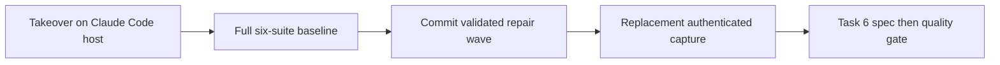

# Task 5b completion and Task 6 outcome gate

## First owner report

branch: feature/original-design-realignment
session path: AI_Codex/Agent_Sessions/2026-09-09-021123-task-5b-completion-gate.md
preserved dirty paths: AI_Codex/Agent_Sessions/2026-09-07-codex-realignment-resumption.md; .agents/; .codex/; AI_Codex/Agent_Sessions/2026-09-07-gpt-5-6-sol-handoff.md; AI_Codex/Architecture/Protocols/2026-09-07-codex-execution-protocol.md; orchestration-quality-control/schemas.permission-backup-20260908-0142/
baseline:
  command: full six-suite Python 3.12 baseline from README, run once at HEAD cef9677
  counts: 755 passed, 0 failures, 0 errors — scripts 637, Claude hooks 8, Claude adapter 6, Codex 36, Cursor 19, eval harness 49
  command: git diff --check
  counts: clean
worker model routing: sonnet implementer, escalate one tier to opus on a recorded failed attempt; effort not settable on this host
reviewer model routing: fresh sonnet spec-validator then a different fresh sonnet quality-validator; opus reserved for the Task 6 acceptance review; effort not settable on this host
task 1 started: no

### Progress — takeover — 2026-09-09 02:11:23 -03

Root confirmed `pwd` at the plugin repository root, branch
`feature/original-design-realignment`, `HEAD` `cef9677`, nine commits ahead of
origin and unpushed. The predecessor session
`2026-09-08-225026-task-5b-live-fixture-repair` ends at a dispatched
revalidation whose verdict was never recorded; its ledger is therefore
incomplete rather than blocked. No product drift beyond the recorded repair
wave was found. All owner-owned dirty paths listed above are preserved
untouched.

### Progress — host change ruling — 2026-09-09 02:11:23 -03

The predecessor ran on a Codex host and routed `gpt-5.6-luna`, `-terra` and
`-sol` at named reasoning efforts. This session runs on Claude Code, where the
capability matrix in the skill's agent reference states effort is not
expressible in subagent frontmatter or the spawn tool. Ruling: worker and
reviewer effort is recorded as `not settable on this host` for every checkpoint
in this session. Naming a level nothing applied would be a false claim about the
run. Codex model ids are unavailable here and are not carried forward.

### Progress — recovered predecessor verdict — 2026-09-09 02:11:23 -03

Root reran the predecessor's own authorized focused surface at unchanged `HEAD`
`cef9677` with the working-tree repair wave in place: the four reachable Claude
modules returned 69 tests, zero failures, zero errors, and `git diff --check`
exited zero. The scoped breaker exception the owner granted at 00:17 is
therefore satisfied. Recorded here because the predecessor lost the turn before
its dispatched validator returned.

### Progress — session-gate unblock ruling — 2026-09-09 02:15:00 -03

The `codex-workflows-plugin` PreToolUse write gate blocked all non-session
writes because `2026-09-07-codex-realignment-resumption.md` carried `next: null`
and was older than eight hours. Ruling: close it truthfully rather than bypass
the gate. Its `next` now names `2026-09-08-145400-task-5b-resumption`, which
that file already declares as its own `predecessor`, so the chain is asserted
from both ends. The predecessor repair session is closed with an explicit
`successor` to this ledger, and this ledger carries `branch` and `next: null` so
the gate resolves to the live session. No note content was altered; one
frontmatter field changed per file, all recoverable through Git.

### Progress — full baseline — 2026-09-09 02:18:00 -03

Root ran the complete six-suite Python 3.12 baseline from the repository README
once, at `HEAD` `cef9677` with the repair wave in the working tree. All six
passed with zero failures and zero errors: scripts 637, Claude hooks 8, Claude
adapter 6, Codex 36, Cursor 19, eval harness 49; `git diff --check` exited zero.
The scripts count rose from the predecessor's 632 because the repair wave added
five tests. This is fresh evidence, not reused.

### Progress — live-run authorization ruling — 2026-09-09 02:19:00 -03

Root reported to the owner that the archived native capture is now
unacceptable under the hardened rules and that a replacement authenticated run
needed separate authorization. The owner answered `take the lead, use
/root-architect-execution and get this job done`. Ruling: that reaffirms the
request after the concern was stated and authorizes exactly one replacement
authenticated Task 5b capture. It does not authorize push, tag, merge, release,
or any second live run.
