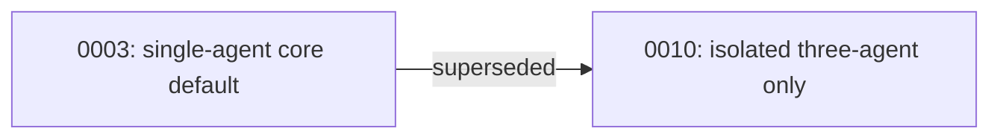

# ADR 0003 — Single-agent pipeline is the core's default execution shape

## Status

Superseded by [ADR 0010](0010-isolated-three-agent-only.md), 2026-07-17.
Accepted, 2026-07-16.

## Context

The legacy v3 system split validation across three Claude subagents
(Orchestrator, Validator, Formatter) with distinct tool grants, and the
original architecture report's Appendix A proposed formalizing this into
four specialist agents. The adversarial critique raised two points against
making a multi-agent topology the default for the portable core: Anthropic's
own published data on its multi-agent research system reports roughly 15x
the token cost of a single agent, justified mainly for breadth-first,
context-exceeding research tasks; and Cognition's public argument against
multi-agent systems attributes a large share of multi-agent unreliability to
context fragmented across agents — plausibly a contributing cause of the
original system's own Problem 5 (inconsistent Validator/Formatter results on
identical input), not a reason to add more agents.

Multi-agent isolation's one concrete, host-enforceable benefit — a
Validator that is mechanically prevented from writing, because its tool
grant excludes Edit — exists only on a host that can enforce per-agent tool
grants. The original report already concedes that on hosts without subagent
support, isolation degrades to "prompt-enforced," which is not a mechanical
guarantee at all.

## Decision

The portable core's documented default is a single agent running both
`validate` and `execute`, with correctness guaranteed by the deterministic
scripts (see ADR-adjacent work in `scripts/`) rather than by tool-grant
isolation. Subagent topology — including the three-agent Claude adapter
this package still ships — is exclusively a host adapter's way of
strengthening enforcement of the same rules and contracts; it is never
required for the core's guarantees to hold.

The Claude adapter keeps three agents (Orchestrator, Validator, Remediator)
rather than collapsing to two, matching the then-current with-skill eval
result. This was a deliberate choice to preserve a result already known to
work well, not a rejection of the critique's reasoning — it is cheap to
collapse to two agents later if evidence favors it, and expensive to
re-split after the fact.

## Consequences

- A host with no subagent support runs the exact same rules, workflows, and
  scripts as the Claude adapter, at a lower level of mechanical enforcement,
  which it must disclose rather than claim parity.
- Adding a fourth or fifth specialist agent (per the original report's
  Appendix A) requires evidence from evals that the three-agent baseline is
  insufficient — it is not the default target architecture.
