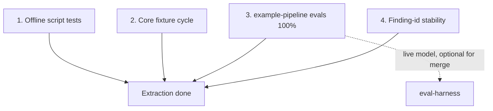

# ADR 0005 — Definition of done for the extraction

## Status

Accepted, 2026-07-16. Item 3 below is open — see Consequences.
Amended by [ADR 0011](0011-agnostic-example-pipeline-profile.md), 2026-09-02.

## Context

The architecture report's "Decisions, assumptions, and out of scope" section
named a missing definition of done for the extraction as a gap the
adversarial critique's item 8 also flagged. This package needs an explicit,
checkable answer to "when is the extraction actually finished?" rather than
an implied one.

## Decision

The extraction is done when all four of the following hold:

1. **The deterministic substrate's own tests pass offline.**
   `python3 -m unittest discover` under both `scripts/tests/` and
   `adapters/claude/hooks/tests/` passes with no model call anywhere in the
   run. Verified repeatedly through Phases 1–4 of this build (61 tests
   total: 53 script tests, 8 hook tests).

2. **The portable core completes a full cycle on a fixture repository with
   no product-specific artifact content.** Demonstrated during
   Phase 4 with a full simulated run through the real scripts and hook:
   classify a generic workflow fixture, derive a finding id, create a
   `pending_approval` checkpoint, confirm the hook blocks a direct edit to
   the checked-out target, resolve a decision, render and apply a diff,
   finalize outcomes, consume the checkpoint, confirm the hook then allows
   the same edit. `evals/core/fixtures/` (added in Phase 5) gives this a
   permanent, named fixture set — a generic orchestrator missing a bounded
   retry and durable state, a rules file with rationale clauses, a workflow
   with an incomplete delegation spec, and one fully compliant workflow —
   with `evals/core/evals.json` recording the expected findings and report
   properties for each.

3. **Profile evaluations pass at 100% with-skill rate.** The
   `example-pipeline` profile's `evals/evals.json` (four cases) must reach
   a 100% with-skill pass rate. Live-model grading is optional for merging
   a release when offline tests pass (see ADR 0011).

4. **The partial-apply conformance fixture proves finding-id stability.**
   `scripts/tests/fixtures/partial-apply/` plus
   `PartialApplyConformanceTest` in `scripts/tests/test_finding_id.py`
   verify a finding's id is unchanged when an unrelated edit shifts every
   line after it. Passing since Phase 1.

## Consequences

Item 3 requires running the eval prompts in `evals/core/evals.json` and
`profiles/example-pipeline/evals/evals.json` against a live model inside an
actual host session and grading the resulting transcripts against each
eval's `assertions`. That harness is external to the portable package
(`eval-harness/` in this repository). This step could not be executed as
part of the original extraction pass, which had no access to a live model.

This is recorded as open, not silently skipped. Before this package is
treated as fully validated against live models, someone with access to run
the actual host skill needs to execute both eval sets and confirm the
with-skill pass rate, then update this ADR's status accordingly.

### Live-model run — 2026-09-02 (Cursor host)

Both ADR workspaces were executed at 3 with-skill + 1 without-skill per
eval, graded with `integrity.json` evidence. Artifacts:

- `orchestration-quality-control-workspace/core/iteration-1/benchmark.json`
- `orchestration-quality-control-workspace/example-pipeline/iteration-1/benchmark.json`

**example-pipeline with-skill:** 100% on all four evals, all three runs
(inline env, missing gates, graph, rules-with-rationale).

**core with-skill:** not 100%. `eval-workflows-generic-clean` with-skill
run 1 failed two assertions:

1. Reports that no problems were found, with no fabricated findings —
   invented a W13 “resize worker with no stated reason” finding on the
   designed-clean fixture.
2. Does not propose any edit, since there is nothing to fix — proposed
   adding a reason clause. The fixture itself stayed unedited
   (`integrity.json` `unedited: true`).

Runs 2 and 3 of that eval passed. The other three core evals passed 5/5
on every with-skill run.

Per the runbook gate (both workspaces at mean 1.0 with-skill), item 3
stays **open**. No assertion was reworded or regraded to force a match.

Author evals (`evals/author/evals.json`) were run the same day as an extra
set, not as item 3. Artifacts:
`orchestration-quality-control-workspace/author/iteration-1/benchmark.json`.
With-skill was 100% on both evals and all three runs. That result does not
close item 3.
