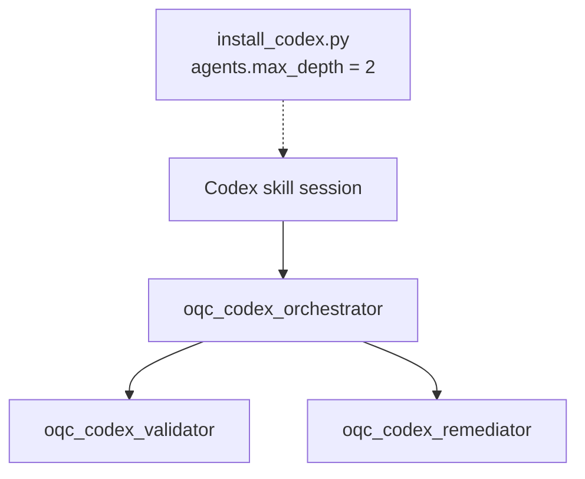

# ADR 0006 — Codex uses a nested three-agent adapter outside the plugin manifest

## Status

Accepted, 2026-07-17. Context note amended by
[ADR 0010](0010-isolated-three-agent-only.md), 2026-07-17: the portable
package no longer defaults to a single-agent pipeline; nested three-agent
topology is now the only shipped execution shape. The Codex-specific
decision below (custom agents outside the plugin manifest, depth 2) remains
in force.

## Context

The portable package deliberately defaults to a single-agent pipeline. Codex
can run custom agents, but its plugin package describes skills, hooks, apps,
MCP servers, and presentation assets — not custom-agent configuration files.
Codex discovers custom agents separately from `~/.codex/agents/` or
`.codex/agents/`. Its default nesting depth is one, so a root session that
spawns an orchestrator which then spawns workers requires depth two.

The selected product requirement prefers topology parity with the Claude
adapter over the more plugin-native alternative in which the root session
directly spawns two workers.

## Decision

The Codex adapter uses three named custom agents:

1. `oqc_codex_orchestrator`
2. `oqc_codex_validator`
3. `oqc_codex_remediator`

The installed skill-bearing root session spawns the orchestrator. The
orchestrator spawns the validator or remediator as required. The adapter
bootstrap installs the TOML files separately and sets
`agents.max_depth = 2`. Plugin installation alone is intentionally
insufficient; missing agents or insufficient depth blocks execution instead
of degrading silently to the portable topology.

The Codex plugin still owns the portable skill and `PreToolUse` hook. The hook
protects pending target files with checkpoint-bound, approved change hashes.
It enforces what may change, not which named agent submitted the allowed tool
call.

## Consequences

- The canonical Agent Skills package remains host-neutral and unchanged in
  structure.
- Codex installation requires an explicit, reversible bootstrap in addition
  to `codex plugin add`.
- Nested runs consume more time and tokens and require a non-default depth.
- The validator receives a mechanical read-only sandbox; the orchestrator and
  remediator remain workspace-write agents constrained by the hook and their
  operating contracts.
- If Codex later supports plugin-bundled custom agents, the bootstrap can be
  retired without changing the portable core contracts.
