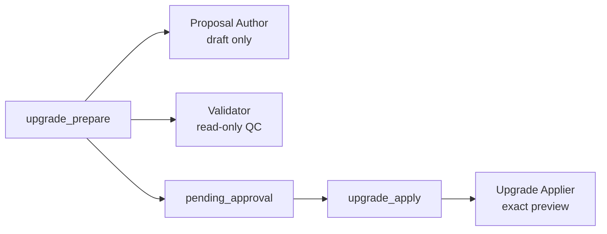

# ADR 0008 — Guided orchestration upgrade with a Proposal Author boundary

## Status

Amended by [ADR 0010](0010-isolated-three-agent-only.md), 2026-07-17: the
`portable-single-agent` template and the `isolation_reason` requirement
described below were removed. Amended by
[ADR 0012](0012-greenfield-orchestration-authoring.md), 2026-09-02: the
Proposal Author also drafts greenfield process documents (`author_prepare`).
Accepted, 2026-07-17.

Superseded by [ADR 0013](0013-three-agent-parameterized-code-gated.md),
2026-09-02: the upgrade trio becomes `operation: upgrade` on the one
three-template topology. The Proposal Author is the Remediator in `draft`
mode and the upgrade applier is the Remediator in `apply-preview` mode; the
upgrade orchestrator is the Orchestrator with that operation.

## Context

The portable core already checks and remediates individual orchestration
defects through validate/execute. Some users need a stronger operation: a
complete, versioned replacement of an existing mechanism plus an
architecture document, presented as one atomic approval.

That operation mixes three incompatible responsibilities:

1. read-only semantic QC against packaged rules and a reference template;
2. creative synthesis of a full replacement artifact set; and
3. deterministic, rollback-capable application of an exact approved proposal.

Reusing the Validator for (1) is correct. Letting the Validator or
Remediator also author the replacement would collapse judgment and mutation
into one role and weaken the approval boundary the package already enforces
for ordinary QC.

## Decision

Add `upgrade_prepare` and `upgrade_apply` operations with:

- two versioned reference templates only:
  - `portable-single-agent` for hosts without nested subagents;
  - `isolated-three-agent` when separate tool grants are required and an
    explicit `isolation_reason` is recorded;
- deterministic scripts for discovery, proposal rendering, checkpoint
  transitions, application, and verification persistence;
- a dedicated Proposal Author worker that returns only
  `upgrade-proposal.schema.json` objects and never writes project files;
- host adapters that keep nesting depth 2 by spawning one upgrade
  orchestrator, which in turn spawns Validator, Proposal Author, or Upgrade
  Applier as needed.

Side-by-side mode creates only new files under `output_root`. In-place mode
updates only discovered sources and creates only the approved documentation
path. Post-apply QC may fail without rolling back an applied version.

## Consequences

- Ordinary QC and guided upgrade share the same `pending_approval` active-run
  signal and hook protections.
- Codex installs six custom agents; Cursor bundles six subagents; Claude adds
  three upgrade-specific subagents beside the existing QC trio.
- The portable core remains host-neutral; adapter entry points are
  `/oqc-upgrade` on Claude and Cursor and `orchestration-upgrade` on Codex.
