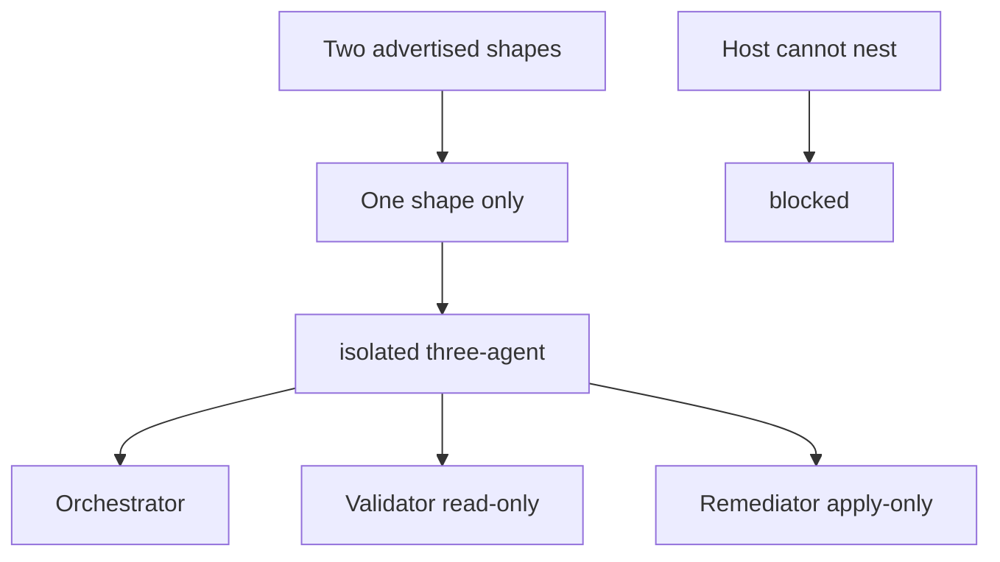

# ADR 0010 — Ship the isolated three-agent topology only

## Status

Accepted, 2026-07-17. Supersedes [ADR 0003](0003-single-agent-core-default.md).
Amends [ADR 0008](0008-guided-orchestration-upgrade.md).

Amended by [ADR 0013](0013-three-agent-parameterized-code-gated.md),
2026-09-02: exactly three agent templates exist, one Orchestrator among
them; every hand-off is an envelope conforming to
`schemas/envelope.schema.json`; and isolation is proven per run by
`oqc.py mail verify` rather than asserted.

## Context

The package documented and shipped **two** sub-agent strategies side by side:

1. A `portable-single-agent` execution shape — the core's documented default
   per ADR 0003 — where one agent runs both `validate` and `execute`, with
   correctness guaranteed by deterministic scripts rather than tool-grant
   isolation.
2. An `isolated-three-agent` topology — Orchestrator, Validator, Remediator
   with distinct tool grants — available as "an adapter's way of
   strengthening enforcement," and also shipped as one of two selectable
   reference templates for the guided-upgrade operation (ADR 0008).

In practice every shipped host adapter (Claude, Codex, Cursor) only ever
mechanizes the isolated three-agent shape — none of the three adapters
implements or ships a single-agent runtime. The `portable-single-agent`
template exists solely as a second, largely theoretical option inside the
guided-upgrade input contract, and it forced a third option in front of every
caller: two templates to choose between, one of which (`isolated-three-agent`)
additionally required an `isolation_reason` justification string before it
could be selected — friction that added no safety, since the isolated
topology is strictly the *stronger* enforcement shape and has always been the
one every adapter actually ships.

This was reported as noise: a plugin advertising a choice between two
sub-agent strategies when only one is ever installable, gated behind a
justification field with no failure mode it prevents (there is no weaker
option to justify skipping).

## Decision

Ship exactly one execution shape: the **isolated three-agent topology**
(Orchestrator, Validator, Remediator), on every host adapter, with no
alternative and no fallback. Concretely:

- `references/templates/portable-single-agent.md` is deleted.
- The core `SKILL.md` "Execution shape" section documents the isolated
  three-agent pipeline as the only shape. A host that cannot complete the
  nested Orchestrator/Validator/Remediator handoff returns a `blocked`
  result — it must never silently run the checks in a single, unrestricted
  agent.
- The guided-upgrade `template_id` input becomes a fixed
  `isolated-three-agent` value (schemas keep it as an enum of one, rather
  than dropping the field, so a future template remains an additive schema
  change instead of a breaking one).
- The `isolation_reason` field is removed entirely — from the input and
  checkpoint schemas, `render_upgrade.py`, `upgrade_state.py`,
  `apply_upgrade.py`, the upgrade-prepare workflow, rule T10 of
  `rules-reference-architecture-quality-control.md`, and the `/oqc-upgrade`
  command/skill UI on every adapter. There is no longer a weaker alternative
  to justify not choosing, so the justification gate has no failure mode to
  guard against.
- `rules-reference-architecture-quality-control.md` keeps only role
  separation (renumbered T8); the portable-template phase-separation rule
  and the isolation-justification rule are removed.

This is a breaking change to the public input contract (an enum value and a
schema field are removed), so the package version moves to `2.0.0`.

## Consequences

- Every caller of `upgrade_prepare` stops passing `template_id` and
  `isolation_reason` as meaningful choices; `template_id` may be omitted
  (defaults to `isolated-three-agent`) or passed as that fixed value.
- `rules-qc-orchestrator.md` no longer describes a "portable core's default
  single-agent pipeline" stage — the Orchestrator role is only ever a
  subagent in the nested topology.
- A host adapter (or a skill-only OpenSkills install lacking the bundled
  subagents) that cannot mechanize the three roles must return `blocked`
  with reason code `adapter_not_installed`. This is a stricter contract than
  ADR 0003's: previously such a host could legitimately run the portable
  single-agent pipeline instead; now it cannot run at all.
- ADR 0003's cost/reliability argument against multi-agent systems (token
  cost, context fragmentation) is not being relitigated here — it was never
  actually exercised, since no adapter shipped the cheaper alternative it
  justified. This ADR simply stops advertising an option nothing implements.
- Historical CHANGELOG entries (1.0.0–1.2.0) and ADR 0003/0008's own bodies
  are left unedited as a historical record; only operative documentation
  (SKILL.md, schemas, scripts, rules, workflows, adapter docs) reflects the
  single-template, no-justification shape going forward.
