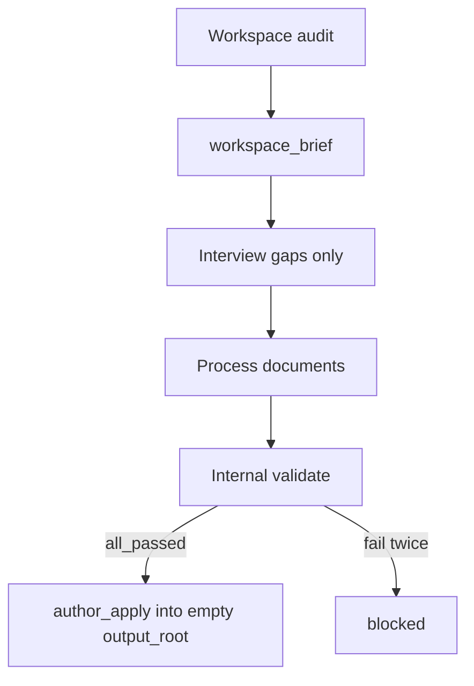

# ADR 0012 — Greenfield orchestration authoring

## Status

Accepted, 2026-09-02. Shipped in 3.1.0.

Amends [ADR 0008](0008-guided-orchestration-upgrade.md): the Proposal
Author role also drafts greenfield process documents. Does not change
[ADR 0010](0010-isolated-three-agent-only.md).

## Context

`validate` / `execute` judge and patch existing documents.
`upgrade_prepare` / `upgrade_apply` replace an existing host mechanism.
Callers who need a **new** workflow, rules file, and optional
orchestrator still have to write those documents by hand and only then
run QC.

A naive “interview then write” authoring path would ask for stack,
layout, and whether tests exist — facts a short workspace audit can
read — and would skip the QC gates this package exists to enforce.

## Decision

Add operations `author_prepare` and `author_apply`:

1. **Audit first.** A deterministic workspace discovery script plus a
   bounded README/manifest read produces `workspace_brief` before any
   question. The model does not walk the repository unbounded.
2. **Interview only gaps.** Always collect `outcome` and `output_root`.
   Skip fields the brief already answers. If an existing mechanism or
   orchestration document set is found, ask author vs upgrade; upgrade
   is a hand-off, not a silent switch.
3. **Process documents only.** Emit `ARCHITECTURE.md`, rules, workflow,
   and an orchestrator document only for multi-worker shapes. Do not
   emit host adapters; that remains upgrade.
4. **QC before Apply.** The preview tree must `all_passed` under the
   selected profile (one Author retry, then `blocked`). Side-by-side
   apply into an empty `output_root` after an atomic approve/decline.
5. **Same isolation.** Host `/oqc-author` (Codex: `orchestration-author`)
   uses the upgrade nesting: Orchestrator, Proposal Author, Validator,
   Upgrade Applier. Shared `pending_approval` active-run rules.

Ordinary QC and upgrade stay user-facing and unchanged.

## Consequences

- Public identity remains `orchestration-quality-control`; authoring is
  an additive pair, not a new package.
- New schemas and `discover_workspace.py` are required for 3.1.0.
- Eval coverage for 3.1.0 must include “does not re-ask brief facts”
  and “preview is QC-clean before Apply.”
- Detail: [docs/authoring.md](../../../docs/authoring.md),
  [spec](../Specs/2026-09-02-greenfield-authoring-design.md).
