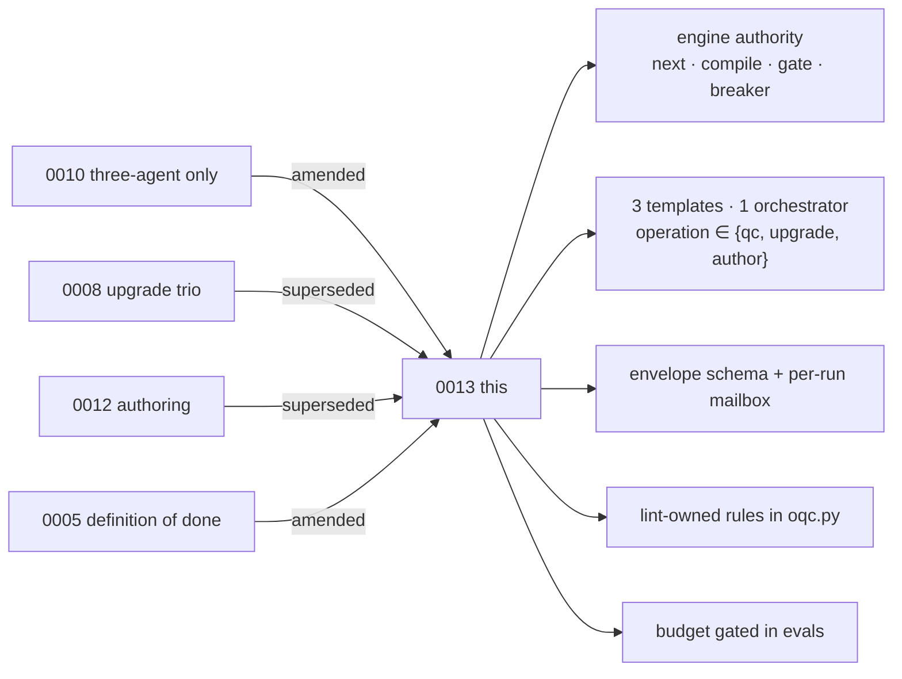

# ADR 0013 — Engine-first: `oqc.py` routes, compiles, gates and stops; exactly three agent templates judge and author through envelopes, under a cost budget

## Status

Proposed, 2026-09-02. Owner decisions 1–6 recorded in
[[2026-09-02-intention-vs-outcome-reconciliation]] §5; model per role and
host in [[2026-09-02-worker-model-decision-brief]].

On acceptance: supersedes [ADR 0008](0008-guided-orchestration-upgrade.md)
and [ADR 0012](0012-greenfield-orchestration-authoring.md) (their operations
become inputs to the one topology); amends
[ADR 0010](0010-isolated-three-agent-only.md) (exactly three templates, one
orchestrator, envelope required, isolation proven per run); amends
[ADR 0005](0005-definition-of-done.md) item 3 with a cost budget. ADR 0003
remains superseded.

## Context

The product descends from `agentic-e2e-test-workflow` (Jun–Jul 2026), whose
design was **engine-first**: a Python engine routed the next task from
artifact state (`router.py`), compiled each worker's full context into one
mailbox file (`adapters.py`), gated outputs statically (`evaluator.py`),
injected critiques on retry and tripped a circuit breaker at three attempts
that only the literal token `IMPLEMENTATION APPROVED` could reset
(`reducers.py`), with immutable state and side effects confined to hooks.
The orchestrator agent only spawned workers with compiled prompts and ran
`evaluate`. The predecessor skill and this package kept the agent topology
and dropped the engine; scripts survived only as bookkeeping. That is the
root of every cost and reliability problem measured below.

Sub-agent isolation is the product's primary asset (owner, 2026-09-02). The
first live measurement (40 runs, 2026-09-02) shows the shipped shape costs
4.3x wall time of a bare model on a 26-line fixture (median 570 s vs 120 s),
routes the model through 13–20 packaged files, and proves a nested worker ran
in only 6 of 30 with-skill transcripts; one run records a "validator
collapse" and still passed. The asset is neither cheap nor measured.

The shape also drifted: six agent files per host, a second orchestrator,
ten workflow files; `isolated-three-agent.md` declares hand-offs of "resolved
inputs, decisions, artifact paths, and hashes", yet no schema defines a
hand-off and delegations travel as prose. No rule is checked in code although
R2, R3, W2, W3, W7/O5, W12 are regex-decidable. 3.2.0 removed mid-run
approval on purpose, but user documents and eval assertions still describe
the gate. Author/upgrade flows are denied by their own Cursor and Codex
hooks.

## Decision

0. **Engine authority.** `oqc.py` decides what runs next (`next`: a pure
   reducer over the mailbox returning one step; the checkpoint is derived
   from it), what each worker reads (`compile`: one prompt file per request
   assembling template, rules, report style, decisions, lint findings or
   approved diffs, and previous critiques; project overrides first; never
   widens context; ≤ 32 KB), whether a result is acceptable (`gate`: hashes,
   schemas, lint-owned codes, anchors, approved set, lint on drafted
   documents), and when to stop (`attempt` ≤ 3 with critiques injected, then
   `awaiting_authorization`, reset only by a root request carrying
   `IMPLEMENTATION APPROVED`). Agents judge and author; they do not route,
   assemble context, evaluate themselves, or count retries. The engine is
   invoked per step; no long-running process, no MCP server, no stdin.
1. **Exactly three templates.** `templates/orchestrator.md`, `validator.md`,
   `remediator.md`. Host agent files are wrappers over them: 3 per host, 9
   total. `operation ∈ {qc, upgrade, author}` is an input; each runs prepare
   and apply in one Orchestrator spawn. The proposal author and upgrade
   applier are Remediator modes (`draft`, `apply-preview`). The Orchestrator
   template is the loop *read → next → compile → spawn → gate*; worker
   templates are *read envelope → read compiled prompt → act → send result*.
   A worker reads exactly two files before its targets.
2. **Envelope and mailbox.** Every hand-off is an envelope conforming to
   `schemas/envelope.schema.json`, appended to
   `.orchestration-qc/mail/<run_id>/events.jsonl` by `oqc.py mail send`;
   compiled prompts live beside it as `<seq>-<role>.prompt.md`. Envelopes
   carry paths, hashes, `attempt` and `critiques`, never content, under a
   size cap. Legal pairs are root↔orchestrator and orchestrator↔worker
   only. `oqc.py mail verify` checks continuity, pairing, hashes (artifacts
   and prompts), distinct `agent_id` per role, and that every attempt
   increment follows a failed gate. The mailbox is the run's event history,
   its transcript and its isolation evidence; the run is replayable from it.
   A worker's only input is its request envelope; a worker's only way to
   stop is a `blocked` envelope.
3. **Isolation is host-enforced where possible and proven every run.**
   Claude: `tools:` per agent. Cursor: `readonly: true` validator, hook for
   exact writes and `oqc.py`-only shell while a run is active. Codex:
   read-only sandbox for the validator, same hook. "Workers cannot spawn" is
   disclosed as not enforceable on Cursor/Codex and covered by `no_spawn` in
   the request envelope plus a `blocked` stop in the worker templates. An
   eval assertion requires a verifying mailbox with distinct worker ids.
4. **Mechanical rules are code.** `oqc.py lint` owns W2, W3, W12, W7/O5, R2
   as findings and R3, W8/O6 as candidates. The Validator may not emit
   lint-owned codes; each rule file lists them.
5. **The interview is the only decision point.** The root session runs
   `discover → plan → ask outcome (author) → confirm defaults (incl.
   `language`, default `en`) → send request envelope`. Nested agents never
   ask. A `blocked` envelope and the circuit breaker's
   `awaiting_authorization`, both surfaced by root, are the only mid-run
   human contacts; both are engine states. Documents and evals state this.
6. **Authoring emits the machine.** `operation: author` writes the caller's
   three host agent templates, declaring the envelope, plus the process
   documents.
7. **Budget is part of done.** ADR 0005 item 3 becomes: core evals 100%
   with-skill on 3 runs each; mailbox verifies on 100% of runs; each worker
   reads exactly envelope + compiled prompt before targets, run total ≤ 6;
   every compiled prompt ≤ 32 KB; no attempt > 3; median wall ≤ 240 s and
   ≤ 2x without-skill; only checkpoint + `mail/<run_id>/` written to
   `.orchestration-qc/`. Measured by `eval-harness/` scripts.
8. **Documentation describes the code.** A test asserts README operations,
   agents, scripts, version and test count against the tree. Release target
   is `origin`; upstream stays read-only (owner decision 3).

## Consequences

- Breaking: version 4.0.0. `operation` enum is `[qc, upgrade, author]`;
  `/oqc-run` replaces four commands; six agent files per host become three;
  `upgrade-*`/`author-*` schemas fold into `input`, `checkpoint`,
  `proposal`; hand-offs without an envelope are not a run.
- Package shrinks from 131 non-test files / 3,694 markdown lines / 18 agents
  / 15 scripts to ≤ 75 / ≤ 1,600 / 9 / ≤ 12
  ([[2026-09-02-return-to-intention-4-0-0]]). Templates get shorter, not
  longer: procedure moves into compiled prompts the engine assembles.
- Finding-id algorithm, checkpoint status vocabulary (now derived by
  `next`), reconciliation, diff rendering, namespaced kinds, profile
  manifest, `example-pipeline`, and the 3.2.0 packaged-defaults interview
  are unchanged in behaviour.
- Restored from the ancestor: router, context compiler, mailbox, static
  gate, reflection loop with critiques, circuit breaker with the
  `IMPLEMENTATION APPROVED` token, pure reducer over an immutable event
  history, prompt/rule override by project-local files. Not restored:
  long-running process, MCP server, dialect middleware, stub hooks, stdin
  prompts. Ancestor defects F2, F6, F7, F10 are written into the plan as
  constraints.
- The hooks' shell restriction during an active run stays (hooks cannot see
  the calling agent); the allowlist becomes `{oqc.py}` and the window is the
  run itself. Disclosed in every adapter README.
- Removed agents, commands, workflows, schemas and scripts are deleted at
  P3, not staged (decision 5, delegated to the agent). Recovery is the
  `v3.2.0-final` tag. Codex notes are never deleted.
- Every agent file names its model; `inherit` is prohibited for every role
  on every host (decision 6). Orchestrator / Validator / Remediator: Claude
  `opus` / `sonnet` / `haiku`; Cursor `grok-4.6[effort=high]` /
  `composer-2.5[effort=high]` / `composer-2.5[fast=false]`; Codex
  `gpt-5.6-terra` medium / `gpt-5.5` high / `gpt-5.6-luna` low. A test asserts no
  `inherit`. The release benchmark checks the tiers, with a one-step
  escalation per failing role. Both hosts can silently replace
  a configured model (Cursor plan/admin fallback; Codex regressions such as
  0.137.0); the adapter READMEs disclose this and the agent cannot observe
  its own model.
- Two public repositories continue to tell two stories until the owner
  reopens upstream; recorded as accepted debt.
