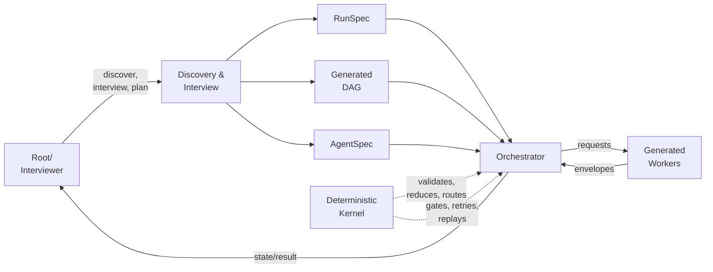

# ADR 0014 — Generated workflow over a deterministic kernel: one fixed control plane, generated roles

## Status

Accepted, 2026-09-04. Governed by
[the original-design realignment master plan](../../Implementation_Plans/2026-09-04-original-design-realignment-master-plan.md)
and its active ticket
[align architecture with original design](../../Tickets/Active/refactor-align-the-architecture-with-original-design.md).

Supersedes [ADR 0013](0013-three-agent-parameterized-code-gated.md), 2026-09-04:
its exactly-three-template, fixed Validator/Remediator output conflicts with a
workflow whose roles are generated. ADR 0013's engine-first authority, envelope
mailbox, isolation and retry/block decisions survive here; its topology decision
does not. Through ADR 0013, ADR 0008 and ADR 0012 remain superseded, ADR 0010
and ADR 0005 remain amended, and ADR 0003 remains superseded. Nothing in ADR
0013 is deleted; it stays the historical record of the engine-first argument.

## Context

ADR 0013 correctly diagnosed the loss of the ancestor's engine — routing,
context compilation, static gating, critique-carrying retry, a circuit
breaker, and immutable state derived from an event history — and correctly
made deterministic code the authority. That diagnosis stands.

ADR 0013 then fixed the answer to a document-QC shape: exactly three
templates (`orchestrator`, `validator`, `remediator`), nine host agent
files, and `operation` drawn from a closed set `{qc, upgrade, author}`. The
product's original design is an orchestration authoring and execution-control
system: discovery and a short interview must be able to emit any task graph
with any roles. A closed three-role output cannot express that.

The engine ADR 0013 assumed is still absent from the tree. `scripts/oqc.py`,
`scripts/mailbox.py`, `scripts/compile_prompt.py`, `scripts/gate.py` and
`schemas/envelope.schema.json` do not exist; the executable scripts are
deterministic bookkeeping utilities. So this record must both re-decide the
topology and state which claims are not yet real.

## Decision

0. **Engine authority is preserved.** Deterministic code — not an agent —
   decides what runs next, compiles each agent's brief, gates every result,
   counts attempts, and decides when to stop. Agents supply judgment and
   authored artifacts only. The engine is invoked per step: no long-running
   process, no MCP server, no stdin prompts.
1. **The control plane is fixed; the workflow is generated.** The fixed shape
   is root/interviewer -> one Orchestrator -> isolated execution agents. What
   is generated from discovery and the interview is the task DAG, the roles,
   their capabilities, their tools, their output schemas, and their
   model/reasoning tiers. This replaces ADR 0013 decision 1. There is no fixed
   Validator/Remediator pair and no closed `operation` enum in core.
2. **State is derived from an append-only event history.** Every hand-off is an
   envelope appended to a per-run mailbox; run state is a pure reduction over
   that history and is never mutated directly. Legal envelope pairs remain
   root<->orchestrator and orchestrator<->worker only. A run is replayable and
   verifiable from its mailbox: continuity, pairing, artifact and brief hashes,
   and a distinct agent identity per role. This preserves ADR 0013 decision 2
   and generalises it beyond three roles.
3. **Isolation stays the primary asset**: host-enforced where the host can
   enforce it, disclosed where it cannot, and proven per run by mailbox
   verification rather than asserted in prose. This preserves ADR 0013
   decision 3.
4. **Bounded retry, then an engine state — never a silent stall.** A failed
   gate carries its critique into the next attempt; an exhausted attempt budget
   moves the run to a blocked or awaiting-user-input state that only the engine
   can set and only root can answer. This preserves ADR 0013's reflection loop
   and circuit breaker without binding either to a literal approval token.
5. **Core records are vendor-neutral.** `RunSpec`, `AgentSpec` and `Envelope`
   carry capabilities and model/reasoning *tiers*; adapters compile them to
   host-native settings, enforce the observable boundaries, and disclose every
   fallback or unenforceable constraint. No provider or model identifier
   appears in core. `inherit` remains prohibited for every role on every host.
   This narrows ADR 0013's per-host model table to an adapter concern.
6. **Document quality control is a capability, not the identity.** QC rules and
   schemas fold into the engine's gates and into generated workflows. The
   product surface is install -> discover -> short interview -> build/run.
7. **Documentation truth is executable.** A runnable check fails whenever a
   product-facing document names a core entrypoint or component that does not
   exist in the tree. Prose may not lead implementation. This makes ADR 0013
   decision 8 mechanical instead of aspirational.
8. **Delivery is proved by vertical slices, not by phase count.** The five
   outcomes below are the build order, each ending in executable evidence, a
   root-owned ledger checkpoint, and a narrow commit. This replaces the paused
   4.0.0 plan's nine phases (`P0` through `P8`) and ADR 0013's pre-end-to-end
   budget gate.

## The five governing outcomes

| Outcome | Exit evidence in one line |
| --- | --- |
| 1. Truth and boundary reset | This record, the disposition of the paused plan and ADR 0013, a salvage list, quarantined claims, and a runnable documentation-truth check. |
| 2. Executable kernel slice | Vendor-neutral specs, event mailbox, pure reducer and router, brief compiler, result gate, retry/block, replay, the narrow adapter port and a fake adapter; proved by a model-free two-task dependent DAG that carries a critique into a passing retry and reaches `completed`, plus a separate exhausted-retry fixture that reaches blocked or awaiting-user-input. |
| 3. Real orchestration slice | The vendor-neutral Orchestrator contract and the smallest first-host adapter; proved by one real spawn with distinct agent identities, a valid mailbox sequence and hashes, a passive root, and a schema-valid answer relayed back through the adapter. |
| 4. Adapter compilation and enforcement | Generated host wrappers plus explicit model, effort, tool, sandbox and fallback mappings; proved per host by contract coverage and that host's own smoke evidence before support is claimed. |
| 5. Product surface and consolidation | Install, discover, short interview, build and run, with QC folded into gates and proven duplication removed; proved by one complete acceptance scenario, budgets, and documentation that matches the executable tree. |

## Salvage list — utilities that survive this decision

The following are executable today, are not superseded by this record, and must
not be deleted before an equivalent gate passes:

| Utility | Why it survives |
| --- | --- |
| `orchestration-quality-control/scripts/qc_lib.py` | Shared deterministic helpers every later script reuses |
| `orchestration-quality-control/scripts/discover_structure.py` | Bounded, deterministic structure manifest — input to generated discovery |
| `orchestration-quality-control/scripts/discover_workspace.py` | Bounded workspace brief — input to generated discovery |
| `orchestration-quality-control/scripts/plan_interview.py` | Decides which interview fields to ask, skip or fork — the short interview's core |
| `orchestration-quality-control/scripts/gate_defaults.py` | Packaged interview defaults that keep the interview short |
| `orchestration-quality-control/scripts/classify_targets.py` | Deterministic document classification for generated QC gates |
| `orchestration-quality-control/scripts/derive_finding_id.py` | Content-anchored identifiers a result gate can verify |
| `orchestration-quality-control/scripts/reconcile_decision.py` | Decision arithmetic and resolution completeness for gates |
| `orchestration-quality-control/scripts/render_diff.py` | Literal unified-diff rendering for authored changes |
| `orchestration-quality-control/scripts/render_upgrade.py` | Atomic proposal validation and rendering |
| `orchestration-quality-control/scripts/checkpoint_state.py`, `author_state.py`, `upgrade_state.py` | Their status vocabulary and transition rules feed the reducer; their direct-CRUD shape does not |
| `orchestration-quality-control/scripts/apply_author.py`, `apply_upgrade.py` | Atomic apply mechanics for a later authoring gate |
| `orchestration-quality-control/references/schemas/*.json` | Existing finding, checkpoint, input, blocked and manifest contracts |
| `eval-harness/check_run_integrity.py`, `measure_run.py`, `measure_package.py`, `convert_evals.py` | Measurement the Outcome 5 budget will reuse |

## Quarantined claims — named but not executable

The following components are described in contributor records as if they exist;
they do not exist in the tree, so they may not be cited as current behaviour and
may not appear in any product-facing document until the outcome that builds them
lands:

- `scripts/oqc.py` and every subcommand attributed to it (`next`, `compile`,
  `gate`, `lint`, `checkpoint`, `mail send`, `mail verify`)
- `scripts/mailbox.py`, `scripts/compile_prompt.py`, `scripts/gate.py`
- `schemas/envelope.schema.json` and the per-run mailbox at
  `.orchestration-qc/mail/<run_id>/events.jsonl`
- the circuit breaker and its `IMPLEMENTATION APPROVED` reset token
- the `templates/orchestrator.md`, `templates/validator.md`,
  `templates/remediator.md` three-template tree
- ADR 0013's budget numbers as measured behaviour: prompts under 32 KB, at most
  six file reads per run, median wall time under 240 s
- ADR 0013's package-shrink targets: at most 75 non-test files, 1,600 markdown
  lines, 9 agent files, 12 scripts

## Next executable slice

Outcome 2 starts with the vendor-neutral `RunSpec`, `AgentSpec` and `Envelope`
records; the append-only event mailbox; the pure `reduce` and `next` pair over
that mailbox; and the model-free two-task dependent DAG fixture, behind one
library boundary with a fake adapter. Brief compilation, the result gate,
retry/block and replay follow inside the same outcome once those pass. No host
adapter, no migration, no deletion and no benchmarking begins before Outcome 2's
gate is executable.

## Consequences

- The topology decision reopens: host agent files stop being a fixed set of
  three per host and become generated wrappers, so ADR 0013's "9 agent files"
  consequence no longer holds.
- `operation ∈ {qc, upgrade, author}` stops being a core enum; the existing
  three operations become generated workflows expressed in the same records.
- Existing QC users need a compatibility path once QC becomes a capability;
  record it as accepted debt to be answered in Outcome 5.
- The salvaged utilities stay in place unchanged until an outcome replaces
  them, so the tree carries both the old bookkeeping shape and the new kernel
  for the duration of Outcomes 2 to 4.
- Adapters take on ongoing model-catalogue maintenance, because tiers live in
  core and identifiers live in adapters.
- Version numbering, release, benchmarking and any deletion wait until the
  end-to-end slice exists; nothing here authorises a release.
