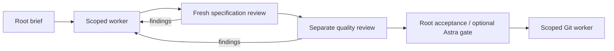

# Codex execution protocol

Structural adaptation of the Claude handoff; prospective routing changes below
incorporate the owner's latest instructions. This governs execution, not product
architecture.



## Roles and sequence

- Root owns architecture, task boundaries, model selection, acceptance and the
  ledger. Product workers implement only named files and tests; they neither
  delegate nor expand scope. Preserve other contributors' changes.
- Execute one dependent implementation task at a time. Parallel agents require
  independent work and disjoint ownership. Split large tasks before dispatch.
- Use explicit model/effort and `fork_turns: none` with a self-contained brief;
  never silently inherit root's model. Host sandbox limits must be disclosed;
  a read-only brief is not enforced isolation.
- Follow TDD for behavior changes. Require observed RED and GREEN evidence;
  passing tests added after implementation are recorded as such.
- Fresh specification reviewer checks requirements without running tests;
  a different quality reviewer runs checks and probes failure boundaries.
  Findings return to implementation. Root adjudicates contradictory verdicts.
- Three implementation attempts per task, including escalations. Record the
  reason before escalation; never reset the count by renaming a task. At the
  cap, unresolved material findings require explicit adjudication.
- Record dispatches, findings, rulings and results incrementally. Mark a task
  complete only after required gates pass. Run affected checks per task and the
  full recorded baseline at outcome gates; tests do not establish live-host proof.

## Model routing

The previous run started every worker at Luna/low, then increased effort and
planned a Terra escalation. Repeated incomplete implementations made that
universal starting tier inefficient. For the next run, choose the cheapest
viable starting tier **by task complexity**:

| Work | Suggested starting point |
| --- | --- |
| Mechanical, tightly specified edit | Luna/low |
| Bounded behavior change with tests | Luna/medium or Terra/medium |
| Coupled state, scheduler, replay or authority changes | Terra/medium; Sol when evidence warrants |
| Important final acceptance | Astra/high, at root's discretion, before completion and commit |
| Exact Git procedure | GPT-5.5/low; GPT-5.4 Mini only if actually available |

Escalate on observed incomplete coverage, reasoning failures or review defects.
Do not spend repeated cheap attempts after that task class has demonstrated a
need for a stronger starting tier. Astra supplements required reviews; it does
not replace implementation evidence.

## Reusable dispatch schemas

```text
Implementation brief:
task | attempt/max | model/effort + rationale | checkout/base | dirty paths
read paths | owned write paths | interfaces/invariants | acceptance commands
constraints | expected result

Worker result:
DONE/BLOCKED | attempt | changed files | RED evidence | GREEN evidence
requirement mapping | findings/limitations

Review result:
PASS/FINDINGS | reviewed scope | file:line evidence | commands/results
material findings | residual risks

Git worker brief:
checkout | expected branch/HEAD | exact allowed paths | approved checks
exact commit message | verified remote + branch | allowed operations

Git worker result:
DONE/BLOCKED | branch | staged paths | checks | commit SHA
push result + remote SHA | final status
```

Root delegates Git mechanics only after deciding scope and acceptance. The Git
worker verifies branch/HEAD and staged paths, stages only the allowlist, checks
the staged diff, commits, and pushes only when authorized. Unexpected drift,
conflicts or extra staged paths return BLOCKED. No force, reset, amend, merge,
release, deletion or product edits without specific authorization. WIP backups
must be labelled incomplete and kept separate from accepted checkpoints.

The inherited quota rule is below 10% remaining weekly or 5% per session:
safe-checkpoint, update the handoff, inform the owner and stand by. Record which
quota window is known; do not infer one from an unlabeled percentage.
