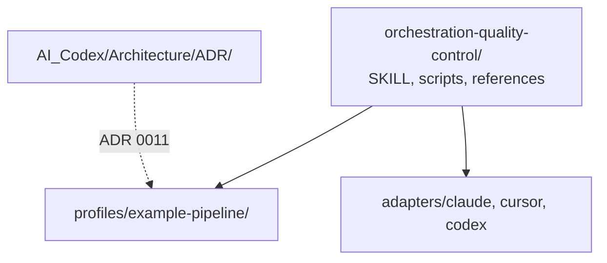

# Design: Product-agnostic core with `example-pipeline` profile

Replace the shipped product-specific profile with a fictional pipeline
artifact profile, and remove every remaining product/predecessor identity
from the repository (live package, docs, archived predecessor tree, and vault).

## Goal

`orchestration-quality-control` is a host-agnostic quality-control tool for
agent orchestration documents, plus one clearly fictional example profile
that demonstrates the profile extension point. A reader who clones the repo
must not encounter a real product name, a retired predecessor skill name,
or that product's mobile test-stack vocabulary.

## Non-goals

- Changing the isolated three-agent topology, validate/execute/upgrade
  operations, or host adapters except to drop predecessor aliases and
  product-named examples.
- Inventing a second real-world profile.
- Preserving benchmark byte-identity with the retired predecessor evals.
- Shipping a compatibility shim for the former profile id or predecessor
  command names.

## Decisions already approved

1. Keep the generic profile mechanism.
2. Replace the current product profile with a fictional
   `example-pipeline` domain (agent-adjacent YAML, not a mobile test runner).
3. Strip/prune all mentions, including the archived predecessor tree and
   vault notes.
4. Breaking release **3.0.0**.
5. Unknown profile ids use the existing `unknown_profile` → `blocked`
   path (no migration message naming the old id).
6. Historical ADRs and CHANGELOG are rewritten so they no longer name the
   product or predecessor skill; they are not left as a museum of the old
   names.

## Architecture

Core classification, finding identity, checkpoints, and diffs stay in
`scripts/`. A selected profile still merges extra globs, extra
`artifact_rules`, and extra `kinds`. With `profile: core` (or omitted),
`*.pipeline.yaml` is `unknown`. With `profile: example-pipeline`, those
files are `artifact` and are judged against the profile's rule file.

## `example-pipeline` profile

### Identity

| Field | Value |
| --- | --- |
| Directory | `orchestration-quality-control/profiles/example-pipeline/` |
| `id` | `example-pipeline` |
| Kind | `example-pipeline/artifact` |
| Artifact globs | `**/*.pipeline.yaml`, `**/*.pipeline.yml`, `**/*.pipeline.data.yaml`, `**/*.pipeline.data.yml` |
| Rules file | `rules/rules-pipeline-artifact-quality-control.md` |
| Evals | `evals/evals.json` (four cases) |

### Artifact rules (P1–P6)

| Id | Requirement |
| --- | --- |
| P1 | Every job declares a bounded `retry` (non-negative integer). |
| P2 | Pipeline `approval` is present and is exactly `required` or `none`. |
| P3 | Secrets are `ref:` names, never literal values. |
| P4 | In a target set with more than one job, flag a job that has no `needs` and is not listed in any other job's `needs` (disconnected / orphan). |
| P5 | Env/config values belong in `*.pipeline.data.yaml`, not inline on the pipeline file. |
| P6 | `state.store` is a non-empty path; omitting state or pointing at "conversation" / "memory" fails. |

### Evals (four)

| Id | Fixture intent |
| --- | --- |
| 1 | Pipeline with inline env/secrets (P3/P5). |
| 2 | Pipeline missing retry and/or approval (P1/P2). |
| 3 | Folder with an orphan job (P4). |
| 4 | Generator rules/prompt that would emit a non-conforming pipeline. |

## Removal set (completed)

Deleted the former product profile directory, the archived predecessor tree,
predecessor Claude command aliases, and vault notes whose only topic was the
named product. Remaining vault notes were rewritten in place.

## Behavior after 3.0.0

| Input | Result |
| --- | --- |
| `profile` omitted or `core` | Generic orchestration checks only |
| `profile: example-pipeline` | Core + P1–P6 on matching YAML |
| Any unknown profile id | Existing `unknown_profile` / `blocked` |
| Predecessor Claude commands | Gone; use `/oqc-validate` |

## Success criteria

- `profiles/example-pipeline/` is the only profile directory.
- The archived predecessor tree is absent.
- Host adapters expose only `/oqc-*` / equivalent upgrade entry points.
- Offline tests pass.
- Search gate is clean, including this spec and ADR 0011.
