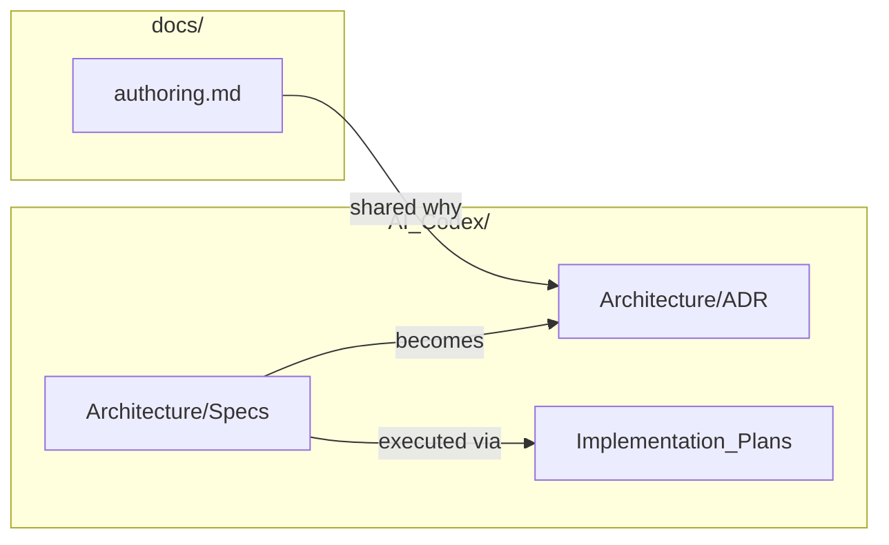

# Design: User docs vs contributor ledger

Stop using `docs/superpowers` (a third-party skill path). Split remaining
documentation by **audience**. Rename the vault to `AI_Codex/`. Keep the
ledger in git.

## Audience

| Tree | Reader | Typical content |
| --- | --- | --- |
| `docs/` | Someone **using** the product | How to run it, what operations do, user-facing feature notes |
| `AI_Codex/` | Someone **forking or contributing** | ADRs, design specs, implementation plans, sessions, reports, tickets |

The same fact may appear in both, written for that reader. User docs may
link into the ledger; the ledger may link out to user docs. Do not
maintain two contradictory sources of truth.

The ledger is versioned with the repository. A user-global gitignore may
list `AI_Codex/`; this repo’s `.gitignore` must negate that so the ledger
is tracked.

## Visual documentation

Every user-facing and contributor-facing note includes at least one
diagram (Mermaid flowchart, sequence, or chart) that shows the shape of
the idea — not a decorative extra. Historical session logs are exempt.
Implementation plans include a diagram only when it clarifies control
flow.

## Rename

`AI_Codex_OrchestratorQcPlugin/` → `AI_Codex/`.

No `Projects/<name>/` nesting. This checkout is one product; the vault
root is the project ledger.

`.gitignore` keeps ignoring editor state only:
`AI_Codex/.obsidian/`.

## Moves

| From | To |
| --- | --- |
| `docs/adr/*.md` | `AI_Codex/Architecture/ADR/` |
| `docs/superpowers/specs/*.md` | `AI_Codex/Architecture/Specs/` |
| `docs/superpowers/plans/*.md` | `AI_Codex/Implementation_Plans/` |

Then delete the empty `docs/superpowers/` tree.

**Stay in `docs/`:** `docs/authoring.md` (user-facing 3.1.0 note).

**Unchanged in place:** package `README` / `SKILL.md` / adapter READMEs
(user-facing, already inside the skill); `eval-harness/RUNBOOK.md`
(contributor tooling — update ADR links only).

## Ledger taxonomy additions

Keep the existing vault folders. Record two that are already used or
needed:

- **Architecture/Specs/** — design specs (why/what, before or instead of
  an ADR)
- **Implementation_Plans/** — agent execution plans (checkbox recipes)

New contributor design work goes to those paths. Do not recreate
`docs/superpowers`.

## Link policy

Rewrite **live** pointers (root README, `docs/authoring.md`, moved ADRs
and specs, skill/eval files that cite ADRs, vault README, orientation).

Leave **historical** session and plan prose that describes where files
lived at the time, except when a path is the only way to open a still-live
file.

Root README keeps the ADR table and in-body ADR links, aimed at
`AI_Codex/Architecture/ADR/…` (shared information, contributor records
reachable from the user overview). Layout table: `docs/authoring.md` and
`AI_Codex/` as the contributor ledger.

Relative links after the ADR move:

- ADR → `docs/authoring.md` = `../../../docs/authoring.md`
- ADR → a spec = `../Specs/<file>.md`
- `docs/authoring.md` → ADR 0012 and the greenfield spec under `AI_Codex/`

ADR 0001: amend the vault path as a later rename; do not rewrite the
freeze as if the folder was always `AI_Codex/`.

On the moved 3.0.0 implementation plan, drop the Superpowers worker
header (`REQUIRED SUB-SKILL: Use superpowers:executing-plans`).

## Non-goals

- Pruning leftover former-product names still in old ledger notes
  (separate strip).
- Changing skill runtime, ADRs’ decisions, or 3.1.0 authoring behavior.
- Gitignoring the ledger.
- Adding `docs/plans/` or a user-facing ADR copy.

## Success

- No `docs/superpowers` path remains.
- No `AI_Codex_OrchestratorQcPlugin` path remains except historical
  prose.
- `docs/` contains only user-facing notes (today: `authoring.md`).
- A clone can read ADRs and specs under `AI_Codex/`.
