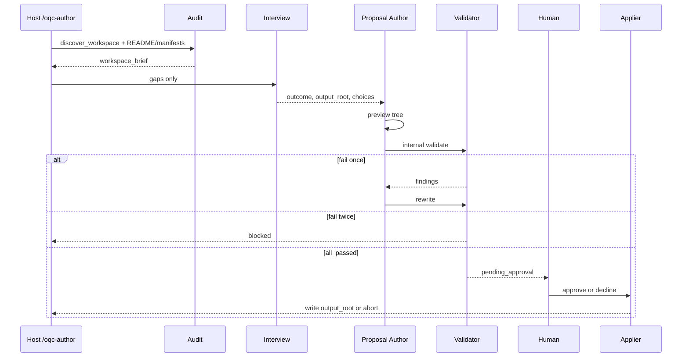

# Design: Greenfield orchestration authoring

Add `author_prepare` / `author_apply` so the skill can produce process
documents (workflow, rules, orchestrator, `ARCHITECTURE.md`) from a
workspace plus a short interview — not only judge or upgrade documents
that already exist.

Shipped in this repository as **3.1.0**.

## Goal

A caller who wants a new agentic process can ask this skill to author it.
The skill first audits the workspace so it does not ask obvious questions,
then interviews only for decisions the codebase cannot answer, drafts a
complete document set against packaged templates, runs the same QC gates
used by `validate` until they pass, and writes nothing until the human
approves.

## Non-goals

- Replacing `validate` / `execute` / `upgrade_*`.
- Emitting host mechanism files (agents, hooks, plugin manifests). That
  remains `upgrade_*`.
- In-place writing onto an existing document tree. Author is
  side-by-side into an empty `output_root`. Changing an existing
  mechanism is upgrade.
- Unbounded model exploration of the repository.
- Guessing the outcome, approval policy, or stop conditions.

## Decisions

1. One product, additive operations (3.1.0).
2. Structured interview after a workspace audit, never a long generic
   questionnaire.
3. Emit process documents only.
4. Internal QC must report `all_passed` before the human sees Apply.
5. Reuse the upgrade topology: Proposal Author drafts, Validator judges,
   Upgrade Applier writes an approved tree.

## Sequence

## Workspace audit (before any question)

A new deterministic script (`discover_workspace.py`, specified) walks
only well-known markers and returns JSON. The model does not glob the
whole repo. It may read the discovery JSON plus a short allowlist:
workspace `README.md` if present, and at most one manifest per detected
stack (`package.json`, `pubspec.yaml`, `pyproject.toml`, `go.mod`,
`Cargo.toml`).

Discovery records, when present:

| Field | Evidence (examples) |
| --- | --- |
| `languages` | Manifests and source suffixes |
| `package_managers` | lockfiles |
| `layout` | top-level directories |
| `test_trees` | `test/`, `tests/`, `e2e/`, `integration_test/`, `*_test/` |
| `ci` | `.github/workflows/`, similar |
| `existing_orchestration` | `**/workflows/workflows-*.md`, `**/rules/rules-*.md`, `**/*orchestrator*` |
| `existing_mechanism` | `.claude/agents/`, `.cursor/agents/`, adapter plugin dirs |
| `doc_language_hints` | README language, `pt-br` paths |
| `profile_hints` | `*.pipeline.yaml` → offer `example-pipeline`; otherwise `core` |

The brief is stored on the author checkpoint as `workspace_brief`. Audit
failure (unreadable workspace) is `blocked`, not an interview.

Audit answers questions. It does not choose the outcome.

## Focused interview

The host asks **one field at a time**. Each field is skipped when the
brief already has a high-confidence value. The human may correct a
skipped default in a final confirmation list (defaults + remaining
answers), not by re-asking every skipped item.

**Always ask**

- `outcome` — one sentence; never inferred from the repo
- `output_root` — must be missing or empty
- if `existing_orchestration` or `existing_mechanism` is non-empty:
  confirm **author** (new tree) vs **upgrade** (replace what is there).
  Choosing upgrade stops author and points at `/oqc-upgrade`.

**Ask only if unresolved**

- `shape`: single-agent procedure vs multi-worker orchestrator
- multi-worker: worker names, return shapes, tool allowlists
- `approval`: `required` | `none`
- `state.store` path
- stop / scope boundary
- named inputs the workflow must receive
- `language` only if the brief has no single hint
- `profile` only if hints conflict or artifacts of a profile are present

**Never ask** (put in the brief instead)

- What language/stack the repo is
- Whether tests or end-to-end folders exist
- To describe directory layout
- To restate README purpose, except as optional correction of the
  confirmation list

If the brief shows an end-to-end or integration tree, the only related
question is whether **this** orchestration’s outcome involves that tree
(yes/no), not what the stack is.

## Output tree (after Apply)

Under `output_root`:

- `ARCHITECTURE.md` — outcome, brief facts, skipped-vs-asked fields,
  diagram
- `rules/rules-<slug>.md` — `rules-template.md`; firm constraints, no
  rationale clauses
- `workflows/workflows-<slug>.md` — `workflows-template.md`
- `orchestrator.md` plus per-worker rule/workflow pairs **only** when
  shape is multi-worker (`orchestrator-template.md`)

Preview lives in the checkpoint, not in `output_root`, until Apply.

## Internal QC

Validator runs packaged `validate` against the preview tree (`profile`
from the brief). `all_passed` is required to open `pending_approval`.
One Author rewrite is allowed. A second failure is `blocked` with the
findings; the human may change the brief and run `author_prepare` again.

## Topology and state

Same isolated three-agent nesting as upgrade (ADR 0008, ADR 0010).
Shared `.orchestration-qc/state/` and `pending_approval` active-run
signal. Author does not share an active run with QC or upgrade.

Specified schemas (not yet in `references/schemas/`):
`author-input.schema.json`, `author-checkpoint.schema.json` (includes
`workspace_brief` and the preview file map).

Host entry points: Claude/Cursor `/oqc-author`, Codex
`orchestration-author`.

## Error handling

| Condition | Result |
| --- | --- |
| Audit cannot run | `blocked` |
| `output_root` exists and is non-empty | `blocked` |
| Human chooses upgrade at the fork | stop author; tell them to run upgrade |
| Internal QC fails twice | `blocked` with findings |
| Decline | checkpoint `aborted`; no files written |

## Success criteria for the 3.1.0 implementation (later)

- Interview question count drops for a typical repo vs a no-audit
  baseline (eval).
- No interview asks a question whose answer is already in
  `workspace_brief` except the confirmation list.
- Preview QC `all_passed` before Apply.
- `output_root` unchanged until approve.
- Existing validate/execute/upgrade behavior unchanged.
