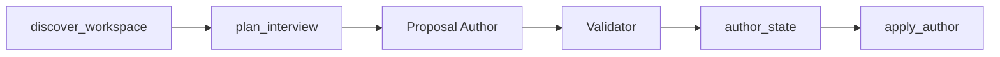

# 3.1.0 Greenfield Authoring Implementation Plan

**Goal:** Ship `author_prepare` / `author_apply` as additive 3.1.0 runtime.

**Architecture:** Deterministic audit and interview plan, then the existing upgrade nesting (upgrade orchestrator, proposal author, validator, upgrade applier) drafts process documents, internally validates the preview, and applies into an empty `output_root` only after approve.

**Tech Stack:** Python 3.10+ stdlib scripts, JSON schemas, Claude/Cursor/Codex adapters, unittest.

## Global Constraints

- Additive 3.1.0. Do not change validate/execute/upgrade behavior.
- No host adapter files in the authored tree.
- Preview QC must be `all_passed` before `pending_approval`.
- Shared `pending_approval` with QC and upgrade.
- Checkpoint on the ledger, then commit, after each gate.
- No former-product strings.

## Tasks

- [ ] Gate 1: `discover_workspace.py` + `plan_interview.py` + tests
- [ ] Gate 2: schemas + `author_state.py` + `apply_author.py` + tests
- [ ] Gate 3: workflows, rules, SKILL, templates wiring
- [ ] Gate 4: Claude, Cursor, Codex host entries (reuse upgrade agents)
- [ ] Gate 5: evals, version 3.1.0, user docs, ADR 0012 shipped status
