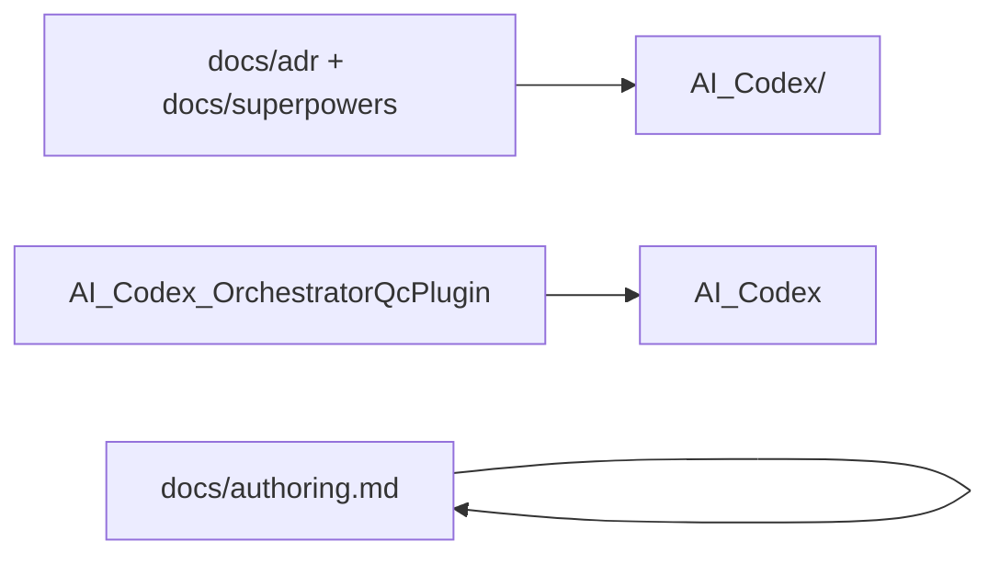

# Docs and ledger layout Implementation Plan

**Goal:** Split user docs from the contributor ledger, rename the vault to `AI_Codex/`, remove `docs/superpowers`, keep the ledger tracked, and make live documentation visually rich.

**Architecture:** Audience is the boundary (`docs/` = product users, `AI_Codex/` = forkers/contributors). ADRs and specs move into the ledger. User docs may link into it. Repo `.gitignore` negates a user-global `AI_Codex/` ignore.

**Tech Stack:** git mv, Markdown, Mermaid.

## Global Constraints

- Implementation approved 2026-09-02.
- Do not recreate `docs/superpowers`.
- Do not gitignore the ledger.
- Do not add leftover former-product notes to git.
- No commit unless the user asks.
- Live links rewritten; historical session prose left as-is.

## Tasks

- [x] Task 1: Negate global ignore; rename vault; move adr/specs/plans; delete `docs/superpowers`
- [x] Task 2: Rewrite live links and vault taxonomy
- [x] Task 3: Add Mermaid to user docs, ledger README, specs, ADRs, skill/package docs
- [x] Task 4: Search gates (no `docs/superpowers`, no live `AI_Codex_OrchestratorQcPlugin` except historical prose)
