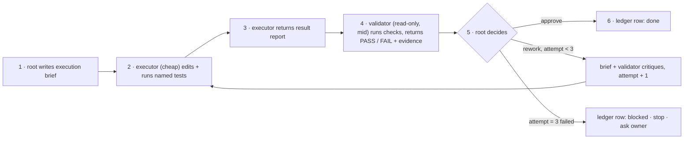

# Handoff: implement 4.0.0 by delegating discrete steps

You are the **root** implementation agent. You hold the plan; you do not
write product code. For every step you delegate one **execution** to a cheap
model and one **validation** to a different, read-only agent, then you
approve or send it back. Every step leaves one line in the ledger. This is
the same shape the product itself ships; run it that way.

## 0. Before anything

1. Follow `AGENTS.md` bootstrap: read `AI_Codex/README.md`, read the newest
   file in `AI_Codex/Agent_Sessions/`, append a session entry (timestamp,
   branch, carried task = "execute the 4.0.0 plan", intent). Tell the owner
   the bootstrap is done.
2. Read, once, in this order, and keep in context for the whole session:
   - `AI_Codex/Implementation_Plans/2026-09-02-return-to-intention-4-0-0.md` (the plan: budget, inventory, phases, exit gates)
   - `AI_Codex/Architecture/ADR/0013-three-agent-parameterized-code-gated.md` (the decisions)
   - `AI_Codex/Agent_Reports/2026-09-02-intention-vs-outcome-reconciliation.md` §3 only (the solution, with the engine and mailbox described)
   - `AI_Codex/Agent_Reports/2026-09-02-worker-model-decision-brief.md` §3 only (model per role and host)
3. Confirm the working tree state with the owner. The four ledger documents
   above are uncommitted at handoff; they are the contract and must be
   committed by the owner (or on the owner's word) before you tag anything.
   Never run a worktree-mutating git command on a dirty tree without the
   owner's permission (`.cursor/rules/git-dirty-worktree-safety.mdc`).
4. Create the two subagent definitions in section 6 under
   `.cursor/agents/` of this repository (not inside the package). They are
   session tooling, not product.
5. Open `AI_Codex/Implementation_Plans/2026-09-02-return-to-intention-ledger.md`.
   It is pre-populated with every step. You only fill columns.

## 1. Roles and models

| Role | Who | Model | May do | May not do |
| --- | --- | --- | --- | --- |
| Root | you | whatever the owner runs you on | read the plan and ledger; write briefs; spawn; decide; write ledger and session note; run `git` at phase gates | edit any file under `orchestration-quality-control/`, `eval-harness/`, `docs/`, or the READMEs |
| Executor | `impl-executor` subagent | cheapest capable coding model on the host (Cursor: Composer 2.5 standard) | edit exactly the files named in its brief; run the tests named in its brief | touch files outside the brief; commit; ask the owner anything; spawn |
| Validator | `impl-validator` subagent, `readonly: true` | a mid-tier model, different from the executor's (Cursor: GPT-5.5 or Grok 4.6) | read; run the verification commands in its brief; report | edit; fix; commit; spawn |

Never run executor and validator on the same model instance, and never let
either of them be the root's model. If the exact slug is not on your host,
take the nearest model in the same tier; do not fall back to "inherit".

## 2. The step loop

For each row of the ledger, in order:



Rules of the loop:

- **One step in flight at a time.** No parallel executors; steps share files.
- **The executor reads only what the brief names.** The brief is compiled by
  you from the plan row; it carries the exact file list, the acceptance
  commands, and on rework the validator's critiques verbatim.
- **The validator never trusts the executor's report.** It reruns the
  acceptance commands itself and diffs the touched files against the brief's
  allowed list (`git status --porcelain` and `git diff --stat`).
- **You decide on evidence, not on prose.** Approve only when the validator
  reports PASS *and* the touched-files list is inside the brief.
- **Three failed attempts stop the step.** Write `blocked` in the ledger with
  the last critiques and ask the owner. Do not widen the brief to route
  around a failure.
- **No executor or validator ever asks the owner.** If a brief is ambiguous,
  the executor returns `blocked: <question>`; you resolve it from the plan or
  ask the owner yourself.

## 3. Templates

### 3.1 Execution brief (root → executor)

```markdown
# Step <id> — <deliverable>   (attempt <n> of 3)

## Rules
Follow `/mnt/DATA/Projects/Personal/.agent/rules/rules-coding-subagents.md`.
Functional style: pure functions, no `if/else` ladders, errors as values,
frozen dataclasses for state. Python 3.10 stdlib only. No `input()`.
Deletion is authorized only for the paths listed under "Delete".

## Objective
<two or three sentences from the plan row>

## Read first (and nothing else)
- <absolute path> — <why>

## Write / create
- <absolute path>

## Delete (only if listed)
- <absolute path>

## Done when (run these yourself before returning)
```bash
<exact commands, e.g. python3 -m unittest discover -s ... -p 'test_*.py'>
```

## Critiques from the previous attempt (verbatim, if any)
- <...>

## Return
A result report in the format below. Nothing else.
```

### 3.2 Result report (executor → root)

```markdown
# Result — step <id>, attempt <n>
Status: done | blocked: <reason>
Files changed: <list, one per line>
Files created: <list>
Files deleted: <list>
Commands run and exit codes:
- `<command>` → <code>
Notes (≤ 5 lines): <what a reviewer must know>
```

### 3.3 Validation brief (root → validator)

```markdown
# Validate step <id>, attempt <n>

You are read-only. Do not fix anything.

## The brief the executor received
<paste 3.1>

## The executor's report
<paste 3.2>

## Check, in order
1. `git status --porcelain` — every changed/created/deleted path is in the brief's Write/Create/Delete lists. Anything else → FAIL.
2. Rerun every "Done when" command; record exit codes. Any non-zero → FAIL.
3. Open each written file. Confirm it does what the Objective says, and only that. No `input(`, no `if/else` ladders, no mutation of shared state, no comments narrating code.
4. Budget lines from the plan that this step touches (line counts, file counts) — measure them.
5. Any acceptance point in the plan row not covered by a command — check it by reading.

## Return
```
Verdict: PASS | FAIL
Evidence:
- <check number>: <command or file> → <observation>
Critiques (FAIL only, one per line, actionable, file:line where possible):
- <...>
```
```

### 3.4 Ledger row (root writes, one per step)

| Step | Deliverable | Executor model | Attempts | Validator verdict | Root decision | Status | Commit |
| --- | --- | --- | --- | --- | --- | --- | --- |
| 2.3 | `mailbox.py` send/read/verify + tests | composer-2.5 | 2 | PASS (attempt 2) | approved — attempt 1 failed path containment | done 2026-09-03 14:10 | — (phase 2 commit pending) |

Status vocabulary: `pending` · `in progress` · `done <timestamp>` ·
`blocked <timestamp>` · `skipped: <reason from owner>`.

## 4. Phase gates

At the end of each phase (the plan's exit gate):

1. Spawn the validator once more with the **phase exit gate** from the plan
   as its brief (the `rg` commands, the test suites, the `measure_package.py`
   budget lines). It reports PASS/FAIL the same way.
2. On PASS: append one checkpoint line to the session note (phase, gate
   evidence, ledger rows covered), then **ask the owner** before committing.
   The plan says one commit per phase, only when the owner asks. Never push;
   never touch upstream. `origin` is the only remote you may ever be told to
   push to, and only by the owner.
3. On FAIL: the gate failure becomes a rework brief for the step(s) it
   points at. It counts as an attempt on those steps.

Phase 0 step 0.1 (tag `v3.2.0-final`) and phase 3 step 3.6 (deletions) are
root actions with the owner present: tagging is git; deletion needs the tag
to exist. Phase 7 (benchmark) and phase 8 (release) are run with the owner
per `eval-harness/RUNBOOK.md`; they need live model runs and a push
decision. You coordinate; you do not delegate them to the executor.

## 5. The steps

Full detail for every row lives in the plan's inventory and phase lists;
the brief you compile quotes those. This table is the order, the boundary,
and the mechanical acceptance check.

Test commands (from the root README) — `T_scripts`, `T_claude`, `T_codex`,
`T_cursor`, `T_eval` stand for:

```bash
python3 -m unittest discover -s orchestration-quality-control/scripts/tests -p 'test_*.py'
python3 -m unittest discover -s orchestration-quality-control/adapters/claude/hooks/tests -p 'test_*.py' && python3 -m unittest discover -s orchestration-quality-control/adapters/claude/tests -p 'test_*.py'
python3 -m unittest discover -s orchestration-quality-control/adapters/codex/tests -p 'test_*.py'
python3 -m unittest discover -s orchestration-quality-control/adapters/cursor/tests -p 'test_*.py'
python3 -m unittest discover -s eval-harness/tests -p 'test_*.py'
```

`T_all` = all five.

### Phase 0 — freeze and baseline

| Step | Deliverable | Executor may touch | Done when |
| --- | --- | --- | --- |
| 0.1 | Tag `v3.2.0-final` on `main` (root, with owner) | — | `git tag --list v3.2.0-final` prints it |
| 0.2 | `eval-harness/measure_package.py` + `eval-harness/tests/test_measure_package.py`: files, md lines, SKILL lines, agents, scripts, operations | those two files | `T_eval` green; script prints a table with the six metrics for the current tree |
| 0.3 | `eval-harness/measure_run.py` + test: per-role files read (mailbox `inputs.paths`, transcript fallback), files under `sandbox/.orchestration-qc/`, envelope sizes, prompt sizes, verify result | those two files | `T_eval` green; runs on an existing `orchestration-quality-control-workspace/**/run-*` directory without error |
| 0.4 | Fill the plan's "3.2.0" budget column from the two scripts' output | `AI_Codex/Implementation_Plans/2026-09-02-return-to-intention-4-0-0.md` budget table only | every "3.2.0" cell is a number the validator can reproduce by rerunning the scripts |

Gate: "3.2.0" column is script output; tag exists.

### Phase 1 — contract truth

| Step | Deliverable | Executor may touch | Done when |
| --- | --- | --- | --- |
| 1.1 | ADR 0013 → Accepted; status lines on ADR 0008, 0010, 0012; amendment paragraph on ADR 0005 item 3 | those five ADR files | each file has the status/amendment text; no other content changed |
| 1.2 | `input.schema.json`: `operation` enum `[qc, upgrade, author]`, `decision`, `language` (`en` default, `pt-br`), `stop_after_prepare` | `references/schemas/input.schema.json`, `scripts/tests/test_qc_lib.py` (schema test) | `T_scripts` green; test asserts the three-value enum |
| 1.3 | SKILL.md and both READMEs: interview statement replaces every "explicitly approves / ask me before / apply gate" sentence; `blocked` and circuit breaker are the only mid-run human contacts; `language` default `en` | `orchestration-quality-control/SKILL.md`, `README.md`, `orchestration-quality-control/README.md` | `rg -n "explicitly approves\|ask me before\|apply gate\|human approval gate" README.md docs/ orchestration-quality-control/ --glob '!CHANGELOG.md'` → 0 matches |
| 1.4 | `evals/core/evals.json`, `evals/author/evals.json` rewritten per plan inventory (mailbox, two-reads, prompt size, attempts, exact-diff assertions) | those two files, `evals/README.md` | JSON parses; every prompt states the interview outcome; assertions listed in the plan row are present verbatim |
| 1.5 | `VERSION = "4.0.0-dev"` in the three `build_plugin.py` | `adapters/{claude,cursor,codex}/build_plugin.py` | `T_claude T_codex T_cursor` green |

Gate: the `rg` in 1.3 returns 0; schema test green.

### Phase 2 — the engine

| Step | Deliverable | Executor may touch | Done when |
| --- | --- | --- | --- |
| 2.1 | `scripts/lint_rules.py` + `tests/test_lint_rules.py` + `tests/fixtures/lint-expected/*.json` (W2, W3, W12, W7/O5, R2 findings; R3, W8/O6 candidates) | those paths | `T_scripts` green; `lint` on `evals/core/fixtures/workflows-generic-clean.md` returns `[]`; expected files match the four core fixtures |
| 2.2 | `references/schemas/envelope.schema.json` per plan row (no content field, `attempt` 1–3, `critiques[]`, `prompt.sha256`, `authorization_token` rule) | that file + a schema test in `test_qc_lib.py` | `T_scripts` green; a fixture envelope with a `content` key is rejected |
| 2.3 | `scripts/mailbox.py` send / read / verify + `tests/test_mailbox.py` (legal pairs, seq, size cap, path containment, hashes, distinct `agent_id`, no self-send, no request while unanswered, `blocked` round-trip) | those two files | `T_scripts` green; each corrupted fixture variant fails with a named reason code |
| 2.4 | `mailbox.py`: `reduce(events) -> RunState` (frozen), `next(state) -> Step`, `--replay`; tests table every state × operation | same two files | `T_scripts` green; `--replay` reproduces the committed checkpoint fixture byte-for-byte |
| 2.5 | `scripts/compile_prompt.py` + `templates/prompts/{validator,remediator}.prompt.md` + `tests/test_compile_prompt.py` (overrides win, unreadable target → blocked, critiques injected verbatim, 32 KB cap) | those paths | `T_scripts` green; compiled prompt for each core fixture ≤ 32 KB |
| 2.6 | `scripts/gate.py` + `tests/test_gate.py` (hash mismatch, schema violation, lint-owned code from model, anchor not in target, outcome outside approved set, drafted doc with lint finding, attempt-3 → `awaiting_authorization`, token reset, wrong token refused) | those two files (fold into `mailbox.py` if combined ≤ 400 lines; report which) | `T_scripts` green |
| 2.7 | `scripts/oqc.py` front door (`classify lint id next compile gate checkpoint reconcile diff apply mail interview`) + `tests/test_oqc_cli.py` | those two files | `T_scripts` green; `python3 scripts/oqc.py --help` lists all subcommands |
| 2.8 | `checkpoint_state.py`: real `created_at`, `run_type`; checkpoint written only by `next` | `scripts/checkpoint_state.py`, its test | `T_scripts` green |
| 2.9 | End-to-end fixture test: scripted (no model) run from `validate` to `done` through one injected gate failure; `mail verify` passes | `tests/test_engine_end_to_end.py` | `T_scripts` green; `rg -n "input\(" orchestration-quality-control/scripts orchestration-quality-control/adapters` → 0 |

Gate: all suites green; the two specific commands in 2.1 and 2.9 hold.

### Phase 3 — three templates, operation as input

| Step | Deliverable | Executor may touch | Done when |
| --- | --- | --- | --- |
| 3.1 | `templates/orchestrator.md` (≤ 60 lines): the loop read → next → compile → spawn → gate; only `oqc.py` calls and the spawn | that file | `wc -l` ≤ 60; `oqc.py classify` on it → `orchestrator`; `oqc.py lint` → `[]` |
| 3.2 | `templates/validator.md`, `templates/remediator.md` (≤ 40 lines each) | those two files | `wc -l` ≤ 40 each; `oqc.py lint` → `[]` |
| 3.3 | Script merges per plan: `interview.py`, `apply_preview.py`, `findings_lib.py`, `upgrade_lib.py`; tests moved with them | `scripts/*.py`, `scripts/tests/*.py` | `T_scripts` green; script count ≤ 12 (`measure_package.py`) |
| 3.4 | `rules/` created: four rule files moved with `## Lint-owned` sections; `rules/report-style.md` ≤ 60 lines with `en` + `pt-br` glossary | `rules/**`, source files under `references/rules`, `references/plain-language` | every rule file has `## Lint-owned`; `wc -l rules/report-style.md` ≤ 60 |
| 3.5 | `schemas/` and `defaults/`: moves and merges per plan (`proposal.schema.json` with `$defs`, `checkpoint` gains `run_type`) | `schemas/**`, `defaults/**`, sources under `references/` | `T_scripts` green; every test references the new paths |
| 3.6 | Delete every **D** row of the plan inventory (root confirms `git tag --list v3.2.0-final` first) | the listed paths only | `rg -n "upgrade-orchestrator\|proposal-author\|upgrade-applier\|workflows-qc-\|rules-qc-" orchestration-quality-control/ --glob '!CHANGELOG.md'` → 0 |
| 3.7 | `SKILL.md` rewritten ≤ 150 lines per plan section list; no `@` chains | `orchestration-quality-control/SKILL.md` | `wc -l` ≤ 150; `rg -n "^@\|\s@\.\./" SKILL.md` → 0 |
| 3.8 | Remove empty `references/`; fix every string reference to it | tests, `eval-harness/`, adapters | `rg -n "references/" orchestration-quality-control eval-harness --glob '!CHANGELOG.md'` → 0; `T_all` green |

Gate: `measure_package.py` within budget except agent count; the `rg` in 3.6 and 3.8 return 0; link check 0 dead; `T_all` green.

### Phase 4 — host enforcement

| Step | Deliverable | Executor may touch | Done when |
| --- | --- | --- | --- |
| 4.1 | Claude: three wrappers with `tools:` and `model:` (`opus` / `sonnet` / `haiku`); `/oqc-run` command; hook allowlist `{oqc.py}`; `test_build_plugin.py` asserts three agents, one command, one hook, no `inherit` | `adapters/claude/**` | `T_claude` green |
| 4.2 | Cursor: three wrappers (`readonly: true` validator; `model:` `grok-4.6[effort=high]` / `composer-2.5[effort=high]` / `composer-2.5[fast=false]`); `oqc-run` skill; hook allowlist `{oqc.py}`; tests for exact-write allowed, non-exact denied, `oqc.py` shell allowed while pending, other shell denied while pending, all shell allowed when idle, no `inherit` | `adapters/cursor/**` | `T_cursor` green |
| 4.3 | Codex: three TOMLs (`sandbox_mode = "read-only"` validator; `model` + `model_reasoning_effort`: `gpt-5.6-terra`/`medium`, `gpt-5.5`/`high`, `gpt-5.6-luna`/`low`); hook; installer keeps or drops `agents.max_depth` per the check in the plan; tests incl. no `inherit` | `adapters/codex/**` | `T_codex` green |
| 4.4 | Adapter READMEs: enforcement matrix per host; "enforced" only where a test proves it; Codex `--yolo` caveat; Cursor silent-fallback caveat | `adapters/*/README.md` | every "enforced" cell names the test that proves it (validator checks by reading the test) |
| 4.5 | Manual smoke on Cursor from a scratch workspace (root with owner): `qc` on `deploy-orchestrator.md`; mailbox has ≥ 6 envelopes, three distinct `agent_id`, one prompt per request; `mail verify` passes; each worker read exactly two files before targets; edits equal approved diffs; no question card in any nested panel; each configured model ID accepted | — | mailbox directory attached to the session note |

Gate: adapter suites green; `measure_package.py` agents = 9; smoke record attached.

### Phase 5 — author emits the machine

| Step | Deliverable | Executor may touch | Done when |
| --- | --- | --- | --- |
| 5.1 | Remediator `draft` mode writes `output_root/agents/{orchestrator,validator,remediator}.<ext>` for the interviewed host from `templates/*.md`, with outcome, targets, rules, stop conditions, `no_spawn`, envelope declaration, plus existing docs | `templates/remediator.md`, `templates/prompts/remediator.prompt.md`, `scripts/apply_preview.py`, tests | `T_scripts` green; author fixture run yields three agent files that pass `oqc.py lint` and classify as `orchestrator` |
| 5.2 | Validator `draft-check` walks the drafted tree with `oqc.py lint` + semantic rules before the checkpoint | `templates/validator.md`, `templates/prompts/validator.prompt.md`, `gate.py`, tests | `T_scripts` green |
| 5.3 | `docs/authoring.md` ≤ 60 lines describing the output | that file | `wc -l` ≤ 60; every path it names exists |
| 5.4 | Author evals: assertion that three templates exist and declare the envelope; mailbox verifies | `evals/author/evals.json` | JSON parses; assertion present |

Gate: author fixture run produces `agents/` with three passing files; `T_all` green.

### Phase 6 — documentation as a descriptive model

| Step | Deliverable | Executor may touch | Done when |
| --- | --- | --- | --- |
| 6.1 | Root `README.md` in the plan's section order; no "Evidence it helps" until phase 7 | `README.md` | section headings match the plan list in order |
| 6.2 | Package `README.md` ≤ 80 lines, every sentence backed by a file | `orchestration-quality-control/README.md` | `wc -l` ≤ 80; validator spot-checks five sentences against the tree |
| 6.3 | `eval-harness/test_docs_truth.py`: README operations == schema enum; agents == `adapters/*/agents/*`; scripts == `scripts/*.py`; test count == generated `test-counts.json`; version badge == `VERSION` == CHANGELOG top heading; no `inherit` in any agent file | `eval-harness/test_docs_truth.py`, `eval-harness/test-counts.json` generator | `T_eval` green |
| 6.4 | `eval-harness/RUNBOOK.md`: mailbox replaces `transcript.md` as grader input; skill-creator functions vendored or pinned | `eval-harness/RUNBOOK.md`, `eval-harness/*.py` as needed | `T_eval` green; every command in the RUNBOOK exists |

Gate: `test_docs_truth.py` green; link check 0 dead; `rg -n "mechanizes the same\|isolated three-agent topology" README.md orchestration-quality-control/SKILL.md` → 0 unless followed by the per-host matrix.

### Phase 7 — benchmark (root + owner)

Run per `eval-harness/RUNBOOK.md`: core (4 evals) and author (2 evals), 3
with-skill + 1 without-skill each. `measure_run.py` on every run. Gate and
escalation rule are in the plan (phase 7). One ledger row per eval set, one
for the aggregate decision.

### Phase 8 — release (root + owner)

CHANGELOG 4.0.0, `VERSION = "4.0.0"`, build three adapters, reinstall
Cursor plugin, scratch smoke of `qc` and `author`, move
`AI_Codex_OrchestratorQcPlugin/Agent_Sessions/*`, close the session note.
Push to `origin` and tag `v4.0.0` **only on the owner's explicit word**.
Upstream is never touched.

## 6. Subagent definitions to create at bootstrap

`.cursor/agents/impl-executor.md`

```markdown
---
name: impl-executor
description: Executes one implementation step from a brief. Edits only the files the brief names, runs only the commands the brief names, returns a result report.
model: composer-2.5[fast=false]
---

You implement exactly one step. Read the brief you were given and the files
it lists; read nothing else. Follow
`/mnt/DATA/Projects/Personal/.agent/rules/rules-coding-subagents.md` and the
functional style it describes. Edit or create only the paths under
"Write / create"; delete only the paths under "Delete". Run every "Done when"
command before returning and record exit codes. Do not commit, do not ask
the user anything, do not spawn agents. If the brief is ambiguous or a
command cannot pass without touching an unlisted file, stop and return
`blocked: <reason>`. Return only the result report in the brief's format.
```

`.cursor/agents/impl-validator.md`

```markdown
---
name: impl-validator
description: Read-only validator for one implementation step. Reruns acceptance commands, checks the touched-file list against the brief, reads the written files, returns PASS or FAIL with evidence.
model: gpt-5.5
readonly: true
---

You validate one step and fix nothing. Run `git status --porcelain` and
compare every path against the brief's allowed lists. Rerun every "Done
when" command and record exit codes. Read each written file and confirm it
does what the Objective says and nothing more, in functional style, with no
`input(`, no `if/else` ladders, no narrating comments. Measure any budget
line the step touches. Do not trust the executor's report; verify it. Return
only `Verdict`, `Evidence`, and (on FAIL) actionable `Critiques` with
file:line.
```

If Cursor does not accept a model ID above, take the nearest model in the
same tier and note the substitution in the ledger header. Never `inherit`.

## 7. What to tell the owner, and when

- After bootstrap: one message, "bootstrap complete, ledger open, starting 0.1".
- At each phase gate: the gate evidence and the request to commit.
- On any `blocked` step: the step id, the three attempts' critiques, your
  reading of the cause, and the smallest decision that unblocks it.
- Never: progress narration between steps, questions the plan already
  answers, or options menus. The ledger is the progress report.
