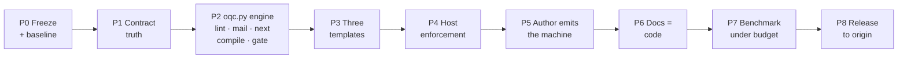

# 4.0.0 Return-to-Intention Implementation Plan

**Goal:** Ship `orchestration-quality-control` 4.0.0 as intended: exactly
three isolated agent templates per host, parameterized by an up-front
interview, communicating through schema-defined envelopes in a per-run
mailbox, with mechanical rules in code, isolation proven every run, and cost
inside a measured budget. Documentation describes the code.

**Architecture:** Engine-first, as in the ancestor `agentic-e2e-test-workflow`
(reconciliation §1.1). Root session interviews, then sends one request
envelope. The Orchestrator agent loops *`oqc.py next` → `oqc.py compile` →
spawn worker with the compiled prompt → `oqc.py gate`*; it never authors,
never routes by prose. Workers (Validator, Remediator; no further spawn) read
exactly their envelope and their compiled prompt and answer with result
envelopes referencing artifacts by path and hash. `oqc.py` owns every
mechanical stage: classify, lint, id, next, compile, gate, checkpoint,
reconcile, diff, apply, mail. Retry with critiques ≤ 3, then
`awaiting_authorization` resumable only by `IMPLEMENTATION APPROVED` from
root. Operation ∈ {qc, upgrade, author} runs prepare and apply in one
Orchestrator spawn.

**Tech stack:** Python 3.10+ stdlib, JSON Schema, unittest, Mermaid.

**Status:** Proposed. Decisions 1–6 recorded
([[2026-09-02-intention-vs-outcome-reconciliation]] §5). Model per role and
host, with the host documentation behind it:
[[2026-09-02-worker-model-decision-brief]]. No agent file may say
`model: inherit`. Governing record:
[[0013-three-agent-parameterized-code-gated]].



## Global constraints

- One commit per phase, only when the owner asks. Tag `v3.2.0-final` before
  P1. Rollback of a phase is `git revert` of that phase's commit.
- No phase starts until the previous exit gate is green and recorded as one
  checkpoint line in the session note.
- Deletions listed in the inventory execute at P3 (decision 5, recorded in
  the reconciliation §5). No `deprecated/` staging in the package; the
  `v3.2.0-final` tag is the recovery point and is named in the 4.0.0
  CHANGELOG. Codex notes (ADRs, reports) are never deleted; superseded ones
  get a status line.
- All offline suites pass at every exit. No test count drops without the
  covered feature being removed.
- No new markdown file in the package unless named here.
- Every budget number is produced by a script in `eval-harness/`.
- `github.com/theocarranza/orchestration-quality-control` (upstream) is not
  pushed to (decision 3). `origin` (`-agnostic`) is the release target.
- Nested agents never call a question UI. The only mid-run human contacts
  are a `blocked` envelope and the circuit breaker (`awaiting_authorization`),
  both engine states surfaced by the root session.
- Ancestor lessons are constraints (spec v3 §10): structural checks, never
  literal-string gates (F6); the compiler never widens context on a miss —
  it blocks (F7); the engine owns the lifecycle of every mailbox file it
  writes (F10); no `input()` or stdin prompt in any script or hook; no stub
  hooks shipped; no duplicate engine copies (F2).
- The engine is invoked per step; there is no long-running process and no
  MCP server. State lives in the mailbox.

## Budget (gate for P7 and P8)

| Metric | 3.2.0 | 4.0.0 gate | Measured by |
| --- | --- | --- | --- |
| Package files (excl. `__pycache__`, tests) | 131 | ≤ 75 | `eval-harness/measure_package.py` |
| Package markdown lines (excl. CHANGELOG, tests) | 3694 | ≤ 1,600 | same |
| `SKILL.md` lines | 181 | ≤ 150 | same |
| Agent definition files | 18 | 9 (3 × 3 hosts) | same |
| Scripts (non-test `.py`) | 15 | ≤ 12 | same |
| Operations | 6 | 3 | `input.schema.json` enum |
| Orchestrator spawns per outcome | 2 (counted by hand from the shipped workflows: prepare and apply are separate spawns; no mailbox exists to measure it) | 1 | mailbox |
| Files read per agent before its work (excluding targets) | 15–20 packaged per run, median 17, over the 7 of 30 with-skill runs whose transcript lists files | 2 per agent (envelope + compiled prompt) · run ≤ 6 | `eval-harness/measure_run.py` on mailbox + transcript |
| Compiled prompt size | n/a | ≤ 32 KB each | `oqc.py compile` records `prompt.sha256` + bytes; `verify` checks |
| Attempts per worker request | uncounted | ≤ 3 then `awaiting_authorization` | `oqc.py mail verify` |
| With-skill `qc` wall time, ≤ 100-line target | median 570 s | ≤ 240 s median and ≤ 2x without-skill | `timing.json` |
| Files written to `.orchestration-qc/` per run | 0–13, median 3, over 30 with-skill runs | `state/checkpoint-*.json` + `mail/<run_id>/` (`events.jsonl` + one prompt per request) | `measure_run.py` |
| Envelope size | unbounded prose | ≤ 4 KB, no content field | `oqc.py mail verify` |
| Checkpoint replayable from mailbox | no | `oqc.py next --replay` reproduces checkpoint status byte-for-byte | `test_mailbox.py` |
| Runs whose mailbox verifies with distinct `agent_id` per role | not measured | 100% | `oqc.py mail verify` |
| Core with-skill assertion pass rate | 95.8% | 100%, 3 runs × 4 evals | `benchmark.json` |
| Offline tests | 177 | ≥ 150, all green | unittest |

The "3.2.0" column is script output as of 2026-09-02, reproducible with:

```bash
python3 eval-harness/measure_package.py
for d in orchestration-quality-control-workspace/*/iteration-1/eval-*/*/run-*; do
  python3 eval-harness/measure_run.py "$d" --json
done
```

Rows whose "Measured by" names `timing.json`, `benchmark.json`, unittest or
a 4.0.0-only mechanism are not produced by those two scripts and carry their
own provenance.

## Inventory

Action key: **K** keep · **R** rewrite · **M** move/merge · **N** new ·
**D** delete at P3 (decision 5; recovery via tag `v3.2.0-final`).

### Package root

| Path | Action | Note |
| --- | --- | --- |
| `SKILL.md` | R | ≤ 150 lines: What it checks · Operations (3) · Interview (root session, defaults, `language`) · Engine (`next` · `compile` · `gate` · breaker) · Envelope + mailbox · Three templates · Enforcement per host · Files. No `@` chains. |
| `README.md` | R | ≤ 80 lines, descriptive. |
| `CHANGELOG.md` | K + 4.0.0 | |
| `entrypoints/` | D | Author/upgrade become `operation` values. |

### `templates/` (agent templates — new top-level; replaces `references/workflows` and `rules-qc-*`)

| Path | Action | Note |
| --- | --- | --- |
| `templates/orchestrator.md` | N | ≤ 60 lines. Loop: `oqc.py mail read --role orchestrator` → `oqc.py next` → on `validate`/`remediate`: `oqc.py compile --seq N` → `oqc.py mail send` request (prompt hash, `no_spawn`) → spawn worker with the envelope path → `oqc.py gate --seq M` → repeat; on `reconcile`/`verify`: run the named subcommand; on `done`: `mail send` result with `isolation_evidence`; on `blocked`/`awaiting_authorization`: `mail send` result to root and stop. Never authors, never reads rules or targets. Folds `rules-qc-orchestrator.md`, `rules-upgrade-orchestrator.md`, `workflows-qc-validate/execute.md`, `workflows-upgrade-*.md`, `workflows-author-*.md`. |
| `templates/validator.md` | N | ≤ 40 lines. Read envelope → read compiled prompt (rules, report style, lint findings, critiques are inside it) → read targets → judge semantic remainder → write `findings.json` + report → `mail send` result. `blocked` on any unresolvable condition. Folds `rules-qc-validator.md`, `workflows-qc-validator.md`. |
| `templates/remediator.md` | N | ≤ 40 lines. Read envelope → read compiled prompt (mode, approved diffs or draft brief, critiques) → act: `apply-findings` (exact before/after), `draft` (write only into empty `output_root`), `apply-preview` (`oqc.py apply` once) → `mail send` result. Folds `rules-qc-remediator.md`, `workflows-qc-remediator.md`, `rules-proposal-author.md`, `workflows-proposal-author.md`, `rules-upgrade-applier.md`. |
| `templates/prompts/{validator,remediator}.prompt.md` | N | Compiler bodies: the procedural text that `oqc.py compile` prepends to rules/decisions/critiques. Overridable from `.orchestration-qc/templates/`. |
| `templates/reference-architecture.md` | M ← `references/templates/isolated-three-agent.md` | Declares the envelope as the hand-off contract; used by `upgrade` comparison and `author` output. |
| `templates/doc-shapes/{workflows,rules,orchestrator}-template.md` | M ← `references/templates/` | W3 lint and `author` use them. |

Host adapter agent files become thin wrappers: frontmatter (`name`, `model`,
`tools`/`readonly`) + one line loading the matching `templates/<role>.md`.

### `rules/` (target rule sets)

| Path | Action | Note |
| --- | --- | --- |
| `rules/workflow.md`, `rules/orchestrator.md`, `rules/rules-file.md`, `rules/generator.md` | M ← `references/rules/rules-*-quality-control.md` | Each gains `## Lint-owned` listing codes the Validator must not emit. |
| `rules/report-style.md` | M ← `references/plain-language/*` (216 lines → ≤ 60) | `en` + `pt-br` glossary section (decision 4). |
| `references/rules/rules-reference-architecture-quality-control.md` | M | Into `rules/orchestrator.md` as the T-codes the `upgrade` comparison uses. |

### `schemas/`

| Path | Action | Note |
| --- | --- | --- |
| `schemas/envelope.schema.json` | N | See reconciliation §3.6. `additionalProperties: false`; no `content`/`body` property; `maxLength` on strings; `artifacts[].sha256` and `prompt.sha256` required on requests; `attempt` integer 1–3; `critiques[]` strings; `authorization_token` allowed only on root→orchestrator requests and must equal `IMPLEMENTATION APPROVED`. |
| `schemas/input.schema.json` | R | `operation` enum `[qc, upgrade, author]`; `decision` (qc: `all|none|[ids]`, upgrade/author: `approve|decline`) supplied by the interview, default from `gate-defaults.json`; `language` enum `[en, pt-br]` default `en`; `stop_after_prepare` boolean default `false`. |
| `schemas/finding.schema.json`, `checkpoint.schema.json`, `blocked.schema.json`, `kinds.md`, `profile-manifest.schema.json` | M | `checkpoint` gains `run_type ∈ {qc, upgrade, author}` (merging `upgrade-checkpoint` and `author-checkpoint`). |
| `schemas/proposal.schema.json` | M ← `upgrade-proposal` + `author-proposal` | One shape, `proposal_type` discriminator. |
| `references/schemas/upgrade-input`, `author-input`, `upgrade-checkpoint`, `author-checkpoint`, `structure-manifest`, `template-gap`, `upgrade-verification` | D or M | `structure-manifest`, `template-gap`, `upgrade-verification` fold into `proposal.schema.json` `$defs`; the rest are replaced by `input`/`checkpoint`. |
| `references/defaults/gate-defaults.json` | M → `defaults/gate-defaults.json` | K in content; `labels` gain `language`. |

### `scripts/`

| Path | Action | Note |
| --- | --- | --- |
| `oqc.py` | N | Front door: `classify · lint · id · next · compile · gate · checkpoint · reconcile · diff · apply · mail · interview`. Thin dispatch. Hook allowlist becomes `{oqc.py}`. |
| `lint_rules.py` | N | Reconciliation §3.3. Pure `lint(text, classes, rel_path) -> findings`. |
| `mailbox.py` | N | Envelopes and state. `send` (seq, legal pair, size cap, path containment, no request while one is unanswered), `read`, `verify` (continuity, pairing, hashes incl. prompt, distinct `agent_id`, no self-send, every `attempt` increment preceded by a FAIL gate). `reduce(events) -> RunState` (frozen dataclass; pure) and `next(state) -> Step` — the ancestor's reducer over envelopes. `--replay` derives the checkpoint. Append-only `mail/<run_id>/events.jsonl`. |
| `compile_prompt.py` | N | `compile(request, package_root, overrides_root) -> PromptDoc`. Assembles `templates/prompts/<role>.prompt.md` + rule set(s) for classified targets + `report-style.md` (validator) + interview decisions + lint findings (validator) / approved findings + diffs (remediator) + `critiques`. Project overrides from `.orchestration-qc/{templates,rules}/` first. Returns `blocked` on unreadable target; never widens. Enforces ≤ 32 KB. Writes `mail/<run_id>/<seq>-<role>.prompt.md`, returns path + sha256 + bytes. |
| `gate.py` (inside `mailbox.py` if ≤ 120 lines, else own file) | N | `gate(result_envelope) -> Pass | Fail(critiques)`: artifact hashes, schema of findings/outcomes, no lint-owned code from the model, anchors exist in targets, outcome ids ⊆ approved set, `lint` on drafted/upgraded documents. Fail appends critiques and increments `attempt` on the next request; `attempt` ≥ 3 → state `awaiting_authorization`. |
| `qc_lib.py`, `classify_targets.py`, `derive_finding_id.py`, `reconcile_decision.py`, `render_diff.py` | K | |
| `checkpoint_state.py` | R | Real `created_at`; `run_type`; absorbs `upgrade_state.py` and `author_state.py` create/decide. No sidecar `findings.json`/report copies written by any template step other than the Validator's single `findings.json` artifact. |
| `interview.py` | M ← `discover_workspace.py` + `plan_interview.py` + `gate_defaults.py` | One module: `discover`, `plan` (`always_ask: ["outcome"]` for author; none for qc/upgrade), `defaults` (adds `language`). |
| `apply_preview.py` | M ← `apply_upgrade.py` + `apply_author.py` | One atomic copy with `run_type` switch. |
| `discover_structure.py`, `render_upgrade.py` | K | Used by `upgrade`. |
| `upgrade_state.py`, `author_state.py`, `gate_defaults.py`, `plan_interview.py`, `discover_workspace.py`, `apply_upgrade.py`, `apply_author.py` | D | After merge. |
| `tests/test_lint_rules.py`, `test_mailbox.py`, `test_compile_prompt.py`, `test_gate.py`, `test_oqc_cli.py`, `test_interview.py` | N | |

Count after: `oqc.py`, `qc_lib.py`, `findings_lib.py` (← `classify_targets`
+ `derive_finding_id`), `lint_rules.py`, `checkpoint_state.py`,
`reconcile_decision.py`, `render_diff.py`, `mailbox.py`, `compile_prompt.py`,
`gate.py`, `interview.py`, `apply_preview.py`, `upgrade_lib.py`
(← `discover_structure` + `render_upgrade`) = 13. Budget is ≤ 12: `gate.py`
folds into `mailbox.py` if the combined module stays ≤ 400 lines, otherwise
`apply_preview.py` folds into `checkpoint_state.py`. P3 records which.

### `evals/`

| Path | Action | Note |
| --- | --- | --- |
| `evals/core/evals.json` | R | Prompts state the interview outcome, not "ask me". Assertions per eval: expected findings · no fabricated findings · report style · **mailbox verifies with distinct `agent_id` for validator (and remediator when findings exist)** · **no worker envelope sent by the orchestrator's own `agent_id`** · **every worker read exactly its envelope and its compiled prompt before targets** · **every compiled prompt ≤ 32 KB** · **no attempt > 3** · edits equal exactly the approved diffs. One eval injects a deliberately failing Remediator result (fixture) and asserts critiques appear in the attempt-2 prompt. |
| `evals/core/fixtures/*` | K | |
| `evals/author/evals.json` | R | Assertion: `output_root/agents/` contains three host templates declaring the envelope; mailbox verifies. |
| `evals/README.md` | R | |

### `profiles/example-pipeline/`

| Path | Action |
| --- | --- |
| all | K (README ≤ 40 lines) |

### `adapters/`

| Path | Action | Note |
| --- | --- | --- |
| `claude/agents/oqc-orchestrator.md`, `oqc-validator.md`, `oqc-remediator.md` | R | Wrappers over `templates/`. `tools:` explicit: Orchestrator `Agent, Read, Write, Bash`; Validator `Read, Grep, Glob, Bash`; Remediator `Read, Edit, Write, Bash`. Bash comment: `oqc.py` only. `model` (decision 6): orchestrator `opus`, validator `sonnet`, remediator `haiku`. |
| `claude/agents/oqc-upgrade-orchestrator.md`, `oqc-proposal-author.md`, `oqc-upgrade-applier.md` | D | |
| `claude/commands/oqc-run.md` | N | One command: interview (`AskUserQuestion` for `outcome` when `author`; defaults confirmation incl. `language`) → `oqc.py mail send` request → spawn `oqc-orchestrator` → surface result, `blocked`, or `awaiting_authorization` (prints critiques; resumes only if the user types `IMPLEMENTATION APPROVED`, which becomes `authorization_token` on a new root request). |
| `claude/commands/oqc-validate.md`, `oqc-execute.md`, `oqc-upgrade.md`, `oqc-author.md` | D | Replaced by `/oqc-run <operation>`. |
| `claude/hooks/oqc-block-main-edits.py` | R | Allowlist `{oqc.py}`; deny non-exact writes to checkpoint targets while pending. |
| `claude/build_plugin.py`, `plugin.template.json`, `README.md`, `skill-overlay.md`, `tests/` | R | Components from the tree. `VERSION = "4.0.0"`. |
| `cursor/agents/oqc_cursor_orchestrator.md`, `oqc_cursor_validator.md`, `oqc_cursor_remediator.md` | R | Wrappers. Validator `readonly: true`. `model` (decision 6): orchestrator `grok-4.6[effort=high]`, validator `composer-2.5[effort=high]`, remediator `composer-2.5[fast=false]`. Exact ID strings confirmed against the picker in P4. |
| `cursor/agents/*upgrade*`, `*proposal*`, `*applier*` | D | |
| `cursor/skills/oqc-run/SKILL.md` | N ← `oqc-author`, `oqc-upgrade` | One entry, `AskQuestion` in root for `outcome` and defaults. |
| `cursor/hooks/oqc_cursor_guard.py`, `cursor_authorization.py` | R | Allowlist `{oqc.py}`. Shell denial only while a run is active (unchanged mechanism, disclosed). Write rule unchanged. |
| `cursor/build_plugin.py`, `install_cursor.py`, `plugin.template.json`, `README.md`, `skill-overlay.md`, `tests/` | R | Three agents declared. Matrix corrected per reconciliation §3.2. |
| `codex/agents/*.toml` | R / D | Same shape as Cursor: three kept as wrappers, three deleted. Validator `sandbox_mode = "read-only"`. `model` + `model_reasoning_effort` (decision 6): orchestrator `gpt-5.6-terra` + `medium`, validator `gpt-5.5` + `high`, remediator `gpt-5.6-luna` + `low`. |
| `codex/hooks/*`, `build_plugin.py`, `install_codex.py`, `install_codex_adapter.py`, `README.md`, `skill-overlay.md`, `tests/` | R | Same hook rule; `agents.max_depth = 2` stays. |

### Repository root

| Path | Action | Note |
| --- | --- | --- |
| `README.md` | R | Descriptive model; P6. |
| `docs/authoring.md` | R | Describes `operation: author` output: three agent templates + docs. ≤ 60 lines. |
| `eval-harness/RUNBOOK.md` | R | Core + author sets; mailbox as transcript; cost steps. |
| `eval-harness/measure_package.py`, `measure_run.py`, `test_docs_truth.py` | N | |
| `AI_Codex_OrchestratorQcPlugin/Agent_Sessions/*` | M → `AI_Codex/Agent_Sessions/` | Directory removed. |
| ADR 0008, 0012 | K + status | "Superseded by ADR 0013". |
| ADR 0010, 0005 | K + amendment | 0010: exactly three, envelope required. 0005: item 3 = core set 100% + budget table. |

## Phases

### P0 — Freeze and baseline

Preconditions: decisions 1–6 recorded (done).

- [ ] Tag `main` `v3.2.0-final`.
- [ ] `test_docs_truth.py` (or the adapter suites) gains one assertion from the start: no file under `adapters/*/agents/` contains `model: inherit` or omits `model`; Codex files also set `model_reasoning_effort`.
- [ ] `eval-harness/measure_package.py`: files, md lines, SKILL lines, agents, scripts, operations (from `input.schema.json`).
- [ ] `eval-harness/measure_run.py`: from a run directory, count packaged files read per role (mailbox `inputs.paths` + transcript fallback), files under `sandbox/.orchestration-qc/`, envelope sizes, `verify` result.
- [ ] Run both on 3.2.0 and the existing workspace; paste as the "3.2.0" column above.

Exit gate: "3.2.0" column is script output; tag exists.

### P1 — Contract truth

- [ ] ADR 0013 Proposed → Accepted; status lines on 0008, 0010, 0012; amendment on 0005.
- [ ] `schemas/input.schema.json` per inventory (3 operations, `decision`, `language`, `stop_after_prepare`).
- [ ] `SKILL.md` description and body: interview covers decisions; no mid-run approval; `blocked` is the only human contact; `language` default `en`.
- [ ] Root README ¶1 and package README: replace "applies nothing until a human explicitly approves" with the interview statement.
- [ ] `evals/core/evals.json`, `evals/author/evals.json`: rewrite per inventory (mailbox and files-read assertions may reference P2 artifacts; they are added now and fail until P3).
- [ ] `VERSION = "4.0.0-dev"` in the three `build_plugin.py`.

Exit gate: `rg -n "explicitly approves|ask me before|apply gate|human approval gate" README.md docs/ orchestration-quality-control/ --glob '!CHANGELOG.md'` returns 0; schema test asserts the three-value enum.

### P2 — `oqc.py` engine: lint, mail, next, compile, gate

- [ ] `scripts/lint_rules.py` + `tests/test_lint_rules.py` (positive, negative and clean-fixture cases per rule; expected outputs for the four core fixtures committed under `tests/fixtures/lint-expected/`).
- [ ] `schemas/envelope.schema.json`.
- [ ] `scripts/mailbox.py` + `tests/test_mailbox.py`: legal pairs (root↔orchestrator, orchestrator↔validator, orchestrator↔remediator), illegal pair refused, seq continuity, size cap, path containment, hash verification, distinct `agent_id`, self-send refused, request-while-unanswered refused, `read` returns the unanswered request for a role, `blocked` round-trip; `reduce` is pure (same events → same state; frozen dataclass); `next` table-tested for every state × operation; `--replay` reproduces a committed checkpoint fixture byte-for-byte.
- [ ] `scripts/compile_prompt.py` + `tests/test_compile_prompt.py`: assembles validator and remediator prompts for each fixture class; project override wins over packaged; unreadable target → `blocked` (no sweep); critiques appear verbatim in attempt-2 output; 32 KB cap refused with reason.
- [ ] `scripts/gate.py` + `tests/test_gate.py`: pass on a good fixture result; fail with named critique on: hash mismatch, schema violation, lint-owned code emitted by model, anchor not in target, outcome outside approved set, drafted document with a lint finding; attempt 3 failure → `awaiting_authorization`; root request with `authorization_token` resets `attempt` and critiques (ancestor `handle_authorization_received`); any other token refused.
- [ ] `scripts/oqc.py` with all subcommands; `tests/test_oqc_cli.py`.
- [ ] `checkpoint_state.py`: real `created_at`, `run_type`; checkpoint written by `next`, never by a template step.
- [ ] `rg -n "input\(" orchestration-quality-control/scripts orchestration-quality-control/adapters` returns 0.

Exit gate: all suites green; `oqc.py lint` on `workflows-generic-clean.md` returns `[]`; a scripted end-to-end fixture run (no model; results written by the test) drives `next` from `validate` to `done` through one injected gate failure, and `oqc.py mail verify` passes on it and fails with the named reason code on each corrupted variant.

### P3 — Three templates, operation as input

- [ ] Write `templates/orchestrator.md` (≤ 60 lines), `validator.md`, `remediator.md` (≤ 40 each) and `templates/prompts/*.prompt.md` per inventory; the Orchestrator names only `oqc.py` calls and the spawn; workers name only envelope, compiled prompt, targets and result; each ends with "Stop: write a `blocked` envelope and return" conditions.
- [ ] Merge scripts per inventory (`interview.py`, `apply_preview.py`, `checkpoint_state.py` absorption); record the final script count and set the budget cell.
- [ ] Move rules, doc-shape templates, schemas, defaults; write `rules/report-style.md`; add `## Lint-owned` to each rule file.
- [ ] Delete every **D** row (decision 5). Confirm `git tag --list v3.2.0-final` exists first; the phase does not start without it.
- [ ] Rewrite `SKILL.md`.
- [ ] Remove `references/` when empty; fix string references (`rg -n "references/"` in tests and `eval-harness/`).

Exit gate: `measure_package.py` within budget except agent count (P4); `rg -n "upgrade-orchestrator|proposal-author|upgrade-applier|workflows-qc-|rules-qc-" orchestration-quality-control/ --glob '!CHANGELOG.md'` returns 0; link check 0 dead; suites green.

### P4 — Host enforcement

- [ ] Claude: three wrappers with explicit `tools`/`model`; `/oqc-run`; hook; `test_build_plugin.py` asserts exactly three agents, one command, one hook.
- [ ] Cursor: three wrappers (`readonly: true` on validator; `model` per decision 6); `oqc-run` skill; hook allowlist `{oqc.py}`; tests add: exact authorized write allowed, non-exact denied, `oqc.py` shell allowed while pending, other shell denied while pending, all shell allowed when idle.
- [ ] Codex: same; validator `sandbox_mode = "read-only"`; `model` and `model_reasoning_effort` both set per decision 6 (a file setting only `model` keeps the parent's effort).
- [ ] Model tier verification (decision brief §4): each Cursor `model` ID accepted by the picker (Cursor falls back silently otherwise); Codex thread reports the TOML model in `/agent`; `agents.max_depth` verified as still honored by the installed CLI or removed from installer and README.
- [ ] Each adapter README: enforcement matrix (reconciliation §3.2); a cell says "enforced" only if a test in that adapter's suite proves it; "not enforceable — disclosed" otherwise. Codex README states that a parent turn under `--yolo` or widened `/permissions` overrides the validator's read-only sandbox; Cursor README states the model fallback conditions.
- [ ] Manual smoke on Cursor from a scratch workspace: `qc` on `deploy-orchestrator.md`; confirm `mail/<run_id>/events.jsonl` has ≥ 6 envelopes with three distinct `agent_id` and one compiled prompt per request; `oqc.py mail verify` passes; each worker's transcript shows exactly two reads before targets; fixture edited exactly per approved diffs; no question card appeared in any nested panel.

Exit gate: adapter suites green; `measure_package.py` agents = 9; smoke record (mailbox file) attached to the session note.

### P5 — Author emits the machine

- [ ] `templates/remediator.md` `draft` mode writes, for the interviewed host, `output_root/agents/{orchestrator,validator,remediator}.<ext>` from `templates/*.md` with the interview's outcome, targets, rules, stop conditions, `no_spawn`, and the envelope declaration — plus the existing `ARCHITECTURE.md`, rules and workflow documents.
- [ ] Validator `draft-check` walks the drafted tree with `oqc.py lint` + semantic rules before the checkpoint is written (existing "internal QC" gate, kept).
- [ ] `docs/authoring.md` rewritten to describe this output.
- [ ] Author evals: assertion that the three templates exist and declare the envelope.

Exit gate: author fixture run produces `agents/` with three files that pass `oqc.py lint` and `oqc.py classify` as `orchestrator`; suites green.

### P6 — Documentation as a descriptive model

- [ ] Root `README.md`, in order: What it does (3 operations) · Interview (what is asked, what defaults) · Exact run (the envelope sequence and `oqc.py` calls) · What you get (one real checkpoint + one real envelope) · Cost (budget table; "4.0.0" column filled in P7) · Enforcement per host (matrix) · Install · Tests (command + count) · Layout · ADRs · License. No "Evidence it helps" until P7.
- [ ] Package `README.md` ≤ 80 lines; every sentence backed by a file.
- [ ] `eval-harness/test_docs_truth.py`: README operations == schema enum; README agents == `adapters/*/agents/*`; README scripts == `scripts/*.py`; README test count == generated `eval-harness/test-counts.json`; version badge == `VERSION` == top `CHANGELOG.md` heading.
- [ ] `RUNBOOK.md`: mailbox replaces `transcript.md` as grader input; vendor or version-pin the skill-creator functions used.

Exit gate: `test_docs_truth.py` green; link check 0 dead; `rg -n "mechanizes the same|isolated three-agent topology" README.md orchestration-quality-control/SKILL.md` returns 0 unless followed by the per-host matrix.

### P7 — Benchmark under budget

- [ ] Stage core (4 evals) and author (2 evals) per RUNBOOK; 3 with-skill + 1 without-skill each (24 runs).
- [ ] `measure_run.py` on every run; aggregate.
- [ ] Gate: core with-skill 100% on all 12 runs; every with-skill run's mailbox verifies with distinct `agent_id` per role; each worker read exactly envelope + prompt before targets and run total ≤ 6; every prompt ≤ 32 KB; no attempt > 3; median wall ≤ 240 s and ≤ 2x without-skill; only checkpoint + `mail/<run_id>/` under `.orchestration-qc/`.
- [ ] One iteration allowed on wall time only (shorten templates/rules, re-run). A failure on accuracy or on isolation evidence stops the release and is recorded in ADR 0005 — except when it is attributable to a role's model tier: then that one role moves up one step on its host's ladder (Claude: remediator `haiku → sonnet[effort=low] → sonnet`, validator `sonnet → opus`; Cursor: remediator `composer-2.5 → composer-2.5[effort=high] → gpt-5.6-terra`, validator `composer-2.5[effort=high] → grok-4.6[effort=high] → claude-sonnet-5`; Codex: remediator `gpt-5.6-luna low → luna medium → gpt-5.6-terra`, validator `gpt-5.5 high → gpt-5.6-sol high`), never to `inherit`, the failure is recorded, and the set is re-run once.
- [ ] Fill "4.0.0" columns; amend ADR 0005 item 3 closed with run reference, or demoted with reason.

Exit gate: `benchmark.json` + `measure_run` summary under `eval-harness/results/4.0.0/`; ADR 0005 updated.

### P8 — Release to origin

- [ ] `CHANGELOG.md` 4.0.0: breaking (3 operations, `/oqc-run`, envelope required, engine routes/compiles/gates, circuit breaker with `IMPLEMENTATION APPROVED`, `oqc.py` front door, removed agents/commands/schemas), kept contracts, budget table, and a "Restored from `agentic-e2e-test-workflow`" list.
- [ ] `VERSION = "4.0.0"`; build three adapters; reinstall Cursor plugin; smoke `qc` and `author` in a scratch workspace.
- [ ] Push `main` and tag `v4.0.0` to `origin` only. Upstream untouched (decision 3); C6 stays recorded as accepted debt in the reconciliation report.
- [ ] Move `AI_Codex_OrchestratorQcPlugin/Agent_Sessions/*` to `AI_Codex/Agent_Sessions/`; remove the directory.
- [ ] Close the session note with one line per phase.

Exit gate: `test_docs_truth.py` green on the pushed tree; `origin` README equals local README.

## Out of scope

- New rule content. 4.0.0 changes where rules are checked and how agents talk, not what the rules say.
- New hosts.
- Pushing to upstream.
- Token-based cost gating where the host does not expose token counts; wall time, files-read and compiled-prompt bytes are the proxies.
- Ancestor features not restored: long-running orchestrator process, MCP server, per-model dialect middleware, ledger/telemetry hooks beyond the mailbox itself.
