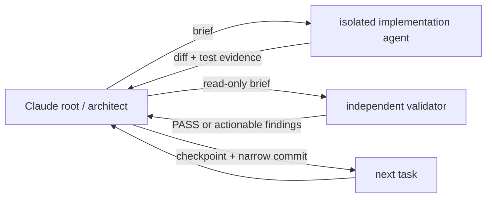

# Handoff: Claude implements the original-design realignment

**Operational form:** load skill `root-architect-execution`
([`.cursor/skills/root-architect-execution/SKILL.md`](../../.cursor/skills/root-architect-execution/SKILL.md)
and [`.claude/skills/root-architect-execution/SKILL.md`](../../.claude/skills/root-architect-execution/SKILL.md)).
This note remains the workstream instance: checkout, owner-owned untracked
paths, six baseline commands, the outcome packets, and the baseline gate — 199
tests when this handoff was written, 216 after Outcome 1 Task 2 added the
seventeen documentation-truth tests, and 245 after Outcome 2 Task 1 took the
scripts suite from 98 to 127.

Claude, you are the root architect for implementation. Hold the governing
plan, delegate bounded product-code tasks to cheaper agents, review their
evidence, own the ledger and Git boundaries, and continue without pausing
unless a serious blocker or the quota guard below fires.

## Mission and authority

Implement the five outcomes in
[[2026-09-04-original-design-realignment-master-plan]] in order. The product
is an orchestration authoring and execution-control system, not primarily a
document-QC pipeline.



Authority order is: latest owner instruction, the master plan, this handoff,
then supporting ADRs/reports. The paused 4.0.0 plan and ADR 0013 are evidence,
not build authority. Do not resume the superseded handoff, restore a fixed
Validator/Remediator workflow, or copy either ancestor wholesale.

## Repository starting state

| Item        | State Claude must preserve                                                                                            |
| ----------- | --------------------------------------------------------------------------------------------------------------------- |
| Checkout    | `/mnt/DATA/Projects/Personal/orchestration-quality-control`                                                           |
| Branch      | local `main`; architectural baseline `75663be` before this handoff commit                                             |
| Remote      | local `main` was 20 commits ahead of `origin/main`; do not reset to the remote                                        |
| Integration | the realignment plan is already merged locally; its feature branch was deleted                                        |
| Tests       | 199 offline tests at handoff time: 98 scripts, 8 Claude hooks, 6 Claude adapter, 36 Codex adapter, 19 Cursor adapter, 32 eval harness. Now 245 under `python3.12`: 127 scripts, 8, 6, 36, 19, 49 |
| Push policy | do not push, release, tag, or touch `upstream` without fresh owner authorization                                      |

These two untracked files are owner-owned. Do not edit, stage, move, delete,
or use them as implementation truth unless the owner explicitly places one in
scope:

- `AI_Codex_OrchestratorQcPlugin/Agent_Sessions/2026-09-02-121500-eval-grader-rules-with-rationale-run-2.md`
- `AI_Codex_OrchestratorQcPlugin/Agent_Sessions/2026-09-02-155800-approval-gate-defaults.md`

**Owner ruling, 2026-09-04.** This list originally named five files. Three of
them — `.claude/agents/impl-executor.md`, `.claude/agents/impl-validator.md`,
and `docs/2026-09-04-master-plan-review.md` — were committed at `5f6ac4f` and
`3c10fe5` before any authorization was recorded. The Outcome 1 gate surfaced
the gap; the owner ratified all three as in scope and released them from this
list. They are now ordinary tracked files, governed by normal brief scope
rather than by this protection. The review file's authority is unchanged: it
remains a report, below the master plan and this handoff in the authority
order above.

## Takeover sequence

- [ ] Confirm `pwd`, `git branch --show-current`, `git log -1 --oneline`, and
      `git status --porcelain=v2 -uall`; report any drift before writing.
- [ ] Read this file, the active ticket, the master plan, and
      [[../Agent_Sessions/2026-09-04-032820-architecture-realignment]] in that
      order. Read the paused plan or ancestor code only for the exact concept a
      current task needs.
- [ ] Create `feature/original-design-realignment` from the current local
      `main`; do not pull, reset, rebase, or recreate the deleted prior branch.
- [ ] Open a new timestamped `AI_Codex/Agent_Sessions/` note, link it after
      [[../Agent_Sessions/2026-09-04-051440-claude-implementation-handoff]], and
      record the branch, exact untracked paths, carried outcome, and baseline.
- [ ] Run the six baseline commands below. Record one checkpoint and commit
      the session bootstrap before beginning Outcome 1.

**Interpreter: `python3.12`, always.** Python 3.12 was always the intended
stack. On this machine bare `python3` is 3.10.12 and `python3.12` is 3.12.13, so
the two are not interchangeable: Outcome 2 Task 1 found `datetime.fromisoformat`
accepting a `Z`-suffixed timestamp on 3.12 and rejecting it on 3.10, which would
have made a validation verdict depend on the interpreter. Every command below,
and every per-task acceptance command, names `python3.12` explicitly. Never
substitute bare `python3`.

```bash
PYTHONPATH=orchestration-quality-control/scripts:orchestration-quality-control/scripts/tests python3.12 -m unittest discover -s orchestration-quality-control/scripts/tests -p 'test_*.py'
python3.12 -m unittest discover -s orchestration-quality-control/adapters/claude/hooks/tests -p 'test_*.py'
python3.12 -m unittest discover -s orchestration-quality-control/adapters/claude/tests -p 'test_*.py'
python3.12 -m unittest discover -s orchestration-quality-control/adapters/codex/tests -p 'test_*.py'
python3.12 -m unittest discover -s orchestration-quality-control/adapters/cursor/tests -p 'test_*.py'
python3.12 -m unittest discover -s eval-harness/tests -p 'test_*.py'
```

## Execution protocol

Use `superpowers:subagent-driven-development`. Run one dependent code task at
a time; parallelize only independent read-only discovery. For each task:

1. Root writes a bounded brief with exact read/write paths, interfaces,
   acceptance commands, and attempt number.
2. An isolated lower-cost implementation agent follows TDD: failing test,
   minimal implementation, focused tests, then a result report. It must not
   commit, widen scope, spawn agents, or ask the owner.
3. A fresh read-only agent checks plan compliance first. After that passes, a
   separate quality review checks the diff and reruns the named commands.
4. Root adjudicates findings. Return actionable findings to the same worker;
   after three failed attempts, record `blocked` and ask the owner.
5. On PASS, root adds a checkpoint to the open session ledger, stages only
   brief-owned paths plus the ledger, runs `git diff --cached --check`, and
   makes one narrow commit before starting the next task.

The main Claude session owns architectural judgment and must not silently
write product code around a failed delegation. Use an explicit cheaper model
for bounded execution and raw discovery, never `inherit`; use a different
fresh agent for validation. Record the actual model and effort in every
checkpoint. Prefer the cheapest tier that can pass the task and escalate only
one tier after evidence of failure.

If the seven-day quota is below 10% or the five-hour quota is below 5%, finish
the current safe checkpoint, update the handoff and session ledger with exact
state, inform the owner, and stand by. If the host exposes no percentages,
record that limitation and react immediately to a host warning or owner report.

## Outcome order and gates

| Outcome                  | Deliverable boundary                                                                                                                    | Do not advance until                                                                                                              |
| ------------------------ | --------------------------------------------------------------------------------------------------------------------------------------- | --------------------------------------------------------------------------------------------------------------------------------- |
| 1. Truth reset           | Successor ADR, old-plan/ADR disposition, salvage/quarantine record, executable documentation-truth check                                | the truth check and all 199 baseline tests pass                                                                                   |
| 2. Kernel                | Vendor-neutral specs, event mailbox, pure reducer/router, brief compiler, result gate, retry/block/replay, narrow adapter port and fake | emitted two-task DAG completes through a critiqued retry; exhausted retry blocks separately; illegal routing/direct mutation fail |
| 3. First real host       | One Orchestrator contract and the smallest real adapter slice                                                                           | captured real spawn has distinct identities, valid event sequence/hashes, passive root, and schema-valid answer relay             |
| 4. Remaining hosts       | Generated wrappers and explicit model/effort/tool/sandbox/fallback mappings                                                             | each claimed host has contract coverage and its own available smoke evidence                                                      |
| 5. Product consolidation | Install → discover → short interview → build/run, with QC folded into gates and proven duplication removed                              | complete acceptance flow, tests, budgets, and documentation match the executable tree                                             |

Do not begin broad migration, deletion, benchmarking, or release work before
the preceding vertical-slice gate is executable and checkpointed.

## First implementation packet — Outcome 1

### Task 1: establish the binding decision record

**Files:**

- Create `AI_Codex/Architecture/ADR/0014-generated-workflow-deterministic-kernel.md`.
- Modify `AI_Codex/Architecture/ADR/0013-three-agent-parameterized-code-gated.md`.
- Modify `AI_Codex/Implementation_Plans/2026-09-02-return-to-intention-4-0-0.md`.
- Modify the open Claude session ledger.

The successor ADR must preserve engine authority, immutable event-derived
state, isolation, retry/block, and adapter enforcement while replacing the
exact-three-role decision with a fixed root → one Orchestrator → generated
isolated-agent control plane. It must name the five governing outcomes, the
salvageable current utilities, the quarantined absent-engine claims, and the
next executable kernel slice. Mark ADR 0013 and the paused plan superseded by
the successor without deleting their historical content.

Verify Markdown links, run `git diff --check`, checkpoint the decision, and
commit only these files plus the ledger.

### Task 2: make documentation truth executable

**Files:**

- Create `eval-harness/check_documentation_truth.py`.
- Create `eval-harness/tests/test_check_documentation_truth.py`.
- Modify only `README.md`, `orchestration-quality-control/README.md`, or
  `orchestration-quality-control/SKILL.md` if the new check proves a false
  present-tense runtime claim.
- Modify the open Claude session ledger.

Implement a ~~Python 3.10~~ Python 3.12 stdlib check over those three product-facing files. For the absent core targets `scripts/oqc.py`, `scripts/mailbox.py`,
`scripts/compile_prompt.py`, `scripts/gate.py`, and
`schemas/envelope.schema.json`, report `document:token:missing-target` and exit
non-zero whenever a product-facing document names the token but its target is
absent. Contributor plans, ADRs, reports, sessions, and the owner-owned
untracked review are outside the scan.

Tests must prove: an absent named target fails; creating the target passes;
unscanned contributor prose does not fail; all findings are reported in stable
sorted order; and the real checkout passes. Run the focused test, the checker
against the repository root, then all six baseline suites. Checkpoint and
commit only after independent specification and quality reviews pass.

### Task 3: close the Outcome 1 gate

Root reruns the documentation-truth check, all six suites, local-link checks
for the changed contributor notes, and `git diff --check` from the Outcome 1
base. The validator must confirm the ADR/plan disposition, salvage list,
quarantined claims, and named next slice. Record exact commands, counts, and
commit hashes in the session ledger. Outcome 2 may start only on PASS.

## Second implementation packet — Outcome 2

Authored by root on 2026-09-04 after the Outcome 1 gate passed. Task order
follows the slice ADR 0014 names: records, mailbox, reduce/next, then the fake
adapter and the model-free DAG, with brief compilation, the gate, retry/block
and replay after those pass.

File paths are fixed by
[`eval-harness/check_documentation_truth.py`](../../eval-harness/check_documentation_truth.py),
which resolves the five quarantined targets to
`orchestration-quality-control/scripts/{oqc,mailbox,compile_prompt,gate}.py`
and `orchestration-quality-control/schemas/envelope.schema.json`. Landing them
at those paths is what retires the quarantined claims.

Per-task acceptance is targeted under the **Validation scope** rule: the focused
test plus the `scripts` suite, since every new module lands under
`orchestration-quality-control/scripts/`. The full six-suite sweep belongs to
Task 7 alone. Every acceptance command runs under `python3.12`, per the
interpreter rule above — briefs must name it explicitly rather than `python3`.

### Task 1: vendor-neutral records and the envelope contract

Create `schemas/envelope.schema.json`, `scripts/kernel_specs.py` and
`scripts/tests/test_kernel_specs.py`. Define `RunSpec`, `AgentSpec` and
`Envelope` as immutable records with explicit validation and stable
serialisation. No host names, model ids or vendor vocabulary in any of them.

Tests must prove: a well-formed envelope validates against the schema; each
required field's absence is rejected with a named error; records reject
post-construction mutation; and serialisation round-trips byte-stably.

### Task 2: append-only mailbox and derived run state

Create `scripts/mailbox.py`, `scripts/run_state.py` and their tests. The mailbox
appends events and never rewrites them. `RunState` is derived by a pure `reduce`
over the event sequence — never stored, never mutated in place.

Tests must prove: the observable phases (`discovery`, `interview`, `planning`,
`orchestration`, `execution`, `verification`, `completed`, `blocked`,
`awaiting-user-input`) are reachable as a table; `reduce` is pure, so replaying
the same events yields an equal state; and any attempt to mutate state directly
fails rather than silently succeeding.

### Task 2b (preparatory): consolidate the freeze helper

Do this BEFORE Task 3. `_freeze` now exists twice — in `scripts/kernel_specs.py`
and `scripts/run_state.py` — with byte-identical logic. Task 2 could not avoid
this: `kernel_specs.py` was read-only for it and the helper is private. Both
copies currently carry the `MappingProxyType` recursion fix from Task 1, so
there is no live bug, but that helper was patched precisely because of a
mutability hole and only one copy carries the comment explaining why.

Promote `_freeze` and `_thaw` into `scripts/qc_lib.py`, which is already the
shared-helpers module and is already imported by both. Have both modules import
them. Land it before Task 3 adds a third copy.

Acceptance: the full `scripts` suite under `python3.12` at its then-current
count, with no behaviour change — this is a move, not a redesign.

### Task 3: scheduling and routing checks

Create `scripts/router.py` and its tests. `next` selects runnable tasks from the
generated DAG against derived state; routing validates every sender/recipient
pair.

Tests must prove, as tables: a dependent task is not offered before its
dependency completes; legal pairs are accepted; illegal pairs are rejected with
a named reason; and no routing path mutates state.

### Task 4: adapter port, fake adapter, result gate, retry, and the replay

**Scope revised by root on 2026-09-05, before starting.** As first written, this
task owed the outcome's load-bearing proof — a classified failure carrying its
critique into a passing retry — while `gate_result` and `retry_or_block` sat in
Task 5. Task 4 would have had to invent throwaway retry logic for Task 5 to
replace. `gate_result` and `retry_or_block` therefore move here, where their
evidence lives. Task 5 keeps brief compilation, replay/verify and the CLI.

Create `scripts/adapter_port.py`, `scripts/fake_adapter.py`, `scripts/gate.py`
and their tests. The port is narrow: spawn, status emission, question relay, and
the hooks/policy boundary. Nothing host-specific enters the kernel.

`gate.py` provides `gate_result`, classifying a worker result as passed or
failed with a critique, and `retry_or_block`, which carries that critique into
the next attempt and moves the run to `blocked` or `awaiting-user-input` when the
attempt budget is exhausted. Per ADR 0014 decision 4, only the engine sets those
states and only root may answer them.

This task carries the outcome's load-bearing evidence. A model-free replay of a
two-task dependent DAG in which a classified failure carries its critique into a
passing retry, the dependent task then runs, and state reaches `completed`. A
separate fixture must exhaust retries and reach `blocked` or
`awaiting-user-input`. Both run entirely through the fake adapter.

### Task 5: brief compilation, replay/verify, CLI boundary

`gate_result` and `retry_or_block` moved to Task 4 with the evidence that
exercises them; this task is correspondingly narrower.

Create `scripts/compile_prompt.py`, `scripts/oqc.py` and their tests, adding
`compile_brief` and replay/verify. `oqc.py` is the single CLI/library boundary;
the kernel stays importable without it.

**Scope clarified by root on 2026-09-05, before starting.** `oqc.py` cannot be a
CLI boundary with nothing to drive, and replay needs a real run to replay, so
this task also owns the orchestrator `drive` loop that Task 4 kept inside its
test fixtures. Two findings carried from Task 4 land here: the loop must record
a RETRY decision durably when it makes it, and it must compose `relay_question`
and `enforce_policy` with the gate rather than leaving two of the port's four
operations proven only in isolation.

`verify` checks structural invariants — unique envelope ids, one consistent
`run_id`, legal sender/recipient pairs, sequential attempts, and no result
without its request. It is **not** cryptographic. ADR 0014 decision 2 names
"artifact and brief hashes", but `Envelope` carries no hash field and
`envelope.schema.json` is frozen for this outcome, so a tampered payload that
violates no invariant is out of reach here. That gap is deliberate and belongs
to Outcome 3, where real adapters make artifact hashing meaningful; it must not
be described as covered.

Tests must prove: a compiled brief is deterministic for identical input; replay
of a mailbox reproduces the same derived state; and verify detects tampering
that violates a structural invariant — reordering, deletion, a duplicated id, a
forged result with no request, and a broken attempt sequence.

### Task 6: the deterministic validation and compilation boundary

Turn accepted discovery/interview decisions into a `RunSpec`, a generated DAG
and generated `AgentSpec` records, reusing the salvaged `plan_interview.py` and
`gate_defaults.py` rather than reimplementing them.

A contract fixture must show that changing one relevant input changes the
emitted DAG or agent manifest, and the model-free run of Task 4 must consume
that emitted spec rather than a hand-written one.

### Task 7: close the Outcome 2 gate

Root runs the full six-suite baseline, the documentation-truth check, and
`git diff --check` from the Outcome 2 base. The validator confirms every exit
condition in the master plan's Outcome 2: the table-tested phases, the two-task
replay through a critiqued retry to `completed`, the separate exhausted-retry
fixture, and the routing and no-direct-mutation cases. Outcome 3 may start only
on PASS.

## Serious stop conditions

Stop and ask the owner only for an architectural conflict not resolved by the
master plan, overlap with an owner-owned dirty path, a credential or destructive
operation outside the brief, three failed attempts on one task, a failing
prior-outcome gate, or a quota threshold. Do not push, release, tag, merge to
`main`, force Git, or delete historical Codex notes without explicit approval.

## Claude's first report to the owner

After takeover, report the new branch and session path, the five preserved
untracked files, baseline test counts, actual worker/reviewer model routing,
and whether Outcome 1 Task 1 has started. Do not ask the owner to restate the
architecture already decided here.
