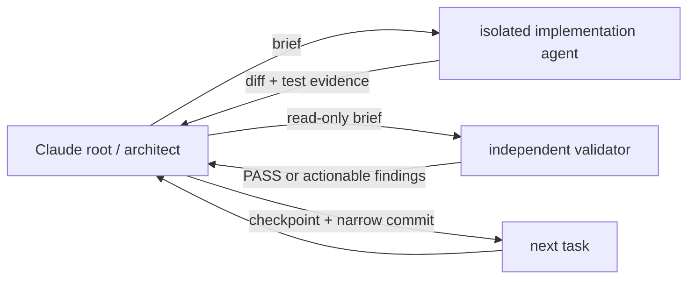

# Handoff: Claude implements the original-design realignment

**Operational form:** load skill `root-architect-execution`
([`.cursor/skills/root-architect-execution/SKILL.md`](../../.cursor/skills/root-architect-execution/SKILL.md)
and [`.claude/skills/root-architect-execution/SKILL.md`](../../.claude/skills/root-architect-execution/SKILL.md)).
This note remains the workstream instance: checkout, owner-owned untracked
paths, six baseline commands, Outcome 1 packets, and the 199-test gate.

Claude, you are the root architect for implementation. Hold the governing
plan, delegate bounded product-code tasks to cheaper agents, review their
evidence, own the ledger and Git boundaries, and continue without pausing
unless a serious blocker or the quota guard below fires.

## Mission and authority

Implement the five outcomes in
[[2026-09-04-original-design-realignment-master-plan]] in order. The product
is an orchestration authoring and execution-control system, not primarily a
document-QC pipeline.



Authority order is: latest owner instruction, the master plan, this handoff,
then supporting ADRs/reports. The paused 4.0.0 plan and ADR 0013 are evidence,
not build authority. Do not resume the superseded handoff, restore a fixed
Validator/Remediator workflow, or copy either ancestor wholesale.

## Repository starting state

| Item        | State Claude must preserve                                                                                            |
| ----------- | --------------------------------------------------------------------------------------------------------------------- |
| Checkout    | `/mnt/DATA/Projects/Personal/orchestration-quality-control`                                                           |
| Branch      | local `main`; architectural baseline `75663be` before this handoff commit                                             |
| Remote      | local `main` was 20 commits ahead of `origin/main`; do not reset to the remote                                        |
| Integration | the realignment plan is already merged locally; its feature branch was deleted                                        |
| Tests       | 199 offline tests: 98 scripts, 8 Claude hooks, 6 Claude adapter, 36 Codex adapter, 19 Cursor adapter, 32 eval harness |
| Push policy | do not push, release, tag, or touch `upstream` without fresh owner authorization                                      |

These five untracked files are owner-owned. Do not edit, stage, move, delete,
or use them as implementation truth unless the owner explicitly places one in
scope:

- `.claude/agents/impl-executor.md`
- `.claude/agents/impl-validator.md`
- `AI_Codex_OrchestratorQcPlugin/Agent_Sessions/2026-09-02-121500-eval-grader-rules-with-rationale-run-2.md`
- `AI_Codex_OrchestratorQcPlugin/Agent_Sessions/2026-09-02-155800-approval-gate-defaults.md`
- `docs/2026-09-04-master-plan-review.md`

## Takeover sequence

- [ ] Confirm `pwd`, `git branch --show-current`, `git log -1 --oneline`, and
      `git status --porcelain=v2 -uall`; report any drift before writing.
- [ ] Read this file, the active ticket, the master plan, and
      [[../Agent_Sessions/2026-09-04-032820-architecture-realignment]] in that
      order. Read the paused plan or ancestor code only for the exact concept a
      current task needs.
- [ ] Create `feature/original-design-realignment` from the current local
      `main`; do not pull, reset, rebase, or recreate the deleted prior branch.
- [ ] Open a new timestamped `AI_Codex/Agent_Sessions/` note, link it after
      [[../Agent_Sessions/2026-09-04-051440-claude-implementation-handoff]], and
      record the branch, exact untracked paths, carried outcome, and baseline.
- [ ] Run the six baseline commands below. Record one checkpoint and commit
      the session bootstrap before beginning Outcome 1.

```bash
PYTHONPATH=orchestration-quality-control/scripts:orchestration-quality-control/scripts/tests python3 -m unittest discover -s orchestration-quality-control/scripts/tests -p 'test_*.py'
python3 -m unittest discover -s orchestration-quality-control/adapters/claude/hooks/tests -p 'test_*.py'
python3 -m unittest discover -s orchestration-quality-control/adapters/claude/tests -p 'test_*.py'
python3 -m unittest discover -s orchestration-quality-control/adapters/codex/tests -p 'test_*.py'
python3 -m unittest discover -s orchestration-quality-control/adapters/cursor/tests -p 'test_*.py'
python3 -m unittest discover -s eval-harness/tests -p 'test_*.py'
```

## Execution protocol

Use `superpowers:subagent-driven-development`. Run one dependent code task at
a time; parallelize only independent read-only discovery. For each task:

1. Root writes a bounded brief with exact read/write paths, interfaces,
   acceptance commands, and attempt number.
2. An isolated lower-cost implementation agent follows TDD: failing test,
   minimal implementation, focused tests, then a result report. It must not
   commit, widen scope, spawn agents, or ask the owner.
3. A fresh read-only agent checks plan compliance first. After that passes, a
   separate quality review checks the diff and reruns the named commands.
4. Root adjudicates findings. Return actionable findings to the same worker;
   after three failed attempts, record `blocked` and ask the owner.
5. On PASS, root adds a checkpoint to the open session ledger, stages only
   brief-owned paths plus the ledger, runs `git diff --cached --check`, and
   makes one narrow commit before starting the next task.

The main Claude session owns architectural judgment and must not silently
write product code around a failed delegation. Use an explicit cheaper model
for bounded execution and raw discovery, never `inherit`; use a different
fresh agent for validation. Record the actual model and effort in every
checkpoint. Prefer the cheapest tier that can pass the task and escalate only
one tier after evidence of failure.

If the seven-day quota is below 10% or the five-hour quota is below 5%, finish
the current safe checkpoint, update the handoff and session ledger with exact
state, inform the owner, and stand by. If the host exposes no percentages,
record that limitation and react immediately to a host warning or owner report.

## Outcome order and gates

| Outcome                  | Deliverable boundary                                                                                                                    | Do not advance until                                                                                                              |
| ------------------------ | --------------------------------------------------------------------------------------------------------------------------------------- | --------------------------------------------------------------------------------------------------------------------------------- |
| 1. Truth reset           | Successor ADR, old-plan/ADR disposition, salvage/quarantine record, executable documentation-truth check                                | the truth check and all 199 baseline tests pass                                                                                   |
| 2. Kernel                | Vendor-neutral specs, event mailbox, pure reducer/router, brief compiler, result gate, retry/block/replay, narrow adapter port and fake | emitted two-task DAG completes through a critiqued retry; exhausted retry blocks separately; illegal routing/direct mutation fail |
| 3. First real host       | One Orchestrator contract and the smallest real adapter slice                                                                           | captured real spawn has distinct identities, valid event sequence/hashes, passive root, and schema-valid answer relay             |
| 4. Remaining hosts       | Generated wrappers and explicit model/effort/tool/sandbox/fallback mappings                                                             | each claimed host has contract coverage and its own available smoke evidence                                                      |
| 5. Product consolidation | Install → discover → short interview → build/run, with QC folded into gates and proven duplication removed                              | complete acceptance flow, tests, budgets, and documentation match the executable tree                                             |

Do not begin broad migration, deletion, benchmarking, or release work before
the preceding vertical-slice gate is executable and checkpointed.

## First implementation packet — Outcome 1

### Task 1: establish the binding decision record

**Files:**

- Create `AI_Codex/Architecture/ADR/0014-generated-workflow-deterministic-kernel.md`.
- Modify `AI_Codex/Architecture/ADR/0013-three-agent-parameterized-code-gated.md`.
- Modify `AI_Codex/Implementation_Plans/2026-09-02-return-to-intention-4-0-0.md`.
- Modify the open Claude session ledger.

The successor ADR must preserve engine authority, immutable event-derived
state, isolation, retry/block, and adapter enforcement while replacing the
exact-three-role decision with a fixed root → one Orchestrator → generated
isolated-agent control plane. It must name the five governing outcomes, the
salvageable current utilities, the quarantined absent-engine claims, and the
next executable kernel slice. Mark ADR 0013 and the paused plan superseded by
the successor without deleting their historical content.

Verify Markdown links, run `git diff --check`, checkpoint the decision, and
commit only these files plus the ledger.

### Task 2: make documentation truth executable

**Files:**

- Create `eval-harness/check_documentation_truth.py`.
- Create `eval-harness/tests/test_check_documentation_truth.py`.
- Modify only `README.md`, `orchestration-quality-control/README.md`, or
  `orchestration-quality-control/SKILL.md` if the new check proves a false
  present-tense runtime claim.
- Modify the open Claude session ledger.

Implement a Python 3.10 stdlib check over those three product-facing files.
For the absent core targets `scripts/oqc.py`, `scripts/mailbox.py`,
`scripts/compile_prompt.py`, `scripts/gate.py`, and
`schemas/envelope.schema.json`, report `document:token:missing-target` and exit
non-zero whenever a product-facing document names the token but its target is
absent. Contributor plans, ADRs, reports, sessions, and the owner-owned
untracked review are outside the scan.

Tests must prove: an absent named target fails; creating the target passes;
unscanned contributor prose does not fail; all findings are reported in stable
sorted order; and the real checkout passes. Run the focused test, the checker
against the repository root, then all six baseline suites. Checkpoint and
commit only after independent specification and quality reviews pass.

### Task 3: close the Outcome 1 gate

Root reruns the documentation-truth check, all six suites, local-link checks
for the changed contributor notes, and `git diff --check` from the Outcome 1
base. The validator must confirm the ADR/plan disposition, salvage list,
quarantined claims, and named next slice. Record exact commands, counts, and
commit hashes in the session ledger. Outcome 2 may start only on PASS.

## Serious stop conditions

Stop and ask the owner only for an architectural conflict not resolved by the
master plan, overlap with an owner-owned dirty path, a credential or destructive
operation outside the brief, three failed attempts on one task, a failing
prior-outcome gate, or a quota threshold. Do not push, release, tag, merge to
`main`, force Git, or delete historical Codex notes without explicit approval.

## Claude's first report to the owner

After takeover, report the new branch and session path, the five preserved
untracked files, baseline test counts, actual worker/reviewer model routing,
and whether Outcome 1 Task 1 has started. Do not ask the owner to restate the
architecture already decided here.
