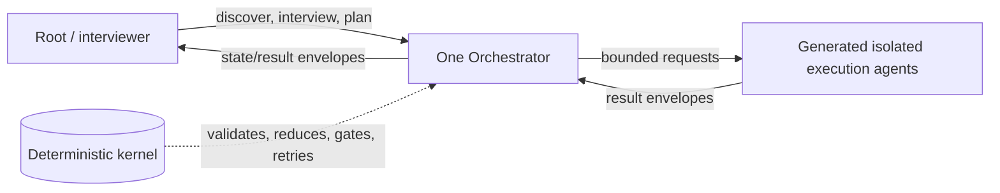

# Original-design realignment master plan

This governing plan records the binding architecture decisions; the paused 4.0.0 plan is evidence, not build authority.

## Product boundary

The product installs as an orchestration authoring and execution-control system: deterministic discovery and a short interview produce a workflow, then one Orchestrator runs it through isolated execution agents. Agents supply judgment and authored artifacts; deterministic code owns state, routing, validation, retries, and authorization boundaries.

The fixed control plane is root/interviewer → one Orchestrator → isolated execution agents. The authored workflow is not fixed to Validator/Remediator: discovery generates its task DAG, roles, capabilities, model/reasoning tiers, tools, and output schemas. Core records are vendor-neutral; adapters compile them to host-native settings and disclose fallback or unenforceable constraints. Document QC is internal or optional, not the product identity.

## Misalignment evidence

| Area | Current evidence | Alignment |
| --- | --- | --- |
| Identity | README/SKILL lead with orchestration-document QC | Lead with discover → interview → build/run; QC is a capability |
| Workflow | ADR 0013/4.0.0 plan fix three templates and Validator/Remediator stages | Fix control plane; generate roles and DAG |
| Engine | `oqc.py`, mailbox, reducer, compiler, gate, breaker are claimed but absent | Build executable kernel first |
| Lifecycle/state | Prose routes root through operations; checkpoint CRUD is not event-derived | One interview/spawn, passive root; append-only events and pure reduction |
| Isolation | Host agents duplicate prompts; Cursor inherits model; Codex omits model/effort | Thin manifest wrappers; enforce observable boundaries and disclose limits |
| Recovery/hooks | Retry/breaker is not wired; ancestor hooks include stubs | Executable retry/block transitions; hooks enforce adapter policy only |
| Delivery | Prior plan has eight phases and costly inventory/live-run gates | Model-free vertical slice, then one real adapter slice |

## Five outcomes

### 1. Truth and boundary reset

Supersede the paused [4.0.0 plan](2026-09-02-return-to-intention-4-0-0.md) and disposition accepted [ADR 0013](../Architecture/ADR/0013-three-agent-parameterized-code-gated.md): preserve its engine-first and control-plane lessons, but require an amendment or successor ADR before implementation because its fixed exactly-three Validator/Remediator output conflicts with generated workflow roles. Identify salvageable utilities and quarantine absent-engine claims. Freeze prose unless it supports the vertical slice.

Exit evidence: a decision record and ledger checkpoint name the superseded plan, ADR disposition, salvage list, quarantined claims, and next executable slice; a runnable documentation-truth check fails if README/SKILL names an absent core entrypoint or component.

### 2. Executable kernel slice

Implement `RunSpec`, `AgentSpec`, `Envelope`, derived `RunState`, append-only mailbox/events, pure `reduce`, `next`, `compile_brief`, `gate_result`, `retry_or_block`, routing checks, replay/verify, and one CLI/library boundary.

Exit evidence: table-tested observable phases (discovery, interview, planning, orchestration, execution, verification, completed, blocked, awaiting-user-input) plus a model-free replay of a two-task dependent DAG through one injected failure to completion with fake agents.

### 3. Real orchestration slice

Add the vendor-neutral Orchestrator contract and dynamic `AgentSpec` generation. Run one small workflow: root interviews once, spawns one Orchestrator, remains observer/relay, and receives only state/result envelopes.

Exit evidence: captured run with distinct agent identities, valid mailbox sequence and artifact hashes, and explicit blocked/user-input handoff when required.

### 4. Adapter compilation and enforcement

Define one adapter port and complete one host end to end; map the same manifests to other hosts. Generate thin wrappers, test exposed model/effort/tool/sandbox settings, and use hooks for state and write/tool boundaries around the kernel. Disclose unenforceable controls.

Exit evidence: the first supported host has generated-config contract tests and a real end-to-end spawn; each later adapter has manifest mapping and its own smoke when that host is available, before support is claimed. Record a verified mailbox and enforcement/fallback matrix grounded in [Claude sub-agent docs](https://code.claude.com/docs/en/sub-agents), [Cursor subagents docs](https://cursor.com/docs/subagents), [Codex subagents docs](https://developers.openai.com/codex/subagents), and [OpenAI GPT-5.4 Mini docs](https://developers.openai.com/api/docs/models/gpt-5.4-mini).

### 5. Product surface and consolidation

Expose install → discover → short interview → build/run. Fold useful QC into internal gates, migrate only slice-required behavior, delete duplicated legacy prompts/operations after equivalent behavior passes, and document the working path. Benchmark only after end-to-end exists.

Exit evidence: full author-and-run acceptance scenario, simple time/tool budget, behavior and host-contract tests, and docs checked against the executable tree.

## Non-goals and proof

First-slice non-goals: a fixed Validator/Remediator pipeline; provider/model IDs in core architecture; long-running process or MCP server; copied ancestor stubs or disconnected evaluator flows; broad migrations, large live-evaluation matrices, arbitrary line/file-count targets, or release before the end-to-end slice.

Each outcome ends with executable evidence, a root-owned ledger checkpoint, and a narrow commit. Kernel proof is reducer tables plus model-free replay; adapter proof is generated-config tests plus real spawn smoke when available; product proof is one complete acceptance scenario. Documentation claims never lead implementation.

## References

- Active ticket: [[../Tickets/Active/refactor-align-the-architecture-with-original-design]] · current session: [[../Agent_Sessions/2026-09-04-032820-architecture-realignment]]
- Paused plan/ledger/session: [plan](2026-09-02-return-to-intention-4-0-0.md) · [ledger](2026-09-02-return-to-intention-ledger.md) · [session](../Agent_Sessions/2026-09-02-212024-implement-4-0-0-orchestration.md)
- ADR: [[../Architecture/ADR/0013-three-agent-parameterized-code-gated]]
- Ancestors: [agentic-e2e@775e57b](https://github.com/theocarranza/agentic-e2e-test-workflow/tree/775e57beaa28441be6657aebba9bb655d717d3c9) · [hierarchical orchestrator@3efc011](https://github.com/theocarranza/hierarchical-multi-agent-orchestrator/tree/3efc011eef3c38d5e239a46fdac79b8d011cf0fa)
- Ancestor concepts: [workflow specs](https://github.com/theocarranza/agentic-e2e-test-workflow/blob/775e57beaa28441be6657aebba9bb655d717d3c9/docs/specs.md) · [architecture](https://github.com/theocarranza/agentic-e2e-test-workflow/blob/775e57beaa28441be6657aebba9bb655d717d3c9/reference/docs/architecture.md) · [core](https://github.com/theocarranza/agentic-e2e-test-workflow/tree/775e57beaa28441be6657aebba9bb655d717d3c9/maestro-e2e-plugin/orchestrator_core) · [hooks](https://github.com/theocarranza/agentic-e2e-test-workflow/tree/775e57beaa28441be6657aebba9bb655d717d3c9/maestro-e2e-plugin/hooks)
