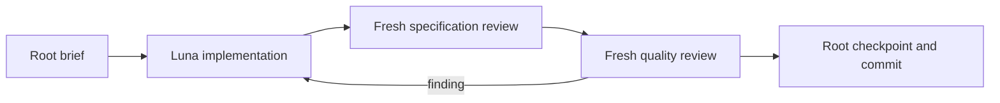

# Codex execution packet

Resume after reading the master plan, this packet, and the linked session.
The original handoff remains the outcome specification. This packet adapts
execution to Codex and records bounded implementation decisions.

## Execution contracts

Use the existing contracts in
[contracts.md](../../.claude/skills/root-architect-execution/references/contracts.md).
For every dispatch provide task/attempt/model/effort/read paths/write paths/
interfaces/acceptance/constraints/dirty paths. Workers own only named product
files and tests; root owns plans, session notes and Git. Workers do not spawn,
commit, expand scope, or ask the owner. Follow TDD for behavior changes.

Start `gpt-5.6-luna` at low effort. First improve a deficient brief without
escalating; increase effort only for a demonstrated reasoning gap. If that
still fails, escalate one model tier to `gpt-5.6-terra`. Keep the three-attempt
limit; record findings and decisions incrementally. Never silently inherit
the root model. The live spawn API accepts explicit model and effort only
with a fresh or bounded context fork, so use `fork_turns: none` and exact paths.

This host lacks a per-spawn read-only sandbox or tool allowlist. Specification
reviewers may use read-only shell reads because no filesystem read tool is
available; they may not run tests. Separate quality reviewers run the named
commands. These are procedural restrictions, not host-enforced isolation.
Repository-local `.codex` and `.agents` are mounted read-only; do not try to
install role configuration there. The actual dispatch enforces model choice.

Use Python 3.12. Full six-suite baseline at outcome gates; impacted scripts
suite per kernel task; adapter suites when adapter imports/contracts change.
Every accepted task gets a checkbox, session checkpoint, narrow commit.
Push to the verified origin feature branch; do not merge, release or tag.

## Outcome 3

- [x] Task 1: finish specification and quality reviews of `ef23d40`.
- [x] Task 2: make the retained fail-fast branch policy explicit.
- [x] Task 3a: vendor-neutral Orchestrator input/output contract.
- [x] Task 3b: engine-authorized question/answer lifecycle.
  - [x] Task 3b.1: executable result schema and question authorization.
  - [x] Task 3b.2: atomic answer event and drive composition.
    - [x] Task 3b.2a: schema-valid root answer authorization.
    - [x] Task 3b.2b: answer port and atomic reducer event.
    - [x] Task 3b.2c: drive pause/resume composition and integrated review.
- [x] Task 4: Claude first-host transport and enforced policy boundary.
  - [x] Task 4a: deterministic Claude CLI/session transport contract.
  - [x] Task 4b: Claude AdapterPort composition and request/identity binding.
  - [x] Task 4c: native pre-tool policy hook and local capability smoke.
- [ ] Task 5: captured real run with externally anchored hashes.
- [ ] Task 6: full gate and independent acceptance review.

### Task 2 bounded decision

Keep the existing whole-run halt on exhausted retry budget. Independent
siblings remain pending. This conserves quota when the full objective cannot
complete, and avoids silently introducing partial-success semantics. Change
the docstring from an accidental slice limitation to an intentional policy;
exercise an emitted multi-branch DAG with scripts for both branches, assert
no sibling request, exact blocked phase, and replay/verify agreement. Existing
exhausted-retry evidence remains unchanged.

Owned files: `scripts/oqc.py`, `scripts/tests/test_compile_workflow.py` beneath
the package. Acceptance: focused compiler tests and full scripts suite.

### Task 3a bounded contract

Define a serializable vendor-neutral Orchestrator contract compiled from the
emitted RunSpec, TaskDag, AgentSpecs and attempt budget. Validate all role
bindings, identity uniqueness and positive budget before spawning anything.
Inputs include the whole generated workflow; instructions explicitly reserve
scheduling, brief compilation, gating, retries and phase transitions to code.
Root delegates once and thereafter observes or relays an engine-declared
question; workers never address root or one another. The Orchestrator cannot
rewrite the mailbox or mutate state. Add a reusable result schema at the
currently emitted `schemas/worker-result.schema.json` path, which is absent.

### Task 3b bounded lifecycle

Add explicit validated question requests and root answers. Gate code is the
sole authority for entering awaiting-user-input and deciding whether an answer
resumes or keeps the run blocked. Answers must bind the outstanding question
and run, obey a schema, and be rejected before append for wrong identity,
duplicate/stale answers, invalid values, or answers outside allowed phases.
No arbitrary adapter phase changes masquerade as engine approval. Preserve
exhaustion as terminal blocked unless the gate explicitly permits an answer.

### Task 4 transport constraints

Use the installed authenticated Claude CLI as planned. Model, effort and tool
settings are explicit and the adapter discloses enforcement limits. Preserve
native session/agent identities and raw transport records for the capture.
A fake transport in unit tests is not real-host proof. Do not make live support
claims before Task 5 passes. Read local CLI help and official documentation
when specifying the concrete command and response protocol.

### Task 5 and gate

One small emitted workflow, one real Orchestrator identity, separate worker
identities, deterministic engine decisions, passive root and schema-valid
answer relay. Capture raw host records, mailbox JSONL, generated contract,
artifact bytes/hashes and external head hash. Offline tests verify the saved
capture without spending model quota again. Tests must reject tampered
artifact bytes and mailbox content. A missing host, quota failure or synthetic
capture is a blocked gate, never a completed live run.

## Later outcomes

Do not begin Outcome 4 broad host migration before the Outcome 3 gate passes.
Then author its bounded packet from verified transport experience: generated
wrappers, model/effort/tool/sandbox/fallback matrix, contract tests, real smokes
only on available hosts, unsupported hosts disclosed honestly.

Outcome 5 follows the adapter gate: wire install/discover/interview/build/run,
generate manifest settings from accepted decisions, fold QC into gates, prove
equivalence before removing duplicate legacy behavior, and run the complete
product acceptance flow with a measured time/tool budget and truthful docs.

## First-host transport design to validate at Task 4

Candidate transport: one native Orchestrator session launched with an explicit
agent definition; subsequent engine-selected task requests resume that same
session. The deterministic Python controller drives scheduling and gates while
the root user-facing agent remains idle. Each request permits exactly its
generated worker type through the native Agent tool. Capture the native session
id and Agent tool-use ids, including subagent output records; never manufacture
worker identity evidence from the requested role name alone.

Use the native pre-tool hook to admit only the engine-issued dispatch and reject
other tools/worker types. The first slice can use tool-free workers returning
text artifacts, with artifact files written and hashed by deterministic adapter
code. Transport/schema errors are named blockers, never fabricated successes.
A single logical Orchestrator session may span short CLI resume invocations;
record process invocation count separately from native session identity and
verify that resume never silently starts a new session. This is a design to
prove with contract tests and capture, not a current implementation claim.

## Task 3a exact worker brief

- Task: vendor-neutral Orchestrator contract; attempt 1; Luna / low.
- Read: compile_workflow.py, kernel_specs.py, compile_prompt.py, adapter_port.py,
  qc_lib.py and their focused tests; ADR 0014; Task 3a above.
- Write: package scripts/orchestrator_contract.py,
  scripts/tests/test_orchestrator_contract.py,
  schemas/worker-result.schema.json. No other files without a root ruling.
- Interface: compile_orchestrator(compiled, max_attempts) returns immutable
  OrchestratorContract; .to_dict(), .to_json(), .from_dict(), .from_json()
  serialize and revalidate the complete contract. The contract contains the
  emitted run_spec, task_dag, agent_specs, max_attempts and canonical control
  instructions. Do not hand-copy existing record validation; reuse from_dict
  and TaskDag.from_list. Validate role-map key equals spec.role, exact DAG role
  coverage, unique agent ids, and budget positive integer excluding bool.
- Output schema: required task_id (nonempty string), attempt (integer >= 1),
  outcome (passed/failed); optional critique (string), artifact (string),
  question (object with question_id and prompt, both nonempty strings).
  Additional properties false. Failed results still require a nonempty
  critique in gate_result; question decisions are Task 3b. This task creates
  the schema artifact; gate integration and schema keyword support must be
  proven in 3b, not claimed here.
- Tests: bad bindings/duplicate identities/budget rejected; frozen nested
  contract data and independent serialization; stable JSON roundtrip; changed
  discovery decisions alter the contract; explicit canonical instructions
  reserve engine authority and enforce the root relay/worker isolation rules.
- Acceptance: /usr/local/bin/python3.12 with scripts and scripts/tests on
  PYTHONPATH; focused test_orchestrator_contract then full scripts suite.
- Constraints: no host vocabulary/model ids; no I/O or clock in compilation;
  TDD with honest RED/GREEN; no commits, agents, user questions or unrelated
  cleanup. Root owns ledger/packet dirty paths.

## Task 3b exact lifecycle decisions

The smallest captured answer path may remain terminally blocked, as the master
plan explicitly permits. Implement both retry-within-budget and stop decisions
if they fit one bounded worker task; split a further task rather than hide an
unimplemented resume path behind a passing fixture.

The failed worker result may carry a question object with question_id and
prompt. A passed result carrying a question is contradictory and must fail.
The gate validates the request against the derived failed task and records
awaiting-user-input with run/task/attempt/question bindings and remaining
budget. The relay carries that exact question. Never turn every ordinary
exhausted failure into a request for input; existing exhaustion stays blocked.

An answer carries run_id, task_id, attempt, question_id, decision (retry or
stop), and text. Check its whole shape and bindings against the outstanding
engine-declared context before appending anything. Wrong run/task/question,
wrong phase, duplicate/stale answer, invalid decision or retry without remaining
budget raises named Blocked. Answer and resulting phase must be one validated
logical transition when reducing a persisted history; do not leave a crash gap
that permits accepting the same answer twice. The adapter records only an
engine-approved transition, and cannot overwrite its phase through context.

On retry, the engine compiles the next attempt with the answer text as context,
keeps the prior critique and counts the new attempt from mailbox history.
No reset to attempt 1 and no grant of a fresh max_attempts budget. On stop,
remaining state stays blocked; re-entering drive must not dispatch untouched
siblings of a blocked run. Verify/replay must reject a forged answer and
preserve the same transition after JSONL reload.

Tests must exercise real drive + FakeAdapter + relay composition, not only
standalone gate helpers. Include valid retry that then passes, valid stop,
invalid/duplicate/stale answers with unchanged log, exhausted budget, and
schema-invalid or contradictory worker question. Extend FakeAdapter to carry
question/artifact fields rather than silently dropping them. Keep every prior
exhausted-retry and emitted-DAG acceptance case.

### Task 3b execution split

Task 3b is two committed checkpoints because schema/gate classification and
mailbox/drive transitions have different invariants.

#### Task 3b.1 — executable result schema and question authorization

Owned files: `scripts/kernel_specs.py`, `scripts/gate.py`, their focused tests,
and `schemas/worker-result.schema.json` only if a defect is proven. Extend the
existing narrow schema evaluator with the exact `minLength` and `minimum`
keywords this checked-in schema uses, and expose a small public validation
entrypoint so gate code does not import a private helper. `gate_result` validates
the complete result against the checked-in schema before semantic checks;
`attempt` is now required and positive at this boundary. Update direct legacy
gate fixtures accordingly, without weakening envelope/reducer rules.

A passed result carrying `critique` or `question` is contradictory and rejected.
A failed result requires nonblank critique. Its optional question is recursively
frozen and must contain exactly nonblank `question_id` and `prompt`. Add a frozen
engine decision for entering `awaiting-user-input`; it binds task, attempt,
critique, question and actual attempts remaining to the mailbox-derived failed
state. Ordinary failures continue through `retry_or_block`, so exhaustion
without a worker question remains `blocked`. This task does not append events,
accept answers, or change `drive`.

Tests prove every schema required/type/enum/minimum/minLength/additional-property
rule, contradictions, immutable question data, mismatched/nonfailed state, bad
remaining budget, and both question-present versus ordinary-failure decisions.
Run focused kernel-spec/gate tests then all scripts tests with Python 3.12.

#### Task 3b.2 — atomic answer event and drive composition

After 3b.1 passes, own `adapter_port.py`, `fake_adapter.py`, `run_state.py`,
`oqc.py` and their focused tests. Preserve earlier fail-fast behavior. Add the
smallest root-answer port and a deterministic engine API that validates an
answer against the outstanding question before append. The single answer
envelope both records the answer and moves phase to `execution` for an allowed
retry or `blocked` for stop, so a crash cannot leave a consumed answer waiting
to be applied. Reducer/replay rejects forged, duplicate, stale, mismatched or
budget-invalid answer histories. Invalid live answers leave the mailbox byte
identical. A retry continues at the next mailbox-derived attempt with prior
critique plus answer context and no refreshed budget. Tests compose actual
`drive`, FakeAdapter, JSONL reload and verify; Task 3b closes only after both
checkpoints and an integrated review pass.

To keep each worker brief bounded, execute 3b.2 as three dependent checkpoints.
Task 3b.2a owns `schemas/root-answer.schema.json`, the existing narrow schema
evaluator/public validator in `kernel_specs.py`, `gate.py`, and focused tests.
The answer object has exactly `run_id`, `task_id`, positive `attempt`, nonblank
`question_id`, `decision` (`retry` or `stop`) and nonblank `text`.
`approve_answer(state, answer)` requires `awaiting-user-input`, exact run/task/
attempt/question binding to the frozen status context, a mailbox-derived failed
task at that attempt, and remaining budget for retry. It returns an immutable
engine decision whose phase is `execution` for retry or `blocked` for stop; it
does not append.

Task 3b.2b then owns `adapter_port.py`, `fake_adapter.py`, `run_state.py` and
their focused tests, plus the smallest `gate.py` refactor needed to share one
answer-transition validator with replay. Extend the port only with the
root-to-Orchestrator answer operation required by Outcome 3. Keep the current
question method compatible until 3b.2c upgrades its live call with the complete
approved question binding. An answer envelope carries one approved answer and the reducer
uses that same event atomically to enter `execution` or `blocked`. Replay rejects
answers outside the waiting phase and any run/task/attempt/question mismatch,
duplicate/stale answer, invalid value, or retry without remaining budget.

Task 3b.2c finally owns `oqc.py` and its focused integration tests. `drive`
consumes the actual latest result through `gate_result` and `decide_failure`,
records and relays the complete approved question binding, and returns waiting. A deterministic
public resume boundary re-derives state, calls `approve_answer` immediately
before append, leaves JSONL byte-identical on rejection, and resumes an allowed
retry at the next mailbox-derived attempt with the prior critique plus answer
text. Stop remains terminal and fail-fast; exhausted ordinary failures remain
blocked. Prove live state equals replay and verify after JSONL reload.

### Task 4 identity and payload binding

The host transport must match each returned worker identity to the exact
engine-issued request, not merely accept a legal agent-to-orchestrator pair.
The existing verify pairing indexes task/attempt, not worker sender; extending
capture verification with dispatched-recipient/result-sender binding belongs
to the real-host task before its authenticity claims. Brief/artifact hashes
must be computed from actual canonical brief bytes and actual artifact bytes;
an agent's claimed hash is not evidence. Validate host structured output before
appending a successful result. Preserve raw evidence of rejected transport
responses separately from the authoritative mailbox.

### Task 4 execution split

Task 4a owns a new `scripts/claude_transport.py` and its focused test module.
It builds an explicit, shell-free Claude CLI invocation for one Orchestrator
session and subsequent `--resume` calls, with explicit model, effort, Agent-only
tools, generated `--agents`, structured worker-result schema, stream JSON and
hook-event capture. `inherit`, blank settings, ambiguous session changes,
malformed/nonzero transport output and missing result/session/Agent identity
records are named blockers. The subprocess runner is injected so tests consume
recorded JSONL without a model call. Raw stdout/stderr and every parsed event are
retained separately from any authoritative mailbox append.

Task 4b owns `scripts/claude_adapter.py`, its tests and the smallest port/drive
changes proven necessary. It implements `AdapterPort` over Task 4a, keeps one
native Orchestrator session across task attempts, matches each Agent tool-use
request to the exact engine-issued task/attempt/worker recipient, validates the
returned structured worker payload before appending a result, computes brief
and artifact hashes from canonical bytes, and records host/session/agent/tool-use
identities as evidence. Rejected host responses never enter the authoritative
mailbox; raw transport evidence remains inspectable.

Task 4c owns the smallest Claude `PreToolUse` command hook, configuration and
focused tests needed to admit only the engine-issued `Agent(<worker>)` dispatch
and deny all other tool/worker requests. Use current structured
`hookSpecificOutput.permissionDecision`; disclose that command-hook timeout or
hook error is not fail-closed and keep deterministic adapter policy validation
load-bearing. A local no-model smoke verifies installed CLI flags and hook
fixtures. Task 5, not Task 4, owns the authenticated model invocation and real
identity/capture proof.

### Task 4b exact worker brief

Implement `ClaudeAdapter(AdapterPort)` in new `scripts/claude_adapter.py` with
focused `tests/test_claude_adapter.py`. It receives an injected process runner,
explicit non-inherited Orchestrator model/effort, exact generated worker
definitions, an injected policy boundary and an artifact directory. It owns a
`ClaudeTransport`, records every returned process tuple or runner exception as
immutable out-of-mailbox transport evidence, and never invokes a real process
in tests. Process exceptions/nonzero exits remain runner-owned evidence exactly
as ruled at Task 4a.

For `spawn`, canonicalize the actual engine brief bytes with sorted compact
JSON, derive SHA-256 from those bytes, and append the engine-issued request
before transport. Select only the worker definition whose key exactly equals
`agent_id`; use that same identity for the request recipient and permitted
native Agent tool. Keep one native Orchestrator session: the first valid
transport result establishes it and every later invocation resumes it. Recheck
the validated structured result's `task_id` and `attempt` against the exact
engine request before appending a result. The result sender is the exact
engine-issued agent identity and its payload records native session, Agent
tool-use id, invocation count and adapter identity as evidence. A returned text
artifact is encoded to bytes and written by deterministic adapter code to a
path derived only from validated run/task/attempt identifiers; compute its hash
from bytes read back from that file, never from a model claim. Record the path
and hash with the result.

Rejected transport or request-binding responses append no result and preserve
inspectable raw evidence. Do not let model output choose sender, recipient,
task, attempt, artifact path, hash, session, or tool identity. Implement the
other four port operations with the same engine-authority and pairing rules as
the fake adapter: status/question/approved-answer envelopes go only through
`AdapterPort._append`; policy is the injected Task 4c seam and must return an
immutable disclosure rather than claim native enforcement itself. Restore an
id counter after a rejected append so failure consumes no envelope id.

Prove with honest RED/GREEN: exact canonical brief/hash and request binding;
initial plus resumed native session; exact Agent identity/tool-use evidence;
task/attempt/worker/session mismatches; structured-output and artifact hashing
from stored bytes; immutable returned/rejected transport evidence; no result on
rejection; all five port operations; composed `drive` retry through the same
session; and no host subprocess/model call. A test double must mirror the full
Task 4a tuple/event shape and assertions target adapter/mailbox/files, not the
double. Only change `claude_transport.py`, `adapter_port.py`, `oqc.py` or their
focused tests if a failing Task 4b test proves the smallest interface change
necessary; report that proof explicitly. Run focused Claude adapter plus
transport/port/oqc tests, then the complete scripts discovery under Python 3.12
and `git diff --check`.

Quality-review production-fix ruling: preserve the strict model-output schema.
After transport validation, add reserved, vendor-neutral, engine-owned
`execution_evidence` to the authoritative result payload with exactly adapter
identity, native session id, Agent tool-use id, Agent id and positive invocation
count. The gate must separate and validate that evidence before validating the
remaining worker-result payload; evidence stays optional for existing adapters,
and unknown model-result fields remain rejected. Snapshot runner exceptions by
value rather than retaining mutable exception objects, and validate injected
worker definitions as a mapping with project `Blocked` failures. This owner-
authorized cap exception is limited to `claude_adapter.py`, its focused tests,
and the smallest proven `gate.py`/`test_gate.py` compatibility change.
