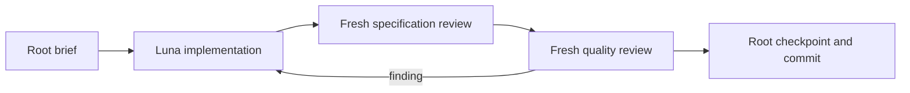

# Codex execution packet

Resume after reading the master plan, this packet, and the linked session.
The original handoff remains the outcome specification. This packet adapts
execution to Codex and records bounded implementation decisions.

## Execution contracts

Use the existing contracts in
[contracts.md](../../.claude/skills/root-architect-execution/references/contracts.md).
For every dispatch provide task/attempt/model/effort/read paths/write paths/
interfaces/acceptance/constraints/dirty paths. Workers own only named product
files and tests; root owns plans, session notes and Git. Workers do not spawn,
commit, expand scope, or ask the owner. Follow TDD for behavior changes.

Start `gpt-5.6-luna` at low effort. First improve a deficient brief without
escalating; increase effort only for a demonstrated reasoning gap. If that
still fails, escalate one model tier to `gpt-5.6-terra`. Keep the three-attempt
limit; record findings and decisions incrementally. Never silently inherit
the root model. The live spawn API accepts explicit model and effort only
with a fresh or bounded context fork, so use `fork_turns: none` and exact paths.

This host lacks a per-spawn read-only sandbox or tool allowlist. Specification
reviewers may use read-only shell reads because no filesystem read tool is
available; they may not run tests. Separate quality reviewers run the named
commands. These are procedural restrictions, not host-enforced isolation.
Repository-local `.codex` and `.agents` are mounted read-only; do not try to
install role configuration there. The actual dispatch enforces model choice.

Use Python 3.12. Full six-suite baseline at outcome gates; impacted scripts
suite per kernel task; adapter suites when adapter imports/contracts change.
Every accepted task gets a checkbox, session checkpoint, narrow commit.
Push to the verified origin feature branch; do not merge, release or tag.

## Outcome 3

- [x] Task 1: finish specification and quality reviews of `ef23d40`.
- [ ] Task 2: make the retained fail-fast branch policy explicit.
- [ ] Task 3a: vendor-neutral Orchestrator input/output contract.
- [ ] Task 3b: engine-authorized question/answer lifecycle.
- [ ] Task 4: Claude first-host transport and enforced policy boundary.
- [ ] Task 5: captured real run with externally anchored hashes.
- [ ] Task 6: full gate and independent acceptance review.

### Task 2 bounded decision

Keep the existing whole-run halt on exhausted retry budget. Independent
siblings remain pending. This conserves quota when the full objective cannot
complete, and avoids silently introducing partial-success semantics. Change
the docstring from an accidental slice limitation to an intentional policy;
exercise an emitted multi-branch DAG with scripts for both branches, assert
no sibling request, exact blocked phase, and replay/verify agreement. Existing
exhausted-retry evidence remains unchanged.

Owned files: `scripts/oqc.py`, `scripts/tests/test_compile_workflow.py` beneath
the package. Acceptance: focused compiler tests and full scripts suite.

### Task 3a bounded contract

Define a serializable vendor-neutral Orchestrator contract compiled from the
emitted RunSpec, TaskDag, AgentSpecs and attempt budget. Validate all role
bindings, identity uniqueness and positive budget before spawning anything.
Inputs include the whole generated workflow; instructions explicitly reserve
scheduling, brief compilation, gating, retries and phase transitions to code.
Root delegates once and thereafter observes or relays an engine-declared
question; workers never address root or one another. The Orchestrator cannot
rewrite the mailbox or mutate state. Add a reusable result schema at the
currently emitted `schemas/worker-result.schema.json` path, which is absent.

### Task 3b bounded lifecycle

Add explicit validated question requests and root answers. Gate code is the
sole authority for entering awaiting-user-input and deciding whether an answer
resumes or keeps the run blocked. Answers must bind the outstanding question
and run, obey a schema, and be rejected before append for wrong identity,
duplicate/stale answers, invalid values, or answers outside allowed phases.
No arbitrary adapter phase changes masquerade as engine approval. Preserve
exhaustion as terminal blocked unless the gate explicitly permits an answer.

### Task 4 transport constraints

Use the installed authenticated Claude CLI as planned. Model, effort and tool
settings are explicit and the adapter discloses enforcement limits. Preserve
native session/agent identities and raw transport records for the capture.
A fake transport in unit tests is not real-host proof. Do not make live support
claims before Task 5 passes. Read local CLI help and official documentation
when specifying the concrete command and response protocol.

### Task 5 and gate

One small emitted workflow, one real Orchestrator identity, separate worker
identities, deterministic engine decisions, passive root and schema-valid
answer relay. Capture raw host records, mailbox JSONL, generated contract,
artifact bytes/hashes and external head hash. Offline tests verify the saved
capture without spending model quota again. Tests must reject tampered
artifact bytes and mailbox content. A missing host, quota failure or synthetic
capture is a blocked gate, never a completed live run.

## Later outcomes

Do not begin Outcome 4 broad host migration before the Outcome 3 gate passes.
Then author its bounded packet from verified transport experience: generated
wrappers, model/effort/tool/sandbox/fallback matrix, contract tests, real smokes
only on available hosts, unsupported hosts disclosed honestly.

Outcome 5 follows the adapter gate: wire install/discover/interview/build/run,
generate manifest settings from accepted decisions, fold QC into gates, prove
equivalence before removing duplicate legacy behavior, and run the complete
product acceptance flow with a measured time/tool budget and truthful docs.
