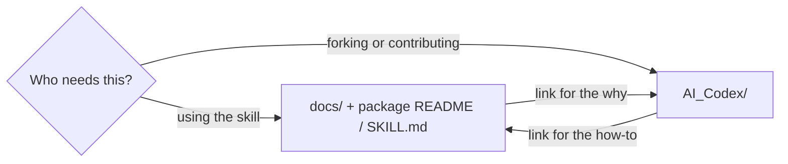
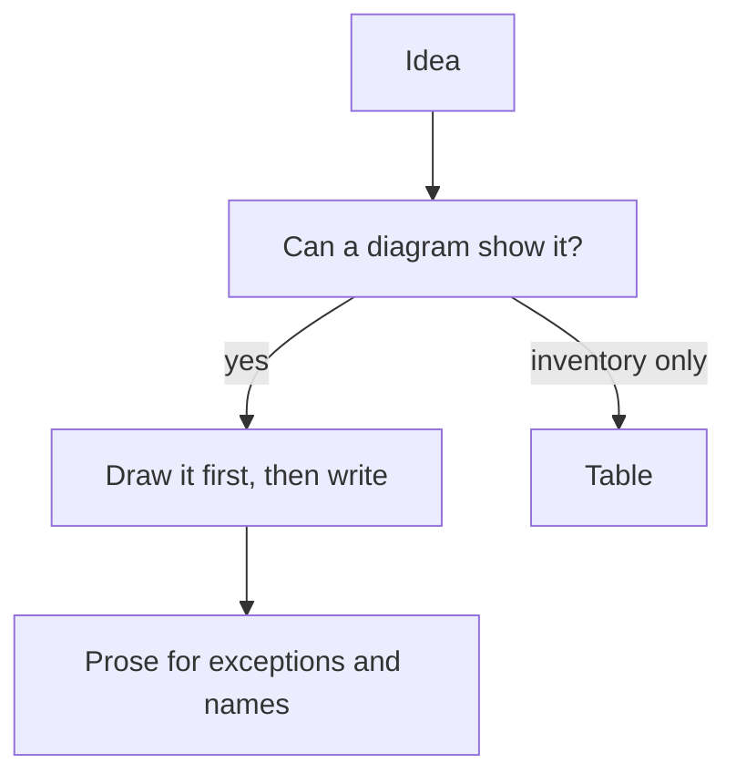
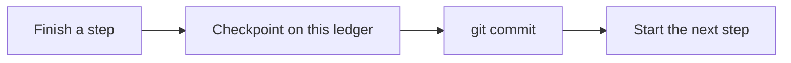

# Documentation

Two trees, one boundary: **who is reading**.

| Reader | Tree | Examples |
| --- | --- | --- |
| Product user | `docs/`, skill `README.md`, `SKILL.md`, adapter READMEs | How to validate, execute, upgrade, author |
| Contributor / forker | `AI_Codex/` | ADRs, specs, plans, sessions, reports |

## Visual richness

Every live user-facing or contributor-facing note includes at least one
Mermaid diagram (flowchart, sequence, or chart) that carries the shape of
the idea. Tables remain for inventories. Prose remains for decisions.
Historical session logs are exempt. Implementation plans include a
diagram when control flow is otherwise hard to see.

## Paths

- Specs: `AI_Codex/Architecture/Specs/YYYY-MM-DD-<topic>-design.md`
- ADRs: `AI_Codex/Architecture/ADR/NNNN-<slug>.md`
- Plans: `AI_Codex/Implementation_Plans/YYYY-MM-DD-<topic>.md`
- User notes: `docs/`

## Implementation gates

Each completed step or quality gate gets its own ledger checkpoint, then
its own commit, then the next step. Do not batch separable gates into one
commit.

Write the checkpoint on the open `Agent_Sessions/` note (and a report if
the gate is a formal result). Then commit, including that note.
