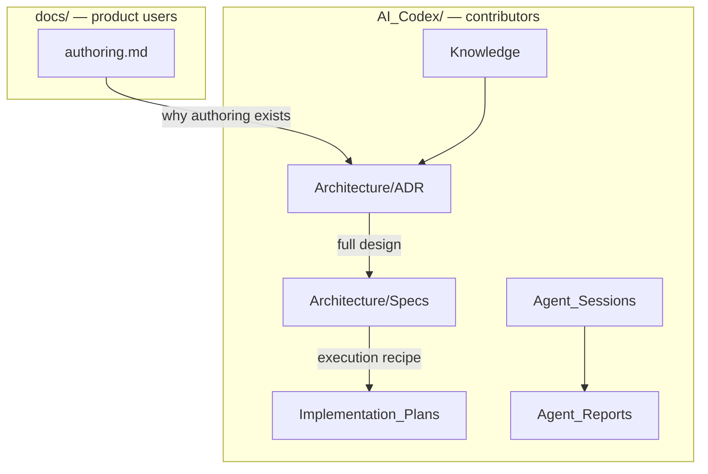

# AI Codex

Contributor ledger for this repository. **Audience:** someone forking or
extending the product. Product users start at the [root README](../README.md)
and [`docs/authoring.md`](../docs/authoring.md).

The same facts may appear in both trees, written for that reader. This
ledger is versioned with the git history.

Software / Agile Project Vault. The governing archetype is recorded in
`.codex-vault.json`.

## Taxonomy

- **Knowledge/** — Permanent distilled knowledge notes (patterns, domains, references) + the knowledge MOC
- **Tickets/Active/** — In-flight ticket ledgers
- **Tickets/Ready/** — Groomed, ready-to-start tickets
- **Tickets/Closed/** — Merged/closed, awaiting release
- **Tickets/Resolved/** — Shipped/archived ticket ledgers
- **Features/** — Feature specifications and implementation detail
- **Architecture/** — High-level architecture overviews
- **Architecture/ADR/** — Architecture Decision Records
- **Architecture/Specs/** — Design specs (why/what, before or instead of an ADR)
- **Architecture/Patterns/** — Recurring design patterns
- **Architecture/Infrastructure/** — Structural/infra definitions
- **Architecture/Agent-Governance/** — Agent governance protocols and directives
- **Architecture/Protocols/** — Operational protocols
- **Implementation_Plans/** — Agent execution plans (checkbox recipes)
- **Agent_Sessions/** — Operational journal of agent sessions (doubly-linked chain)
- **Agent_Reports/** — Formal agent-generated reports
- **assets/** — Images and binary attachments
- **Meta/** — Templates, scripts, and vault plumbing

Do not recreate `docs/superpowers`. New design specs go to
`Architecture/Specs/`. New ADRs go to `Architecture/ADR/`. New plans go
to `Implementation_Plans/`. Every live note here includes a diagram —
see [[Knowledge/Documentation]].

## Entry Points

- [[Knowledge/Agent_Orientation]]
- [[Knowledge/Documentation]]
- [[Agent_Sessions/README]]
- [[Tickets.base]]
- [[Features.base]]
- [[Agent_Sessions.base]]
