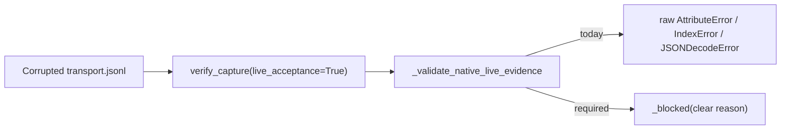

# Native acceptance crashes instead of blocking on malformed evidence

## Problem

`_validate_native_live_evidence` is the mechanism that separates genuine host
evidence from a forged or corrupted capture. It must reject bad input cleanly.
Three dereferences are unguarded, so malformed evidence escapes as an uncaught
Python exception instead of a `Blocked` with a reason. A crash in the acceptance
path is a defect: it produces no verdict and no recovery action.

All three are reachable from a corrupted or hand-edited `transport.jsonl`
through the public `verify_capture(dir, live_acceptance=True)` entry point.
Record values are never type-checked upstream — `_read_records` only confirms a
record is a dict with the exact `_FIELDS` key set, never the value shapes.

## Evidence

Reproduced by a quality validator against the live module:

1. `argv[-1]` set to a non-string raises
   `AttributeError: 'int' object has no attribute 'encode'` at
   `hashlib.sha256(argv[-1].encode())`.
2. `argv = ["claude", "--model"]` with `prompt_sha256` forged to match — so the
   earlier prompt-binding check passes — raises `IndexError: list index out of
   range` at `argv[argv.index(flag) + 1]`, because the flag is the final element.
3. `--agents` or `--settings` present but followed by a non-JSON string raises
   `json.JSONDecodeError` at `json.loads(...)`.

Deliberately deferred during Outcome 3 under a proportionality ruling: these are
reachable only from a hand-corrupted evidence file, not from a genuine run, so
they did not gate Task 6.

## Acceptance

- Every `argv` element is confirmed to be a string before `.encode()`.
- A flag that is the final element of `argv` is rejected rather than indexed past.
- `json.JSONDecodeError` from the `--agents` and `--settings` reads is converted
  into `_blocked(...)`.
- One test per crash path asserts `Blocked` is raised, not the raw exception.
- No existing check is weakened; the focused Claude modules and the full scripts
  suite stay green.

## References

- `orchestration-quality-control/scripts/claude_capture.py` — `_validate_native_live_evidence`
- Session [[2026-09-09-021123-task-5b-completion-gate]], quality gate of 2026-09-09 04:52
