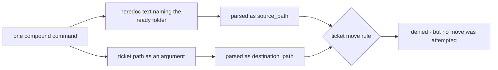

# Upstream — workflow plugin misreads prose as a ticket move and denies the command

## Problem

A `PreToolUse` policy hook shipped by `codex-workflows-plugin` denies Bash
commands with a ticket-move error when no move was attempted. It fires whenever
a single compound command both writes text that names the ready ticket folder
and separately passes a ticket path as an argument.

The rule derives `source_path` and `destination_path` from paths recovered
anywhere in the command string, including inside heredoc or redirected content,
then rejects the pair because the destination is not the active folder. Content
being written is treated as a move operand.

The trigger is narrow but easy to hit unintentionally, and it is provoked by
exactly the behaviour the governing agent protocol requires: recording ticket
work in a session ledger while performing that ticket work.

## Evidence

Narrowed by reproduction during the Outcome 3 session. The first hypothesis —
that a multi-path `git add` was to blame — was tested and disproved.

| Command shape | Result |
| --- | --- |
| `git add <ticket dir> <session note>` | allowed |
| prose naming the ticket folders, no path argument | allowed |
| heredoc naming the ready folder **and** a ticket path argument | **denied** |

Observed message: `Tickets from Tickets/Ready/ must be moved to Tickets/Active/
when started, not Ready.` The destination it names is the staged directory
argument, and the source was prose — which is the tell.

Fails closed. The denied command does not run and the working tree was verified
unchanged, so nothing is corrupted. The cost is a misleading error that invites
a wrong diagnosis.

## Where the defect lives

`codex-workflows-plugin` v0.5.20, `scripts/policy/engine.py`, function
`_evaluate_ticket_paths`, in the branch guarded by
`if event.source_path and event.destination_path`.

**This repository does not contain that project.** It is installed only as a
plugin cache under `~/.claude/plugins/`, and its source is
`https://github.com/Monolith-INC/codex-workflows-plugin`. This ticket exists to
track the defect and its workaround from here; the fix must land upstream. No
upstream issue has been opened — that needs a separate decision, since it is an
outward-facing action on a third-party repository.

## Workaround in force

Keep ledger prose that names ticket folders in its own tool call, separate from
any command carrying a ticket path. Splitting a blocked staging step into
single-path calls cleared it.

## Acceptance

- Move source and destination are derived only from genuine move or rename
  operations — `mv`, `git mv`, a rename tool call — never from paths recovered
  in written content.
- A command that writes prose naming a ticket folder while touching a ticket
  path is allowed.
- Genuine out-of-order ticket moves are still denied.
- A regression test covers the compound-command shape above.

## References

- Session [[2026-09-09-021123-task-5b-completion-gate]], tech-debt section of 2026-09-09
