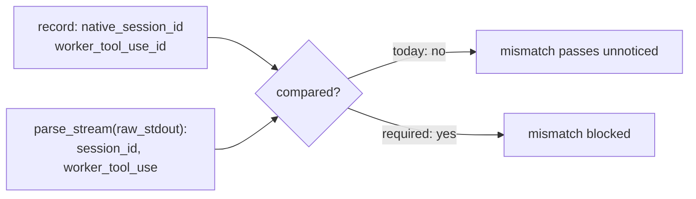

# Verifier does not bind archived native identities to reparsed host evidence

## Problem

`_validate_native_live_evidence` reparses `raw_stdout` but never compares the
reparsed `parse_stream(...).session_id` and `.worker_tool_use["id"]` against the
record's own `native_session_id` and `worker_tool_use_id`. The manifest carries
those identities and the acceptance path trusts them, so a record whose declared
identity disagrees with its own archived stdout would be accepted.

Relatedly, the verifier never asserts that invocations after the first carry
`--resume <session_id>` in argv. The property "resume never silently starts a
new session" therefore rests on human reading of the archived argv and the
`SessionStart:resume` hook events, not on an executable check.

Both are identity-binding gaps in the same mechanism: recorded identity is
trusted rather than derived from host evidence.

## Evidence

Raised by the Task 6 independent acceptance review. The reviewer confirmed by
hand that all three records in the accepted capture
`AI_Codex/Agent_Evidence/2026-09-09-task5b-live-final` do match — one native
session `cc392b63…` established at `SessionStart:startup` and resumed on
invocations 2 and 3, three distinct Agent tool-use ids — and stated plainly that
the verifier would not have caught a mismatch. Task 6 passed without this, so it
is a hardening gap rather than a failure of the accepted evidence.

## Acceptance

- Acceptance compares the reparsed session id and worker tool-use id against the
  record's archived values and blocks on any mismatch.
- Invocations after the first are asserted to carry `--resume <session_id>` for
  the established session.
- Tests cover a mismatched session id, a mismatched tool-use id, and a later
  invocation missing `--resume`.
- The accepted capture still verifies unchanged.

## References

- `orchestration-quality-control/scripts/claude_capture.py:197` — `_validate_native_live_evidence`
- Session [[2026-09-09-021123-task-5b-completion-gate]], Task 6 review of 2026-09-09 09:37
