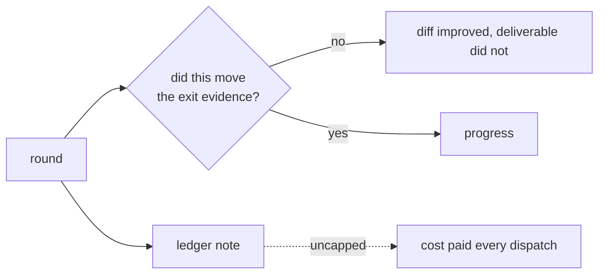

# Anchor each round to the plan's exit evidence and cap ledger cost

## Problem

**The loop optimises the diff, never the deliverable.** The governing packet
defines Task 5b as *"one authenticated run and saved-capture acceptance"* — a
single cheap binary experiment. The skill's loop never asks whether a round
moved toward a task's stated exit evidence, so the code improved steadily for
twelve hours while the deliverable did not move at all. The run was eventually
spent three times for cents apiece, and each attempt returned a defect that no
offline round had found: a passed result carrying a critique forward, a
comparison that could never accept a genuine capture, and a worker fabricating a
tool call. All three were behavioural properties of a real model against a real
host, unreachable by code inspection. The loop was searching the wrong space and
had no rule that would tell it so.

**Ledger cost is uncapped.** The contract requires a progress note at every
dispatch, verdict, reproduction and ruling. That is genuinely what makes an
interrupted task resumable — it saved this session twice — but it is paid every
time with no ceiling. One unfinished task produced roughly 250 ledger lines.

## Acceptance

- Each checkpoint states the task's exit evidence from the governing plan and
  whether the round moved toward it.
- The skill instructs that when several rounds pass without moving the exit
  evidence, that is a signal the loop is searching the wrong space, and names
  running the real experiment as the corrective.
- Ledger guidance keeps per-event notes but bounds their length, so
  resumability is preserved without unbounded cost.

## References

- `.claude/skills/root-architect-execution/SKILL.md`
- `.claude/skills/root-architect-execution/references/contracts.md`
- Session [[2026-09-09-021123-task-5b-completion-gate]], backlog F7 and F8
