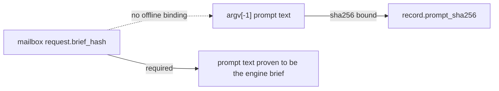

# Bind the archived worker prompt to the mailbox request brief hash

## Problem

Offline acceptance binds the prompt only by SHA-256 of `argv[-1]` against the
record's `prompt_sha256`. That proves the archived argv is self-consistent, but
nothing binds the prompt text to the mailbox request's engine-issued
`brief_hash`. A capture whose worker was driven by a different brief than the
one the engine recorded would satisfy the current checks.

The Task 6 reviewer verified by hand that each prompt embeds the exact canonical
brief for the accepted capture, so the evidence is sound; the gap is that the
property is asserted by a person rather than by the verifier.

## Acceptance

- Acceptance derives the canonical brief bytes from the mailbox request and
  confirms the archived prompt carries them, blocking on a mismatch.
- A test proves a capture whose prompt does not match its recorded brief hash is
  rejected.
- The accepted capture still verifies unchanged.

## References

- `orchestration-quality-control/scripts/claude_capture.py` — `_validate_native_live_evidence`
- `orchestration-quality-control/scripts/claude_adapter.py` — brief canonicalisation and `brief_hash`
- Session [[2026-09-09-021123-task-5b-completion-gate]], Task 6 review of 2026-09-09 09:37
