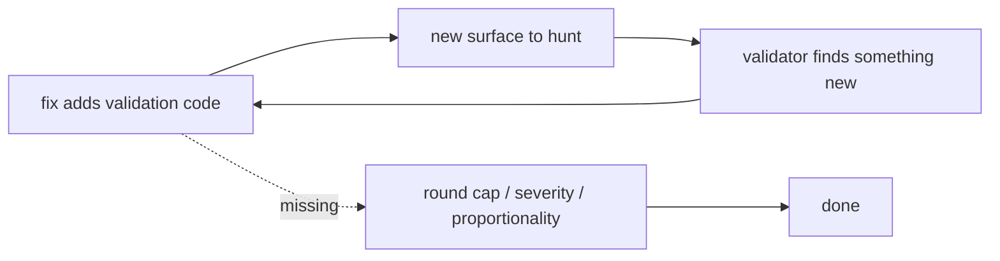

# Bound the root-architect validation loop so it converges

## Problem

The `root-architect-execution` loop has no termination condition. Its breaker
counts **failures**, not **rounds**: *"Same worker until three failures, then
blocked."* A round where the implementer succeeds and the validator legitimately
finds something new costs a full cycle and trips nothing, so a loop that keeps
succeeding can iterate without bound.

This is not theoretical. One sub-task consumed roughly five hours of quota
across a single session and twelve hours overall without completing, because
each round's fix became the next round's attack surface:

| Round | Fix added | What the next round found |
| --- | --- | --- |
| 1 | `_validate_native_live_evidence` | it was unreachable dead code |
| 2 | ~20 tests driving it | 3 branches still not independently proven |
| 3 | 3 more tests | a self-priming prompt and 3 crash paths |

Two missing rules make it worse. **Findings carry no severity** — the contract's
shape is `path / requirement / evidence / required fix` with no field saying
whether a finding gates the commit, so a crash reachable only from a hand-edited
file blocks as hard as a defect that would waste an expensive live run. And
there is **no proportionality rule**: the only economic guidance is a quota
floor, nothing tying verification effort to the cost of what it protects. The
loop hardened a verifier for hours to protect an experiment costing cents.

## Evidence that bounding works

The final validation round of that session was dispatched with an explicit
severity rule — blocking only if it would waste the live run or admit a forged
capture. It returned a correct `PASS` in about **70 seconds**, against roughly
**13 minutes** for the previous unbounded round on the same code.

## Acceptance

- The skill caps validation rounds per task. Past the cap, remaining findings
  are logged as follow-ups rather than blocking.
- The finding contract gains `severity: blocking | follow-up`, and only
  `blocking` gates the commit.
- The skill states that verification effort must be proportional to the cost of
  what it protects, and that when the gated action is cheap and repeatable the
  correct move is to run it rather than harden against it.
- The red-flags table gains the corresponding excuse counters.

## Explicitly out of scope

A triviality escape letting root apply mechanical one-line fixes itself was
proposed and **rejected by the owner on 2026-09-09**: it would bypass the
independent review that catches exactly the subtle errors root is most likely to
make, and root reviewing its own change is not review. The rule that root writes
no product code stands unchanged. Do not reintroduce it under this ticket.

## References

- `.claude/skills/root-architect-execution/SKILL.md`
- `.claude/skills/root-architect-execution/references/contracts.md`
- Session [[2026-09-09-021123-task-5b-completion-gate]], backlog F1, F2, F3, F4
