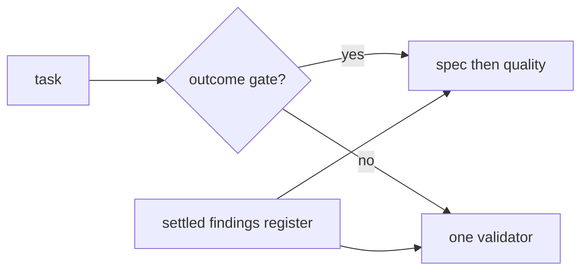

# Right-size validator dispatch and stop re-litigating settled findings

## Problem

Two independent sources of repeated work in `root-architect-execution`.

**Every task pays for two validators.** The loop mandates a fresh spec validator
then a different fresh quality validator, with no rule for when one suffices. A
previous owner had to override it explicitly — *"routine duplicate spec/quality
stages are suspended for speed"* — to get throughput. When a human must
routinely fight a rule to make progress, the rule is miscalibrated.

**Validators have no memory, so settled questions return.** Fresh agents cannot
know what has already been decided. During Outcome 3 a validator claimed the
flat `hook_name`/`outcome` event vocabulary was invented and ungrounded. Root
reproduced it against 483KB of real archived host output, found the vocabulary
correct, and **rejected** the claim. Nothing in the skill records that, so the
only thing preventing its return was root hand-writing an "already settled — do
not re-raise" section into every subsequent brief. That worked, but by luck and
diligence rather than by design.

## Acceptance

- The skill distinguishes outcome gates, which get spec then quality, from
  routine tasks, which get one validator.
- The ledger gains a settled-findings register recording each claim that was
  reproduced and rejected, with the evidence that settled it.
- The brief contract requires injecting that register into every validator
  dispatch, so a settled claim is out of scope by construction.
- The red-flags table gains a counter for re-raising a settled finding.

## References

- `.claude/skills/root-architect-execution/SKILL.md`
- `.claude/skills/root-architect-execution/references/contracts.md`
- Session [[2026-09-09-021123-task-5b-completion-gate]], backlog F5 and F6
