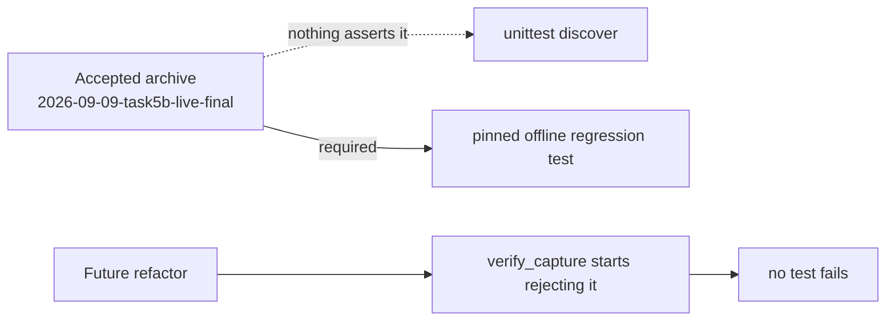

# Pin an offline regression test to the accepted live capture

## Problem

No test in the suite is pinned to the accepted archive. Every fixture is
hand-shaped. A future change that made `verify_capture` reject the real capture
would not be caught by `unittest discover` — the suite would stay green while
the product lost the ability to accept its own accepted evidence.

This is not hypothetical. During Outcome 3 exactly that defect shipped: the
archived-events comparison compared `parse_stream`'s frozen tuples against
events read back from JSON as lists, so it could never accept a genuine capture.
Every test fed the validator in-memory frozen events, so none exercised the JSON
round-trip a real archive always performs, and the suite stayed green. It was
found only by spending an authenticated run.

The lesson generalises: **unit tests that bypass serialization cannot prove a
serialization boundary.** A test anchored to real bytes on disk can.

## Acceptance

- One offline test points at `AI_Codex/Agent_Evidence/2026-09-09-task5b-live-final`
  and asserts `verify_capture(..., live_acceptance=True)` passes, with phase
  `completed` and head `96d0fc9acf469a1a591dddd4a37cd4de27637bb69923370d90a7cff2f2f6f0fe`.
- The test spends no quota and makes no host call.
- It skips cleanly with a clear message if the archive is absent, since the
  evidence directory is deliberately untracked and not published.
- The archive is treated as read-only; the test never writes to `AI_Codex/`.

## Notes

The evidence directory is intentionally **not** committed. `origin` is a public
repository and the captures' `transport.jsonl` carries machine paths, the MCP
server inventory, native session ids and per-run cost data. Any solution must
tolerate the archive being missing on a fresh clone rather than requiring it to
be published.

## References

- `orchestration-quality-control/scripts/tests/test_claude_capture.py`
- Session [[2026-09-09-021123-task-5b-completion-gate]], Task 6 review of 2026-09-09 09:37
