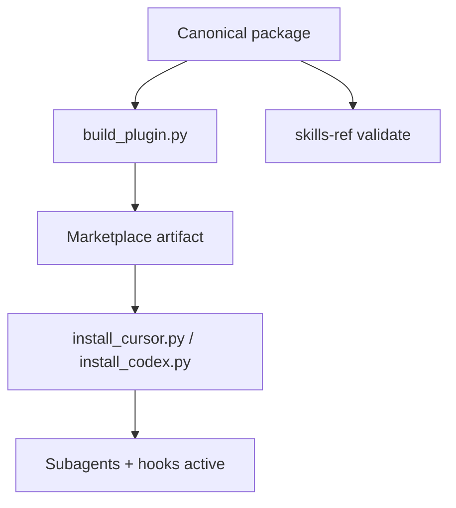

# Agent Skills standards — packaging and installation patterns

## Summary

Context7 documentation was queried against the Agent Skills open specification, Vercel Skills CLI (`vercel-labs/skills`), and OpenSkills (`numman-ali/openskills`), then compared to the live `orchestrator_qc_plugin` tree.

The repository is structurally aligned with the Agent Skills spec. The distinguishing product choice is **full-plugin distribution only**: skill-only install paths would discard nested sub-agents, hook-enforced approval, and root-session restraint — the primary anti-drift mechanism.

Portability should anchor on the **specification** ([agentskills.io/specification](https://agentskills.io/specification)), not on any single installer. OpenSkills and Vercel Skills are distribution mechanisms.

## Standards landscape

| Layer | Role | Authority |
| --- | --- | --- |
| Agent Skills spec | Format contract (`SKILL.md`, directories, validation) | [agentskills.io/specification](https://agentskills.io/specification) |
| Vercel Skills CLI | Cross-agent installer (`npx skills`, 40+ agents) | [vercel-labs/skills](https://github.com/vercel-labs/skills) |
| OpenSkills | Alternate installer (`npx openskills`) | [numman-ali/openskills](https://github.com/numman-ali/openskills) |

Older architecture notes cited OpenSkills `_autodocs/skill-md-format.md` and `_autodocs/README.md`; both return 404. Current maintained references are agentskills.io and [vercel-labs/skills `_autodocs`](https://github.com/vercel-labs/skills/tree/main/_autodocs).

## Spec requirements (relevant to OQC)

### Directory layout

```text
skill-name/
├── SKILL.md          # required
├── scripts/          # optional
├── references/       # optional
├── assets/           # optional
```

The canonical package at `orchestration-quality-control/` follows this shape, including a `scripts/` directory for deterministic gates — consistent with the spec's executable-resources model.

### Frontmatter

Required fields: `name` (must match directory name, max 64 chars, lowercase hyphen-case) and `description` (max 1024 chars, should state what and when).

Shipped skills align on name/directory pairs: `orchestration-quality-control`, `orchestration-upgrade`, `oqc-upgrade`.

### Progressive disclosure

Agents load metadata at discovery, full `SKILL.md` on activation, and `references/` / `scripts/` on demand. The split between core `SKILL.md`, `references/rules/`, `references/workflows/`, and `scripts/*.py` matches spec intent.

### Validation

The spec provides `skills-ref validate ./my-skill`. The repository does not yet run this in CI.

## Installer behavior (external reference)

Vercel Skills CLI treats Cursor, Codex, and Claude Code as universal agents using `.agents/skills/` (project) and `~/.agents/skills/` (global). OpenSkills uses `.agent/skills/` (singular) with `--universal`.

Plugin manifests (`.cursor-plugin/`, `.codex-plugin/`, `.claude-plugin/marketplace.json`) declare skill paths outside the default 2-level catalog walk.

These installers are **not** the OQC distribution path. They do not register hooks, nested subagents, or host marketplace wiring.

## Repository alignment

| Area | Status |
| --- | --- |
| Canonical skill layout | Aligned |
| Host adapters as build overlays (`build_plugin.py` injects overlay without mutating source) | Aligned |
| Reproducible marketplace builds with `BUILD-MANIFEST.json` | Aligned |
| Full-plugin install front doors (`install_cursor.py`, `install_codex.py`) | Aligned |
| Nested topology enforced; no silent single-agent fallback | Aligned |
| `aplicatudo-e2e` profile for former E2E artifact rules | Aligned |
| `skills-ref validate` in CI | Gap |
| `compatibility` and `metadata.version` in canonical frontmatter | Gap |
| Explicit `skills` array in Cursor `plugin.template.json` | Gap (Codex template already declares skills) |

## Full-plugin-only decision

OQC is a plugin, not a flat skill:

```text
root session (hook-restrained)
└── oqc_cursor_orchestrator | oqc_codex_orchestrator
    ├── validator (read-only)
    └── remediator (literal approved changes only)
```

While a checkpoint is `pending_approval`, hooks deny protected edits and unrestricted shell except named deterministic scripts and exact authorized before/after pairs. Skill-only distribution would ship instructions without this enforcement layer.

The Codex adapter already documents that `npx skills add` is not a valid installation path for the nested adapter. That policy applies product-wide.

## Recommended conformance work

1. Add `skills-ref validate` on the canonical package and entrypoints in CI/build tests.
2. Add `compatibility` frontmatter (Python 3.11+, nested subagents, hooks).
3. Mirror plugin manifest version in `metadata.version`.
4. Add explicit `skills` paths to the Cursor plugin template.
5. Replace stale OpenSkills `_autodocs` citations in repo docs.

## Release pipeline



## Sources

- Context7: `/vercel-labs/skills`, `/numman-ali/openskills`
- [Agent Skills specification](https://agentskills.io/specification)
- Live tree: `orchestration-quality-control/`, `dist/cursor-marketplace/`, `dist/codex-marketplace/`
