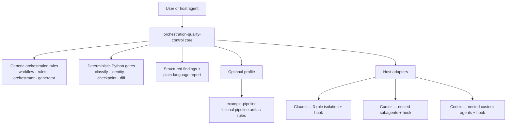
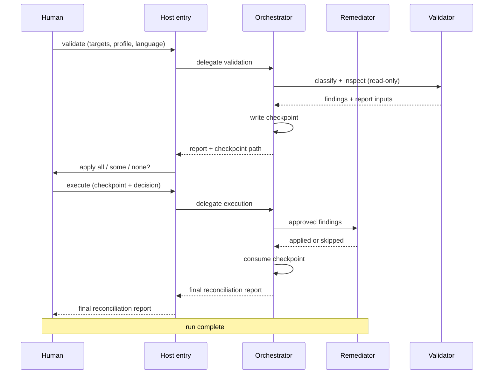
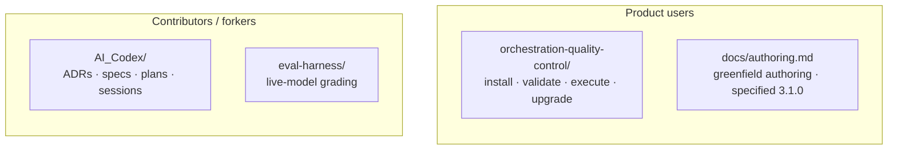

# Orchestration Quality Control

[](orchestration-quality-control/SKILL.md)
[](orchestration-quality-control/CHANGELOG.md)
[](orchestration-quality-control/scripts/)
[](orchestration-quality-control/scripts/tests/)
[](https://github.com/agentskills/agentskills)

**Quality control for the documents that run your agents** — workflow files, orchestrator documents, and rules files — not the application code agents write. The package classifies targets, checks them against packaged policy, returns structured findings with literal before/after diffs, and applies nothing until a human explicitly approves.

| Start here | Host install |
| --- | --- |
| [`orchestration-quality-control/SKILL.md`](orchestration-quality-control/SKILL.md) | [Claude](orchestration-quality-control/adapters/claude/README.md) · [Cursor](orchestration-quality-control/adapters/cursor/README.md) · [Codex](orchestration-quality-control/adapters/codex/README.md) |

---

## Table of contents

- [The problem](#the-problem)
- [The solution](#the-solution)
- [How a run works](#how-a-run-works)
- [Evidence it helps](#evidence-it-helps)
- [Operations](#operations)
- [Suggested use cases](#suggested-use-cases)
- [Examples](#examples)
- [Repository layout](#repository-layout)
- [Installation and testing](#installation-and-testing)
- [Architecture decisions](#architecture-decisions)
- [References](#references)
- [License](#license)

---

## The problem

Teams building **agentic workflows** (multi-step processes where one agent delegates work, validates results, asks for approval, and keeps state) encode that behavior in markdown: workflow files describe steps, rules files state constraints, and orchestrator documents coordinate workers. When those documents are incomplete or inconsistent, the failure mode is subtle: agents skip approval gates, retry forever, lose progress when a session ends, or edit files before anyone agrees.

A prior implementation, bundled inside a product test suite, mixed two concerns that do not belong together:

1. **Generic orchestration checks** — delegation completeness, bounded retries, durable state, approval ownership — useful for any agent workflow.
2. **Domain-specific checks** — artifact shape for that one product's suite — useful only there.

Coupling them made the tool look like a niche linter while actually trying to be a portable orchestration gate. Worse, early versions relied heavily on model consistency for mechanical steps (classification, finding identity, checkpoint transitions), which produced **different findings for identical input** and sometimes reported edits as applied when they were not safe.

---

## The solution

This repository ships **`orchestration-quality-control`**: a portable [Agent Skills](https://github.com/agentskills/agentskills)-format package with a **core-plus-adapters** layout.



The core separates **policy** (what good orchestration looks like) from **enforcement** (how a host prevents bypass). Mechanical decisions run in dependency-free Python under `orchestration-quality-control/scripts/`; a language model is used only to judge whether a passage violates a rule and to write the human-facing report. Every proposed fix must quote verbatim text from the target file — if the anchor is missing, the finding is rejected before review.

Domain checks live in optional **profiles** (for example [`profiles/example-pipeline/`](orchestration-quality-control/profiles/example-pipeline/)). With no profile, the core runs generic checks only.

---

## How a run works

Two quality-control operations run in order; two upgrade operations are optional.



**Checkpoints** (durable run records) live in the workspace under `.orchestration-qc/state/`, not inside the package. A checkpoint with status `pending_approval` is the only active-run signal — there is no separate marker file. Host adapters with hooks can block direct edits to target files while a review is pending.

Every host adapter (Claude, Cursor, Codex) mechanizes the same **isolated three-agent topology**: Validator (read-only) and Remediator (apply-only) run as separate, narrowly-permissioned subagents under an Orchestrator, calling the same deterministic scripts at every gate. A host that cannot complete that nested handoff returns `blocked` rather than silently running the checks in a single agent ([ADR 0010](AI_Codex/Architecture/ADR/0010-isolated-three-agent-only.md)).

**Guided upgrade** (`upgrade_prepare` / `upgrade_apply`) discovers an existing orchestration, compares it to the isolated-three-agent reference template, drafts a complete replacement plus `ARCHITECTURE.md`, checkpoints the literal preview, and applies only an atomic approve/decline decision ([ADR 0008](AI_Codex/Architecture/ADR/0008-guided-orchestration-upgrade.md)).

---

## Evidence it helps

### Eval coverage in this repository

| Eval set | Profile | Cases | Purpose |
| --- | --- | ---: | --- |
| [`evals/core/evals.json`](orchestration-quality-control/evals/core/evals.json) | `core` | 4 | Generic orchestration only |
| [`evals/author/evals.json`](orchestration-quality-control/evals/author/evals.json) | `core` | 2 | Greenfield authoring interview and apply gates |

The definition of done ([ADR 0005](AI_Codex/Architecture/ADR/0005-definition-of-done.md), amended by [ADR 0011](AI_Codex/Architecture/ADR/0011-agnostic-example-pipeline-profile.md)) requires both sets to reach **100% with-skill pass rate**. The repo includes [`eval-harness/`](eval-harness/) tooling (converter, run-integrity checker, runbook) to repeat that grading; see [`eval-harness/RUNBOOK.md`](eval-harness/RUNBOOK.md) for the 3 with-skill + 1 without-skill run protocol per eval.

### Offline deterministic tests

**174** automated tests run with no model call (counts as of v3.1.0):

| Suite | Tests |
| --- | ---: |
| Core scripts (`scripts/tests/`) | 88 |
| Claude hook | 8 |
| Claude adapter build | 6 |
| Codex adapter | 36 |
| Cursor adapter | 19 |
| Eval harness | 17 |

These cover classification, content-anchored finding IDs (stable when unrelated lines shift), checkpoint state machine, diff rendering, partial-apply conformance, upgrade path containment, and hook authorization.

---

## Operations

| Operation | What it does |
| --- | --- |
| **`validate`** | Classify targets, run applicable rules, return findings + plain-language report + checkpoint when issues exist |
| **`execute`** | Apply `all`, `none`, or a named subset of finding IDs from a pending checkpoint; reconcile applied vs skipped |
| **`upgrade_prepare`** | Discover orchestration, compare to a reference template, return proposal + docs preview + checkpoint |
| **`upgrade_apply`** | Atomic `approve` or `decline` on an upgrade checkpoint |
| **`author_prepare`** | Audit workspace, interview gaps, draft process documents, internal QC, checkpoint |
| **`author_apply`** | Atomic `approve` or `decline` into an empty `output_root` |

Input contracts: [`references/schemas/input.schema.json`](orchestration-quality-control/references/schemas/input.schema.json), [`upgrade-input.schema.json`](orchestration-quality-control/references/schemas/upgrade-input.schema.json), and [`author-input.schema.json`](orchestration-quality-control/references/schemas/author-input.schema.json).

Host entry points:

| Host | QC | Upgrade | Author |
| --- | --- | --- | --- |
| Claude Code | `/oqc-validate`, `/oqc-execute` | `/oqc-upgrade` | `/oqc-author` |
| Cursor | skill + bundled subagents | `/oqc-upgrade` | `/oqc-author` |
| Codex | packaged plugin + custom agents | `orchestration-upgrade` skill | `orchestration-author` |

---

## Suggested use cases

1. **Before merging agent workflow changes** — Run `validate` on new or edited workflow and rules files; require explicit approval before `execute` applies fixes.
2. **Auditing an orchestrator document** — Flag unbounded retry loops, state kept only in chat context, or missing delegation specs (see core eval fixture `deploy-orchestrator.md`).
3. **Rules authoring hygiene** — Detect rationale clauses (`because`, `so that`) and step sequencing that belongs in workflow files, not rule bullets.
4. **Generator-source review** — Check whether prompts or generators that produce orchestration artifacts would violate packaged rules (core) or profile artifact rules (for example the fictional pipeline format).
5. **Replacing a legacy orchestration** — Use guided upgrade to compare an existing mechanism against the isolated-three-agent reference architecture, draft a complete replacement, and apply it atomically.
6. **Optional profile for a fictional pipeline artifact format** — Select `profile: example-pipeline` for `*.pipeline.yaml` checks without loading that vocabulary into generic runs.
7. **Authoring a new process (specified, 3.1.0)** — `/oqc-author` after a workspace audit; see [`docs/authoring.md`](docs/authoring.md).

---

## Examples

### Validate a workflow (core profile)

```yaml
operation: validate
targets:
  - docs/agent/workflows/deploy.md
profile: core
language: en
```

Expected outcome: a short plain-language report listing each violation (what, which rule, where, suggested change), a structured finding per issue with a literal `{before, after}` span, and — if anything failed — a checkpoint path under `.orchestration-qc/state/`.

### Execute after selective approval

```yaml
operation: execute
checkpoint_path: .orchestration-qc/state/checkpoint-<run_id>.json
decision:
  - core/workflow/missing-retry-cap-abc123
  - core/workflow/non-durable-state-def456
```

Expected outcome: only those findings are applied; others remain untouched; the checkpoint moves to `consumed` with per-finding applied or skipped outcomes.

### Upgrade with side-by-side output

```yaml
operation: upgrade_prepare
mechanism_path: .claude/agents/my-orchestrator.md
apply_mode: side-by-side
output_root: docs/agent/oqc-v2/
```

Expected outcome: a full proposal tree under `output_root`, an `ARCHITECTURE.md` preview, and a pending upgrade checkpoint for atomic approval.

---

## Repository layout



| Path | Role |
| --- | --- |
| [`orchestration-quality-control/`](orchestration-quality-control/) | Portable skill — rules, workflows, schemas, scripts, profiles, adapters |
| [`docs/authoring.md`](docs/authoring.md) | Greenfield authoring for product users |
| [`AI_Codex/`](AI_Codex/) | Contributor ledger — ADRs, specs, plans, sessions (versioned) |
| [`eval-harness/`](eval-harness/) | Benchmark conversion and run-integrity tooling (repo-local, not shipped in the skill) |
| `dist/` | Generated Claude, Cursor, and Codex marketplace bundles (gitignored; build per adapter README) |

Runtime checkpoints and workspace state stay **outside** the package and **outside** git — under each target workspace's `.orchestration-qc/`.

---

## Installation and testing

**Portable skill** — readable by any Agent Skills host; install via your host's skill mechanism (for example [OpenSkills](https://github.com/numman-ali/openskills) as one installer implementing the spec).

**Full enforcement** — use a host adapter so subagents and hooks match the benchmarked topology:

- Claude: [`adapters/claude/README.md`](orchestration-quality-control/adapters/claude/README.md) — build with `python3 orchestration-quality-control/adapters/claude/build_plugin.py`, then `/plugin marketplace add` + `/plugin install` the generated `dist/claude-marketplace/`
- Cursor: [`adapters/cursor/README.md`](orchestration-quality-control/adapters/cursor/README.md)
- Codex: [`adapters/codex/README.md`](orchestration-quality-control/adapters/codex/README.md) — single entry: `python3 orchestration-quality-control/adapters/codex/install_codex.py --scope user`

Run offline tests from the repository root:

```bash
PYTHONPATH=orchestration-quality-control/scripts:orchestration-quality-control/scripts/tests \
  python3 -m unittest discover -s orchestration-quality-control/scripts/tests -p 'test_*.py'

python3 -m unittest discover -s orchestration-quality-control/adapters/claude/hooks/tests -p 'test_*.py'
python3 -m unittest discover -s orchestration-quality-control/adapters/claude/tests -p 'test_*.py'
python3 -m unittest discover -s orchestration-quality-control/adapters/codex/tests -p 'test_*.py'
python3 -m unittest discover -s orchestration-quality-control/adapters/cursor/tests -p 'test_*.py'
python3 -m unittest discover -s eval-harness/tests -p 'test_*.py'
```

Public behavior changes belong in [`orchestration-quality-control/CHANGELOG.md`](orchestration-quality-control/CHANGELOG.md).

---

## Architecture decisions

These records live in the [contributor ledger](AI_Codex/). They are linked from here because the same facts matter to a user who wants the *why* behind the shipped topology.

| ADR | Topic |
| --- | --- |
| [0001](AI_Codex/Architecture/ADR/0001-freeze-baseline-and-legacy-archival.md) | Freeze baseline (predecessor tree later removed) |
| [0002](AI_Codex/Architecture/ADR/0002-agent-skills-spec-anchor.md) | Anchor on Agent Skills spec, not OpenSkills alone |
| [0003](AI_Codex/Architecture/ADR/0003-single-agent-core-default.md) | Single-agent pipeline as core default (superseded by 0010) |
| [0005](AI_Codex/Architecture/ADR/0005-definition-of-done.md) | Extraction definition of done (incl. benchmark parity) |
| [0006](AI_Codex/Architecture/ADR/0006-codex-nested-adapter.md) | Codex nested adapter |
| [0007](AI_Codex/Architecture/ADR/0007-cursor-native-adapter.md) | Cursor native adapter |
| [0008](AI_Codex/Architecture/ADR/0008-guided-orchestration-upgrade.md) | Guided orchestration upgrade (amended by 0010 and 0012) |
| [0009](AI_Codex/Architecture/ADR/0009-claude-native-plugin-marketplace.md) | Claude native plugin marketplace |
| [0010](AI_Codex/Architecture/ADR/0010-isolated-three-agent-only.md) | Ship the isolated three-agent topology only |
| [0011](AI_Codex/Architecture/ADR/0011-agnostic-example-pipeline-profile.md) | Replace the product profile with `example-pipeline` |
| [0012](AI_Codex/Architecture/ADR/0012-greenfield-orchestration-authoring.md) | Greenfield authoring (specified, 3.1.0) |

Deeper design narrative: [`AI_Codex/Agent_Reports/2026-07-15-orchestration-qc-openskills-architecture.md`](AI_Codex/Agent_Reports/2026-07-15-orchestration-qc-openskills-architecture.md) (vault report; same facts as the ADRs above).

---

## References

**Standards and portability**

- [Agent Skills specification](https://github.com/agentskills/agentskills) — `SKILL.md` frontmatter, progressive disclosure, optional `scripts/` and `references/` ([ADR 0002](AI_Codex/Architecture/ADR/0002-agent-skills-spec-anchor.md))
- [OpenSkills](https://github.com/numman-ali/openskills) — one supported installer for the open standard

**Why isolated three-agent is the only shipped topology**

- A mechanically read-only Validator (tool grant excludes `Edit`/`Write`) and an apply-only Remediator are the one concrete, host-enforceable guarantee this package can offer beyond prompt instructions — every shipped adapter (Claude, Cursor, Codex) mechanizes exactly this shape ([ADR 0010](AI_Codex/Architecture/ADR/0010-isolated-three-agent-only.md), superseding [ADR 0003](AI_Codex/Architecture/ADR/0003-single-agent-core-default.md))
- A host that cannot complete the nested handoff returns `blocked` rather than quietly running the checks in a single, unrestricted agent

**In-repo contracts**

- Skill entry: [`orchestration-quality-control/SKILL.md`](orchestration-quality-control/SKILL.md)
- Package overview: [`orchestration-quality-control/README.md`](orchestration-quality-control/README.md)
- Authoring (specified): [`docs/authoring.md`](docs/authoring.md)
- Reference template: [`references/templates/isolated-three-agent.md`](orchestration-quality-control/references/templates/isolated-three-agent.md)

---

## License

MIT — see [`orchestration-quality-control/SKILL.md`](orchestration-quality-control/SKILL.md) frontmatter and adapter plugin manifests.
