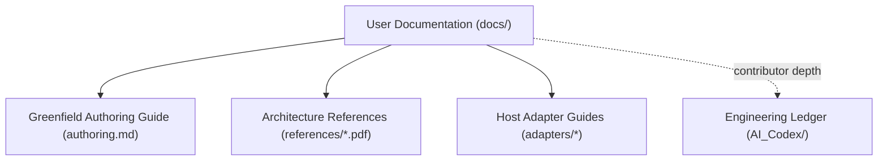

# User Documentation

Welcome to the user documentation for **Orchestration Quality Control (OQC)**.

This directory contains user-facing guides, reference materials, and operation documentation. Contributor-facing records (Architecture Decision Records, execution plans, agent session ledgers, and technical tickets) live in [`AI_Codex/`](../AI_Codex/README.md).



---

## Guides and Reference Index

| Document | Type | Description |
| :--- | :--- | :--- |
| [`authoring.md`](authoring.md) | Guide | How to discover repository topology and author new agent workflow/rule document trees. |
| [`references/`](references/) | References | Architecture papers and visual slide decks covering multi-model agent skills. |
| [`../orchestration-quality-control/SKILL.md`](../orchestration-quality-control/SKILL.md) | Canonical Skill | The main Agent Skills entry point describing validation, remediation, and upgrade flows. |

---

## Host Adapters

Native adapter guides for supported agent hosts:

* [Claude Code Adapter](../orchestration-quality-control/adapters/claude/README.md)
* [Cursor Adapter](../orchestration-quality-control/adapters/cursor/README.md)
* [Codex Adapter](../orchestration-quality-control/adapters/codex/README.md)
* [Antigravity (AGY) Adapter](../orchestration-quality-control/adapters/agy/README.md)

---

## Document Schema

Every markdown document in `docs/` conforms to the following metadata schema in its YAML frontmatter:

```yaml
---
title: "Human Readable Title"
id: "kebab-case-id"
description: "1-2 sentence summary of what this document covers."
doc_type: "guide"         # guide | concept | reference | index
status: "active"          # active | draft | deprecated | superseded
audience: "user"          # user | integrator | contributor
version: "x.y.z"          # Semantic version of the document
created: YYYY-MM-DD
last_updated: YYYY-MM-DD
related_adrs:             # Optional list of ADR numbers
  - "ADR 0012"
tags:
  - "example-tag"
---
```
