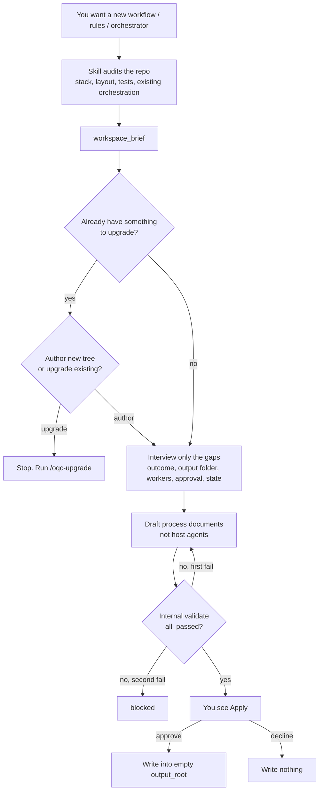
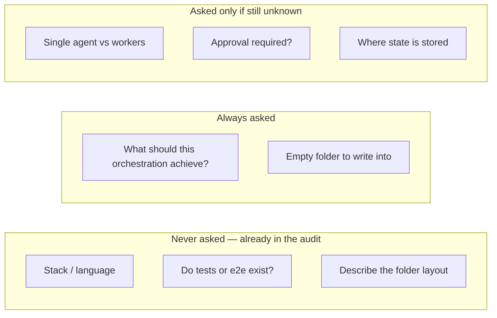

# Greenfield authoring (specified for 3.1.0)

This skill will be able to **write** the documents that run an agentic
process, not only check or upgrade ones that already exist.

The operations are specified, not shipped. Until 3.1.0, use
`validate` / `execute` / `upgrade_*` only.

## What ships conceptually

`author_prepare` then `author_apply`, matching the upgrade split.

1. **Audit the workspace** (no questions yet): stack, top-level layout,
   test and end-to-end trees, CI, existing workflow/rules/orchestrator
   files, existing host agents. Deterministic discovery plus README and
   package manifests — not a free-form repo tour.
2. **Interview the gaps:** the outcome, where to write, and only those
   orchestration choices the repo cannot answer (workers, approval,
   durable state, stop conditions). If something to upgrade already
   exists, the skill asks whether you meant upgrade instead.
3. **Draft** workflow, rules, optional orchestrator, and
   `ARCHITECTURE.md` from the packaged templates.
4. **Run the same quality-control rules** on that draft. The human sees
   Apply only when the draft passes, or a blocked result after one
   rewrite.
5. **Write** the tree under an empty `output_root` after approve, or
   write nothing after decline.

It does not install Claude/Cursor/Codex agents. That is still guided
upgrade. It does not guess the outcome from the README.

## Planned host entry

| Host | Entry (not shipped) |
| --- | --- |
| Claude Code, Cursor | `/oqc-author` |
| Codex | `orchestration-author` |

## Authority

- [ADR 0012](../AI_Codex/Architecture/ADR/0012-greenfield-orchestration-authoring.md)
- [Design spec](../AI_Codex/Architecture/Specs/2026-09-02-greenfield-authoring-design.md)
