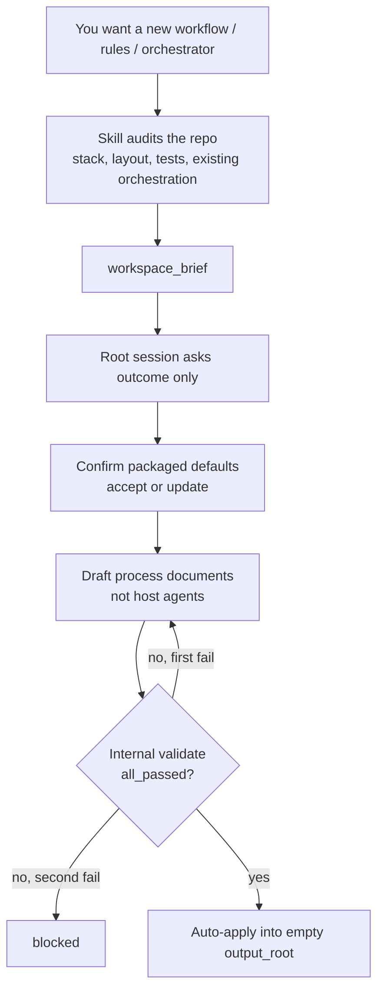
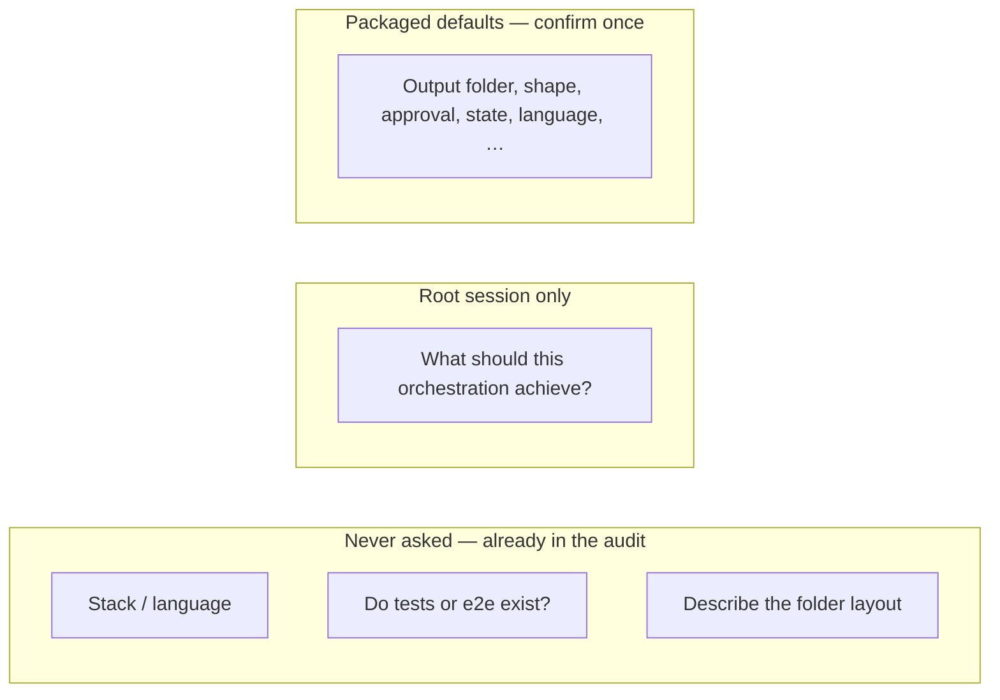

# Greenfield authoring

This skill can **write** the documents that run an agentic process, not
only check or upgrade ones that already exist.

Use `/oqc-author` (Codex: `orchestration-author`).

## What ships conceptually

`author_prepare` then `author_apply`, matching the upgrade split.

1. **Audit the workspace** (no questions yet): stack, top-level layout,
   test and end-to-end trees, CI, existing workflow/rules/orchestrator
   files, existing host agents. Deterministic discovery plus README and
   package manifests — not a free-form repo tour.
2. **Ask outcome only** in the root session: what the orchestration should
   achieve. Every other authoring field uses packaged defaults from
   `references/defaults/gate-defaults.json`, confirmed once (accept or
   update) before nested work starts.
3. **Draft** workflow, rules, optional orchestrator, and
   `ARCHITECTURE.md` from the packaged templates.
4. **Run the same quality-control rules** on that draft. On pass, **auto-apply**
   with packaged `decision: approve` unless `blocked`.
5. **Write** the tree under the default or overridden `output_root`
   (`authored-orchestration` by default).

It does not install Claude/Cursor/Codex agents. That is still guided
upgrade. It does not guess the outcome from the README.

## Root session UI (Cursor)

Nested Task subagents cannot surface `AskQuestion` to the parent chat. The
**outcome** question and defaults confirmation must run in the root Cursor
session before spawning `oqc_cursor_upgrade_orchestrator`. See
`references/workflows/workflows-root-session-interview.md`.

## Planned host entry

| Host | Entry |
| --- | --- |
| Claude Code, Cursor | `/oqc-author` |
| Codex | `orchestration-author` |

## Authority

- [ADR 0012](../AI_Codex/Architecture/ADR/0012-greenfield-orchestration-authoring.md)
- `references/defaults/gate-defaults.json`
