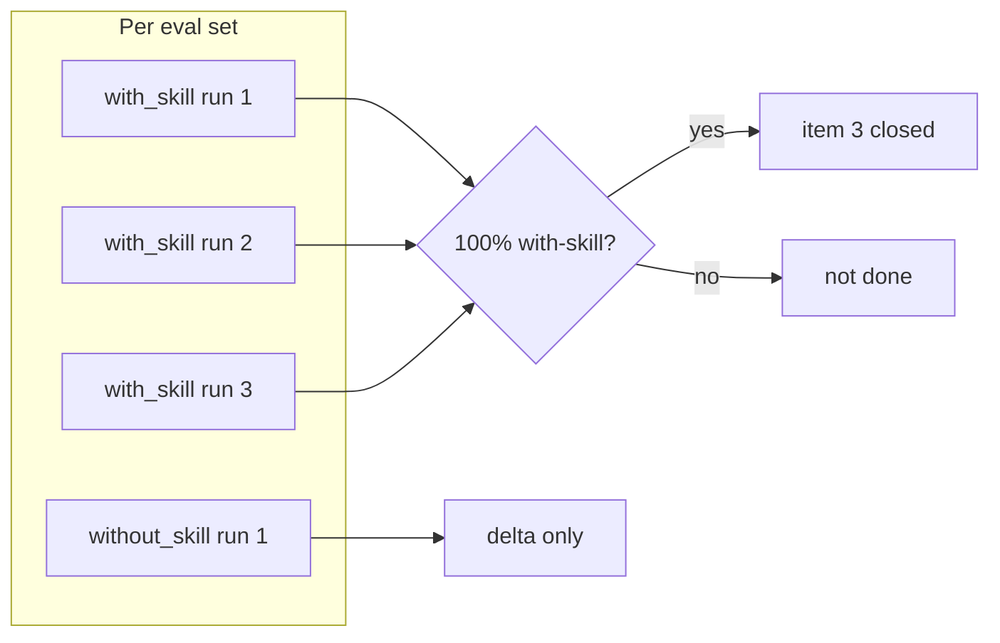

# Eval-benchmark runbook

Closes ADR 0005 item 3 (`AI_Codex/Architecture/ADR/0005-definition-of-done.md`): profile
evaluations at 100% with-skill pass rate. This harness is intentionally
external to `orchestration-quality-control/` — the portable package stays
free of test-running machinery; this folder is repo tooling.

It reuses the skill-creator plugin's benchmark harness (grading rubric,
`aggregate_benchmark.py`, `eval-viewer/generate_review.py`) rather than
reimplementing one. Workspace layout is
`eval-<name>/{with_skill,without_skill}/run-N/{grading.json,timing.json,outputs/}`
with the same `benchmark.json` schema. `SC` below is that plugin's skill
directory:

```
SC=/home/corporaterick/.claude/plugins/cache/claude-plugins-official/skill-creator/unknown/skills/skill-creator
```

Two benchmark runs are done — one per `evals.json` — kept in separate
workspaces since ADR 0005 gates on each independently:

- `orchestration-quality-control-workspace/core/iteration-1/`
- `orchestration-quality-control-workspace/example-pipeline/iteration-1/`

Run counts per eval, per this project's decision: **3 `with_skill` runs +
1 `without_skill` run**. `with_skill` is the gating configuration (must
reach 100% every run); `without_skill` only informs the delta.



## Step 1 — Stage the workspace

For each eval set:

```bash
python3 eval-harness/convert_evals.py \
  orchestration-quality-control/evals/core/evals.json \
  orchestration-quality-control-workspace/core/iteration-1

python3 eval-harness/convert_evals.py \
  orchestration-quality-control/profiles/example-pipeline/evals/evals.json \
  orchestration-quality-control-workspace/example-pipeline/iteration-1
```

This creates `eval-<slug>/{eval_metadata.json, sandbox/}` per eval, where
`sandbox/` holds only that eval's fixture(s) — nothing else in the repo.

## Step 2 — Snapshot each sandbox before any run

```bash
python3 eval-harness/check_run_integrity.py snapshot \
  <workspace>/eval-<slug>/sandbox -o <workspace>/eval-<slug>/baseline-hashes.json
```

Do this once per eval, before spawning any of its runs (with_skill or
without_skill share the same sandbox baseline since both start from the
same fixture).

## Step 3 — Spawn runs

Per skill-creator's `SKILL.md` ("Running and evaluating test cases"),
launch all runs for all evals in the same turn — don't run with_skill
first and come back for baselines later.

**with_skill run** (×3 per eval):

```
Execute this task:
- Skill path: orchestration-quality-control/ (profile: core | example-pipeline, matching this eval set)
- Task: <eval prompt, verbatim from evals.json>
- Input files: everything under <workspace>/eval-<slug>/sandbox/, and nothing else
- Save outputs to: <workspace>/eval-<slug>/with_skill/run-<N>/outputs/
- Outputs to save: the plain-language report text and any apply decision
```

**without_skill run** (×1 per eval): same prompt and sandbox, no skill
path, save to `<workspace>/eval-<slug>/without_skill/run-1/outputs/`.

Each subagent must be pointed at a copy of the sandbox (or the sandbox
itself if runs are sequential) so a with_skill run's edits can't leak into
another run's baseline. If runs for the same eval run concurrently, snapshot
+ copy the sandbox per run directory instead of sharing one.

## Step 4 — Capture timing as runs complete

On each subagent's completion notification, write immediately (this data
is not available later):

```json
{"total_tokens": <n>, "duration_ms": <n>, "total_duration_seconds": <n>}
```

to `<workspace>/eval-<slug>/<config>/run-<N>/timing.json`.

## Step 5 — Verify integrity per run

```bash
python3 eval-harness/check_run_integrity.py verify \
  <run_sandbox_dir> <workspace>/eval-<slug>/baseline-hashes.json \
  --transcript <workspace>/eval-<slug>/<config>/run-<N>/outputs/transcript.md \
  --allow "orchestration-quality-control/" \
  --ignore ".orchestration-qc/" \
  -o <workspace>/eval-<slug>/<config>/run-<N>/integrity.json
```

`--ignore ".orchestration-qc/"` excludes the package's own runtime-state
directory (checkpoints) from the edit diff — a with_skill run legitimately
creates this alongside the fixture as part of a real `validate` pass; it is
not an edit to the fixture itself and must not fail the "left unedited"
assertion just for existing.

`isolation_ok`/`paths_outside_sandbox` is heuristic evidence, not a verdict
— the grader weighs it, it doesn't replace the grader's read of the
transcript. `unedited`/`changed_files` is exact and should be treated as
authoritative for "did not edit before approval" assertions.

## Step 6 — Grade each run

Spawn a grader subagent per run, following `$SC/agents/grader.md` exactly,
with one addition to its instructions: **for any assertion about not
editing the fixture, or not reading outside the sandbox, the grader must
read this run's `integrity.json` and cite it as evidence rather than
inferring from the transcript alone.** Write `grading.json` to the run
directory (sibling to `outputs/`), using the exact field names
`text`/`passed`/`evidence` per expectation.

## Step 7 — Aggregate

```bash
cd "$SC"
python3 -m scripts.aggregate_benchmark \
  <repo>/orchestration-quality-control-workspace/core/iteration-1 \
  --skill-name orchestration-quality-control \
  --skill-path orchestration-quality-control/

python3 -m scripts.aggregate_benchmark \
  <repo>/orchestration-quality-control-workspace/example-pipeline/iteration-1 \
  --skill-name orchestration-quality-control \
  --skill-path orchestration-quality-control/profiles/example-pipeline/
```

Produces `benchmark.json` + `benchmark.md` per workspace.

## Step 8 — Review viewer (optional but recommended)

```bash
python3 "$SC/eval-viewer/generate_review.py" \
  <workspace>/iteration-1 --skill-name orchestration-quality-control \
  --benchmark <workspace>/iteration-1/benchmark.json \
  --static <workspace>/iteration-1/review.html
```

`--static` since this runs headless.

## Step 9 — Apply the pass-rate gate, honestly

ADR 0005 item 3 is satisfied only if **both** workspaces' `with_skill`
`run_summary.pass_rate` is `{"mean": 1.0, "stddev": 0.0, "min": 1.0, "max": 1.0}`
— every with_skill run, every assertion, every eval.

- **If it holds**: update ADR 0005's status line and Consequences section
  with a dated resolution note pointing at both `benchmark.json` paths.
  Bump the changelogs.
- **If any assertion in any with_skill run fails**: leave the ADR item
  open, and record in it (and in the session's ledger record) exactly
  which eval, which assertion, and the grader's evidence for the failure.
  Do not regrade to force a match, and do not silently drop or reword the
  failing assertion.
