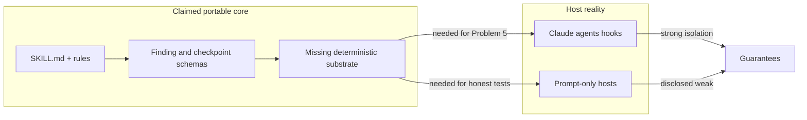

# Feedback: Orchestration QC OpenSkills Architecture Report

Source: [`2026-07-15-orchestration-qc-openskills-architecture.md`](/home/corporaterick/Documents/Projects/aplicatudo-monorepo/AI_Codex_Aplicatudo/Agent_Reports/2026-07-15-orchestration-qc-openskills-architecture.md)

Context check: the live tree under `projects/aplicatudo/.agents/skills/` matches the report’s picture — shared library `e2e-quality-control/` (no `SKILL.md`), executable siblings `e2e-quality-control-validate` / `-execute` (v3), README already calling the library non-invocable. Current workspace `orchestrator_qc_plugin` is an empty stub, so this feedback stays architectural.

---

## Verdict

**Strong diagnosis, credible target shape, incomplete productization plan.** The six problems are real and well evidenced. Core-plus-profile-plus-adapter is the right extraction boundary. Appendix A’s specialist eligibility gate is the best part of the forward design. The document is weaker on: what is executable vs prompt-only in the “portable core,” finding-id stability mechanics, distribution packaging truth, and how much agent surface area to ship in v1.

---

## What works well

1. **Problem framing is accurate.** Problem 1 is confirmed: canonical shared dir has no `SKILL.md`; discovery/entry confusion is real. Problem 3 (untracked `.agents`/`.claude`) correctly identifies why this cannot be a portable product yet. Problem 6 (generic orchestration vs E2E coupling) is the right identity fix.

2. **Honest about OpenSkills limits.** Refusing to claim host-level isolation that OpenSkills cannot enforce — and requiring adapters to disclose weaker guarantees — is mature. Many skill extractions oversell portability.

3. **Contracts are the right abstraction layer.** Input / finding / checkpoint YAML contracts are the portable spine. If those stay stable, profiles and adapters can churn.

4. **Fail-closed + applied-or-skipped reconciliation.** Matches the live split-phase design (main session owns approval because subagents cannot ask). Elevating that to a host-neutral contract is correct.

5. **Appendix A eligibility gate.** “One agent per capability when tool/context/schema/model/failure differs; otherwise parameterize” prevents the proliferation trap while keeping formal definitions meaningful. The thin binding file that *references* rules/workflows (no third copy) is essential.

6. **Migration order is sensible.** Freeze → extract generic → profile E2E → add `SKILL.md` → rebuild Claude adapter → retire stale dist is the right sequence.

---

## Gaps and weaknesses

### 1. “Portable core” is underspecified as an executable unit

The report describes a pipeline (`Classification → Rule selection → Verification → …`) and Strategy/Adapter/Pipeline patterns, but OpenSkills cores are usually **prompt + Markdown policy**, not a runtime. It never states clearly:

- which stages are **deterministic code** (path validation, schema parse, finding-id hashing, checkpoint state machine),
- which remain **model judgment** (policy violation classification, suggested_change drafting),
- and where that code lives (package scripts, adapter hooks, or neither).

Without that split, Problem 5 (non-deterministic Validator/Formatter) will reappear after extraction. The test plan assumes deterministic reconciliation; the architecture does not mandate a non-LLM layer to produce it.

**Recommendation:** Add an explicit “Deterministic substrate” section: schema validators, finding-id algorithm, checkpoint state machine, and capability-skip detection as code or strict structured-output validators — not hope in prompts.

### 2. Finding identity is named but not designed

`id: stable-finding-id` is required for approval reconciliation and retries, but there is no algorithm (hash of `rule + location + kind`? normalized path + rule id?). Live non-determinism on byte-identical fixtures will not be fixed by renaming the package.

Also, `kind` enum mixes E2E vocabulary (`artifact`, `generator-gap`, `generator-contradiction`) with generic (`workflow`, `orchestrator`). That re-couples the core finding schema to the E2E profile.

**Recommendation:** Core kinds = orchestration-generic only; profile-specific kinds under a namespaced extension field. Publish the id derivation algorithm in `schemas/`.

### 3. Distribution claim needs a freshness check

Problem 2 cites `…/plugins/e2e-quality-control/dist/e2e-quality-control.skill` as a stale v1 archive. A workspace search found **no `.skill` file** currently. Either it was removed, lives outside the searched tree, or the path is outdated. The *class* of problem (dist ≠ live) remains valid; the specific evidence may be stale.

**Recommendation:** Re-verify packaging artifacts before treating archive retirement as a migration step; document the actual publish path (OpenSkills install, Claude plugin, Cursor skill sync).

### 4. Validate/execute split vs single skill entry is unresolved tension

Live design uses **two skills** because the orchestrator subagent cannot own the approval gate. Target architecture shows **one** `SKILL.md` with `operation: validate | execute`. That is fine as a portable facade, but the Claude adapter will still need two commands (or one command with an explicit phase handoff). The report mentions aliases but does not specify the adapter UX contract.

**Recommendation:** State: portable core exposes one skill with two operations; Claude adapter ships two slash commands that call those operations; Cursor adapter documents the weaker single-agent path.

### 5. Appendix A vs current three-agent model — cost of the jump

Today: Orchestrator + Validator + Formatter. Proposed: Orchestrator + Workflow QC + Rules QC + Orchestrator QC + Remediation (and profile-specific workers later).

That is a real increase in handoffs on every validate run. The eligibility gate softens this, but the **default recommended set is already four specialists**. For a first portable release, that may be premature relative to fixing discovery, contracts, and determinism.

**Recommendation:** v1 specialists = **Validator** (parameterized by selected rule packs) + **Remediator**; keep classification as deterministic or orchestrator-owned. Split Workflow/Rules/Orchestrator QC specialists only when evals prove cross-contamination or tool-boundary need. Appendix A is a good *target*, not necessarily the *first ship*.

### 6. State lifecycle fix is right; marker semantics still fuzzy

Host-neutral statuses (`pending_approval | consumed | aborted`) are good. The report still leaves “absent vs terminal record” as adapter choice without a **required observable** for “is a run active?” — which the Claude pre-tool hook depends on. If adapters diverge, the security property (block main-session edits) becomes non-portable and hard to test.

**Recommendation:** Require every adapter to implement `is_run_active(workspace) -> bool` against the same state machine, even if storage differs (marker file vs checkpoint status).

### 7. Cursor adapter is a placeholder

`adapters/cursor/README.md` as disclosure-only is honest, but the folder structure implies parity. Given this workspace’s empty `orchestrator_qc_plugin`, readers may assume Cursor enforcement is in scope. It is not.

**Recommendation:** Label Cursor as “capability matrix + install notes only” until a host mechanism exists; do not imply hooks/agents parity in the tree.

### 8. Scope honesty is good; product criteria are thin

Out-of-scope correctly excludes building the package in this report. What’s missing is a **definition of done for extraction**: which core evals must pass on a disposable fixture repo with zero Aplicatudo files before calling the skill portable.

---

## Design tensions to resolve before build

| Tension | Doc position | Risk if unresolved |
| --- | --- | --- |
| Core = docs vs core = docs + validators | Implied pipeline, no code boundary | Non-determinism survives extraction |
| One skill vs two phases | One `SKILL.md`, two operations | Claude UX and approval ownership unclear |
| 4 specialists vs 2 | Appendix A recommends 4 | Latency, handoff failures, overbuild |
| E2E kinds in core schema | Mixed `kind` enum | Profile leak into “generic” package |
| Dist retirement | Assumes stale `.skill` | Migration step may be no-op or wrong path |

---

## Priority order if this becomes `orchestrator_qc_plugin`

1. **Contracts + schemas + finding-id algorithm** (no agents yet).
2. **Canonical `SKILL.md` + core rule packs** extracted from generic W/O/validator/formatter/state rules.
3. **Deterministic checkpoint state machine + blocked/skipped result types.**
4. **Claude adapter** (validate/execute commands, 2–3 agents, hook) wired to the same contracts.
5. **`aplicatudo-e2e` profile** moved behind explicit profile select.
6. **Evals** on a disposable non-Aplicatudo fixture repo, then E2E profile regression.
7. **Specialist split** (Appendix A) only after baseline evals show need.

---

## Doc-quality notes (secondary)

- Readers/TOC/diagrams are clear; executive summary matches the body.
- “Architecture specifications” section is a useful checklist but reads like a template dump (authN, scalability) — trim or tie each bullet to a concrete package artifact.
- Rename Formatter → Remediator in the main body earlier; Appendix A uses Remediator while earlier sections still say Formatter.
- Compatibility statement for `e2e-quality-control` name should include command aliases and version metadata (`metadata.version` is already `3.0.0` on validate skill).

---

## Bottom line

Approve the **direction**: portable orchestration QC core, E2E as profile, host adapters with honest capability disclosure, formal specialists with an eligibility gate.

Do **not** treat the document as an implementation-ready blueprint until it specifies: deterministic substrate, finding-id algorithm, core vs profile schema boundaries, Claude two-phase adapter UX, and a thinner v1 agent surface. The diagnosis of the current system is stronger than the completeness of the extraction design.
